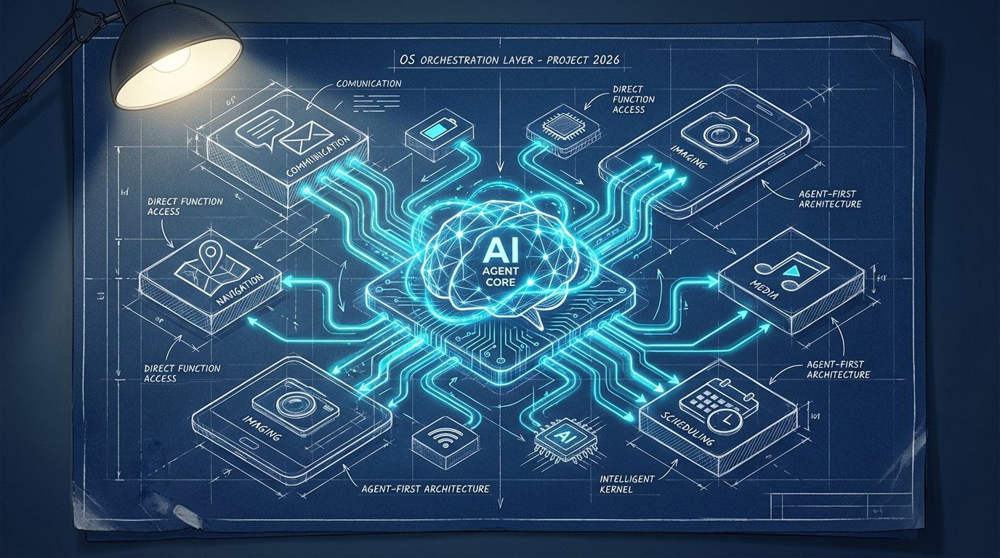
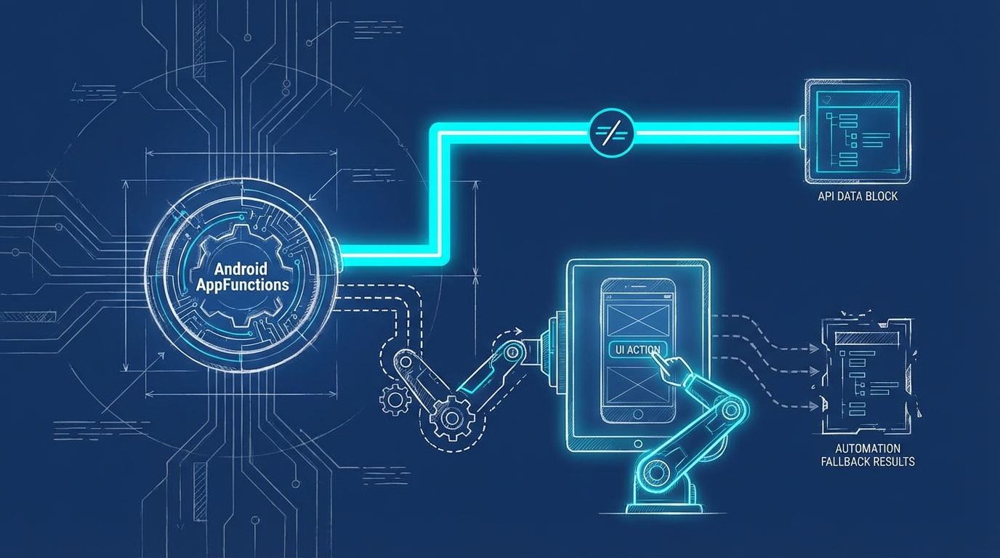

+++
title = 'Agent-First OS 2026: AI Agent Viết Lại Cách Dùng App Android'
date = 2026-03-29T23:00:00+00:00
tags = ['AI', 'Android', 'Mobile Dev', 'AppFunctions']
categories = ['Tech']
description = 'Android đang chuyển mình thành hệ điều hành "Agent-First" với Jetpack AppFunctions. Điều này thay đổi ra sao cách người dùng và AI tương tác với ứng dụng?'
images = ['og-hero.jpg']
+++

Vào tháng 3/2026, Google chính thức giới thiệu **AppFunctions** – một Jetpack API mới định hình lại hoàn toàn cách nền tảng Android hoạt động dưới vỏ bọc. Không chỉ là một bản cập nhật thông thường hay vài dòng code tối ưu giao diện, đây là bước ngoặt chiến lược đưa Android chuyển mình thành một **"Agent-First OS"**. Thay vì bắt người dùng phải tự mở app, tìm kiếm trên menu, chạm và vuốt để thực hiện từng bước nhỏ, các AI Agent như Gemini giờ đây sẽ trực tiếp đóng vai trò như một người điều phối. Chúng sẽ tự động "gọi" các chức năng bên trong ứng dụng để hoàn thành trọn vẹn tác vụ cho bạn.

Vậy thực chất Agent-First OS là cái gì? Công nghệ AppFunctions hoạt động ra sao, và giới lập trình viên mobile (đặc biệt là các team dev tại Việt Nam) cần chuẩn bị những gì để không bị bỏ lại phía sau? Dưới đây là 5 câu hỏi lớn giải mã xu hướng sẽ thống trị năm 2026 này.

### 1. Agent-First OS là gì và tại sao Google quyết định ra mắt AppFunctions?

Trong suốt hai thập kỷ qua, hệ điều hành di động luôn được thiết kế xoay quanh Giao diện người dùng đồ họa (GUI). Người dùng đóng vai trò trung tâm: muốn làm gì thì phải mở đúng app đó lên và thao tác chạm/vuốt. Tuy nhiên, sự phát triển bùng nổ của AI tạo sinh đã cho thấy một giới hạn lớn: con người ngày càng lười thao tác tay và muốn tương tác bằng ngôn ngữ tự nhiên.

**Agent-First OS** chính là giải pháp đảo ngược lại quy trình truyền thống này. Trong một hệ điều hành Agent-First, OS đóng vai trò là não bộ trung tâm (thông qua các AI Agent tích hợp sâu), trực tiếp lắng nghe lệnh của người dùng bằng giọng nói hoặc văn bản, hiểu được ý định đó, và tự động "sai việc" các ứng dụng để trả về kết quả cuối cùng. 

Google ra mắt **AppFunctions** nhằm tạo ra một chuẩn giao tiếp chung để các ứng dụng Android "khai báo" năng lực của mình cho hệ thống một cách thống nhất. Nhờ API này, Gemini Assistant có thể hiểu chính xác app của bạn làm được gì (ví dụ: đặt một chuyến xe, tra cứu đơn hàng vừa mua, hay gửi tin nhắn cho nhóm chat) và kích hoạt tính năng đó ở background mà không yêu cầu người dùng mở app.

### 2. AppFunctions khác biệt thế nào so với Deep Link hay API truyền thống?

Nhiều lập trình viên lâu năm sẽ lập tức đặt câu hỏi: *"Chẳng phải Deep Link (URL Scheme) hay Intent của Android từ thời kỳ đầu đã làm được việc này sao?"* 

Câu trả lời nằm ở **tính tự mô tả (self-describing capabilities)** và cơ chế **chạy hoàn toàn cục bộ trên thiết bị (on-device execution)**. 
- Deep Link thường yêu cầu lập trình viên phải biết chính xác định dạng URI và khi gọi, nó thường bắt buộc phải mở giao diện (Activity) của ứng dụng lên. Điều này làm gián đoạn luồng suy nghĩ của AI Agent.
- AppFunctions hoạt động tinh vi hơn nhiều. Về mặt ý tưởng, nó rất giống với **Model Context Protocol (MCP)** đang cực kỳ phổ biến ở mảng cloud/server, nhưng được tối ưu riêng cho môi trường local của Android app. AppFunctions cho phép ứng dụng khai báo các hàm chức năng đi kèm với siêu dữ liệu (metadata) và mô tả ngữ nghĩa (semantic description). AI Agent sẽ đọc các mô tả này, tự hiểu hàm nào dùng cho việc gì, truyền tham số tương ứng và gọi hàm đó chạy ngầm dưới background. Vì mọi tương tác đều diễn ra cục bộ (local) trên điện thoại, tốc độ phản hồi cực nhanh (low latency) và loại bỏ hoàn toàn việc phải gửi dữ liệu nhạy cảm qua các API server trung gian.

### 3. Nếu ứng dụng chưa kịp tích hợp AppFunctions, AI Agent sẽ xử lý ra sao?

Google hiểu rất rõ rằng họ không thể ép toàn bộ hệ sinh thái khổng lồ với hàng triệu ứng dụng trên Google Play phải đập đi xây lại hoặc cập nhật API mới chỉ trong một đêm. Để giải quyết khoảng trống chuyển giao công nghệ này, họ đã giới thiệu thêm một cơ chế dự phòng mang tên **UI Automation Platform**.

Nếu một ứng dụng cũ hoặc ứng dụng từ các nhà phát triển chưa tích hợp AppFunctions, Gemini Agent vẫn có khả năng hoàn thành nhiệm vụ nhờ UI Automation. Lúc này, AI sẽ "đóng vai" con người: nó tự động chụp ảnh màn hình ngầm, phân tích cấu trúc các thành phần UI (đâu là nút bấm, đâu là ô nhập text), từ đó tự động mô phỏng thao tác cuộn, click và gõ phím. Nhờ vậy, Gemini có thể đặt giúp bạn một chiếc pizza hoặc điều phối một chuyến rideshare nhiều điểm dừng ngay trên những ứng dụng cũ kỹ nhất. Mặc dù luồng chạy qua UI Automation sẽ chậm hơn và có tỷ lệ lỗi cao hơn so với việc gọi hàm trực tiếp (AppFunctions), nó vẫn là bước đệm hoàn hảo để mở rộng tầm với của Agent-First OS.

### 4. Bài toán Quyền riêng tư (Privacy) và Bảo mật (Security) được giải quyết như thế nào?

Khi chúng ta trao cho AI quyền hạn tự động gọi các tính năng của ứng dụng (kể cả những app chứa dữ liệu tài chính hay thông tin cá nhân), rủi ro bảo mật đương nhiên là cực kỳ lớn. Do đó, Google đã thiết kế kiến trúc AppFunctions với trọng tâm cốt lõi là **Privacy by Design**:
- **On-device Execution:** Như đã đề cập, toàn bộ quá trình phân tích ý định và thực thi hàm diễn ra ngay trên phần cứng của điện thoại (nhờ NPU), dữ liệu không bị đẩy lên đám mây.
- **Tính minh bạch tuyệt đối (Transparency):** Hệ điều hành Android 16/17 luôn hiển thị một Live View hoặc thông báo trạng thái rõ ràng để người dùng biết AI đang tương tác với app nào và làm hành động gì.
- **Cơ chế xác nhận bắt buộc (Human-in-the-loop):** Đối với các tác vụ được đánh dấu là nhạy cảm (như thực hiện thanh toán, gửi tiền, hay xóa dữ liệu quan trọng), AI tuyệt đối không được phép tự quyết định. Hệ thống sẽ tự động chặn luồng thực thi, bật lên một hộp thoại xác nhận và chờ người dùng bấm "Đồng ý". Hơn nữa, bạn luôn có quyền ngắt ngang (override) mọi hành động của AI bất cứ lúc nào.

### 5. Dev Việt cần chuẩn bị gì cho làn sóng Agent-First OS này?

Sự chuyển dịch sang Agent-First OS không chỉ là một trend nhất thời mà sẽ định hình lại toàn bộ ngành công nghiệp phát triển phần mềm trong 5 đến 10 năm tới. Mặc dù AppFunctions và UI Automation hiện đang trong giai đoạn early beta và mới chỉ khả dụng trên một số dòng máy cao cấp (như Galaxy S26 series) trước khi mở rộng trên Android 17, các team dev cần hành động ngay từ bây giờ:
- **Chuyển đổi sang Tư duy "API cho AI":** Đã qua rồi cái thời lập trình viên chỉ quan tâm vẽ UI/UX cho màn hình sao cho đẹp. Giờ đây, bạn phải thiết kế các hàm chức năng (Functions) mạch lạc, có cấu trúc dữ liệu rõ ràng, và quan trọng nhất là phải viết phần mô tả (prompt description) thật chuẩn xác để AI dễ hiểu, dễ gọi.
- **Tách biệt Logic và UI:** Đảm bảo kiến trúc ứng dụng (ví dụ Clean Architecture hoặc MVVM) tách biệt hoàn toàn Business Logic ra khỏi UI. Nếu logic của bạn bị dính chặt vào Activity/Fragment, bạn sẽ không thể tái sử dụng nó cho AppFunctions vốn chạy ở background.
- **Tối ưu hiệu năng tiêu thụ (Resource Optimization):** Vì các AI agent sẽ liên tục quét và gọi nhiều ứng dụng cùng một lúc trong nền, app của bạn bắt buộc phải nhẹ, tiêu thụ ít RAM và có thời gian khởi động hàm tính bằng mili-giây để tránh bị hệ điều hành "kill" do quá tải.

### Tổng kết

Năm 2026 chính là thời điểm đánh dấu sự trưởng thành vượt bậc của thế hệ AI Agent. Điện thoại di động đang dần lấy lại đúng nghĩa "thông minh" của nó: một người trợ lý ảo có khả năng tự động thực thi công việc, thay vì chỉ là một tấm bảng thụ động hiển thị hằng hà sa số các biểu tượng ứng dụng. Hãy bắt đầu nghiên cứu và tích hợp AppFunctions ngay hôm nay. Bởi trong thế giới Agent-First, những ứng dụng "chỉ dành cho con người sử dụng" rất có thể sẽ sớm trở thành một món đồ cổ thời công nghệ.
