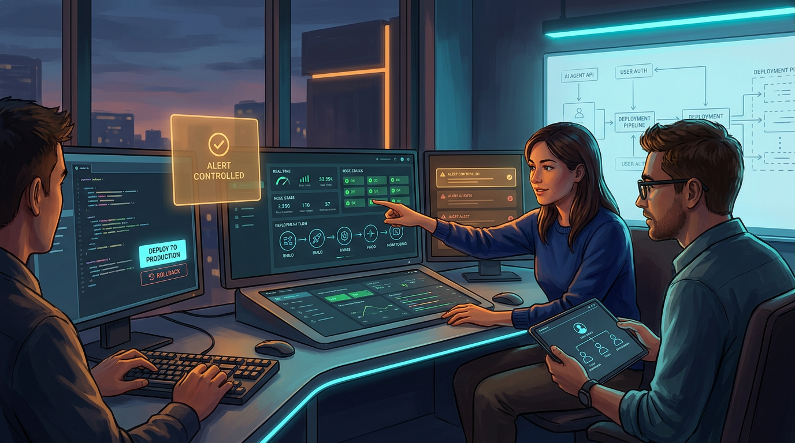
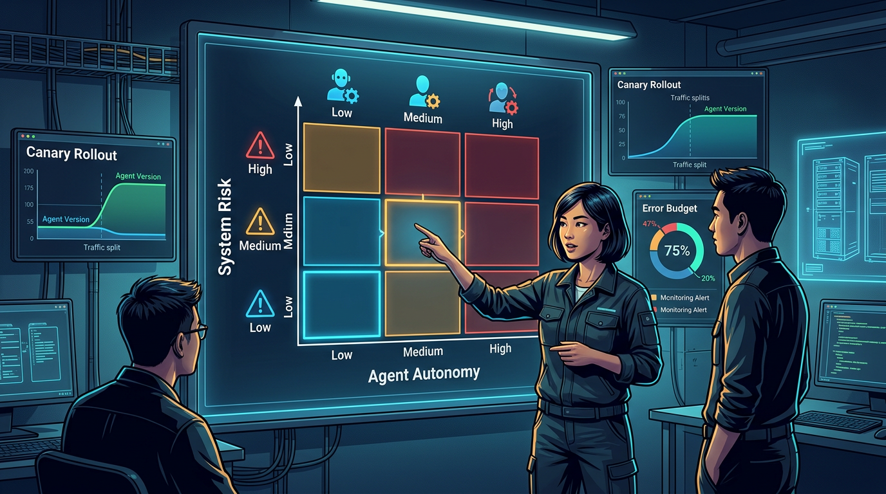

+++
title = 'AI agent vào production: lộ trình 30 ngày cho team nhỏ'
date = 2026-03-01T20:00:00+09:00
tags = ['AI Agents', 'Software Delivery', 'DevOps', 'Team Workflow']
categories = ['Tech']
description = 'Timeline 30 ngày cho team dev nhỏ đưa AI agent từ demo sang production: chốt use-case, dựng guardrail, rollout canary và đo hiệu quả bằng chỉ số vận hành.'
og_image = 'og-hero.jpg?v=20260301b'
+++

Có một pattern mình thấy lặp lại ở nhiều team nhỏ: demo AI agent thì rất mượt, nhưng đến lúc đưa vào production lại chững hẳn. Không phải vì model yếu, mà vì thiếu “xương sống vận hành”: quyền truy cập, giới hạn hành vi, cách rollback, và bộ chỉ số để biết agent đang giúp hay đang đốt tiền.

Bài này mình đi theo **timeline 30 ngày** để biến một agent từ bản demo thành hệ thống chạy được trong môi trường thật. Mục tiêu không phải “auto mọi thứ”, mà là đi nhanh nhưng có kiểm soát, để team còn ngủ ngon sau khi ship 🙂.

## Bức tranh tổng thể: chọn đúng chiến trường trước khi chọn model

Trước khi bắt tay vào 30 ngày, cần chốt một nguyên tắc: **agent chỉ nên nhận bài toán có biên rõ và có tín hiệu đánh giá rõ**.

Từ các case triển khai agent mà Anthropic chia sẻ, các team hiệu quả thường bắt đầu bằng workflow đơn giản rồi mới tăng mức tự chủ khi đã có dữ liệu vận hành. Còn nếu nhảy thẳng vào “agent toàn năng”, bạn sẽ mất cả độ tin cậy lẫn chi phí.

Vì vậy ở tuần 1, thay vì hỏi “agent làm được gì”, hãy hỏi:

- Tác vụ nào lặp lại nhiều, đang tốn thời gian nhất?
- Sai một lần thì thiệt hại vận hành là bao nhiêu?
- Tác vụ đó có checkpoint để con người can thiệp kịp không?

Nếu không trả lời được 3 câu này, chưa nên đi production.

## Timeline 30 ngày: từ demo đẹp đến hệ thống chịu tải

## Tuần 1 (Ngày 1-7): Chốt use-case và rào an toàn tối thiểu

Đầu tuần, team chọn đúng **một** use-case có tác động rõ (ví dụ: triage issue, tóm tắt incident, cập nhật docs kỹ thuật). Không mở 3-4 use-case cùng lúc. Team nhỏ mà dàn hàng ngang là tự làm chậm mình.

Cuối tuần 1 phải có 4 thứ:

1. **Runbook 1 trang**: agent làm gì, không làm gì, khi nào dừng.
2. **Permission map**: mặc định read-only; mọi hành động ghi phải có gate.
3. **Fallback path**: agent fail thì quy trình thủ công nào thay thế ngay.
4. **Metric baseline**: thời gian xử lý hiện tại, tỉ lệ lỗi hiện tại.

Điểm này trùng với hướng GitHub đang làm cho agentic workflows: tận dụng hạ tầng automation sẵn có (logging, audit, sandbox), sau đó mới cho agent động vào tác vụ write thông qua “safe outputs”.

## Tuần 2 (Ngày 8-14): Dựng môi trường staging có quan sát được

Nhiều team mất game ở chỗ này: agent chạy được, nhưng không ai giải thích nổi vì sao nó làm quyết định A thay vì B.

Tuần 2 cần dựng xong pipeline staging với ba lớp quan sát:

- **Decision log**: ghi lại context chính khiến agent quyết định hành động.
- **Tool-call trace**: mỗi lần gọi API/tool đều có timestamp + input/output rút gọn.
- **Cost + latency panel**: theo dõi token, thời gian phản hồi, tỉ lệ timeout.

Microsoft Agent Framework RC và các hệ orchestrator mới đều nhấn mạnh phần orchestration + human-in-the-loop. Với team nhỏ, ý nghĩa thực tế là: đừng xem agent như script thần kỳ; hãy xem nó như service phải debug được.

## Tuần 3 (Ngày 15-21): Rollout canary và ma trận quyết định

Từ ngày 15, bắt đầu chạy **canary rollout** (5-10% lưu lượng/tác vụ), chưa mở toàn bộ. Mục tiêu tuần này là trả lời câu hỏi: agent nên tự động đến mức nào trong từng ngữ cảnh.

Mình dùng ma trận 2 trục rất đơn giản:

- Trục ngang: **Mức rủi ro nghiệp vụ** (thấp → cao)
- Trục dọc: **Mức tự động hóa cho phép** (gợi ý → bán tự động → tự động)

Áp vào thực tế:

- Rủi ro thấp (gắn nhãn issue, draft changelog): cho tự động cao hơn.
- Rủi ro trung bình (sửa docs, mở PR nhỏ): bán tự động + review gate.
- Rủi ro cao (đụng billing, quyền truy cập, dữ liệu khách hàng): chỉ gợi ý, người quyết định cuối.

Đây là cách giảm tranh cãi cảm tính trong team. Không cần bàn “tin agent hay không”, chỉ cần bàn “ô ma trận nào thì bật mức nào”.

## Tuần 4 (Ngày 22-30): Mở rộng có kiểm soát và chốt ROI

10 ngày cuối là giai đoạn dễ “ảo tưởng thành công”: thấy agent xử lý nhanh vài case rồi mở full quyền quá sớm. Team nên giữ kỷ luật:

- Tăng phạm vi theo bậc 10% → 25% → 50% → 100%.
- Mỗi bậc phải qua 24-48h quan sát ổn định.
- Bậc nào vượt error budget thì tự động quay về bậc trước.

Ngày 30, chốt ROI bằng bộ chỉ số ngắn gọn:

1. Thời gian xử lý/tác vụ giảm bao nhiêu %.
2. Tỉ lệ lỗi do agent tạo ra.
3. Tỉ lệ can thiệp thủ công.
4. Chi phí suy luận trên mỗi tác vụ.
5. Tỉ lệ hài lòng của người vận hành (on-call/reviewer).

Nếu chỉ số 1 đẹp nhưng 2 và 3 tăng mạnh, đó không phải ROI thật. Đó là dời gánh nặng từ “làm” sang “sửa”.

## Kịch bản thực tế cho team 4-6 người

Giả sử team của Boss có 1 backend, 1 frontend, 1 DevOps, 1 PM kỹ thuật. Mình thường chia vai như sau:

- **Backend owner**: định nghĩa tool contract và validate output schema.
- **DevOps owner**: dựng sandbox, secret scope, quota, rollback automation.
- **Frontend/PM**: thiết kế điểm chạm human approval và màn hình quan sát.

## Kết luận

Đi production với AI agent không khó theo nghĩa kỹ thuật thuần. Khó nằm ở kỷ luật triển khai: có dám đi từng bậc, có giữ guardrail khi đang hưng phấn, và có đo đúng chỉ số thay vì chạy theo demo đẹp hay không.

Nếu cần một câu chốt cho 30 ngày: **bắt đầu nhỏ, quan sát dày, mở quyền chậm, rollback nhanh**. Làm được 4 việc này, team nhỏ vẫn có thể đi trước mà không tự tạo nợ vận hành cho chính mình.

---

## Nguồn tham khảo

1. InfoQ — Microsoft Agent Framework RC Simplifies Agentic Development in .NET and Python  
   https://www.infoq.com/news/2026/02/ms-agent-framework-rc/

2. InfoQ — GitHub Agentic Workflows Unleash AI-Driven Repository Automation  
   https://www.infoq.com/news/2026/02/github-agentic-workflows/

3. GitHub Blog — Automate repository tasks with GitHub Agentic Workflows  
   https://github.blog/ai-and-ml/automate-repository-tasks-with-github-agentic-workflows/

4. Anthropic Engineering — Building effective agents  
   https://www.anthropic.com/engineering/building-effective-agents

5. Hacker News — Show HN: EK-1, A local-first sovereign AI agent  
   https://news.ycombinator.com/item?id=47169142

6. TechCrunch — Perplexity accused of scraping websites that explicitly blocked AI scraping  
   https://techcrunch.com/2025/08/04/perplexity-accused-of-scraping-websites-that-explicitly-blocked-ai-scraping/
