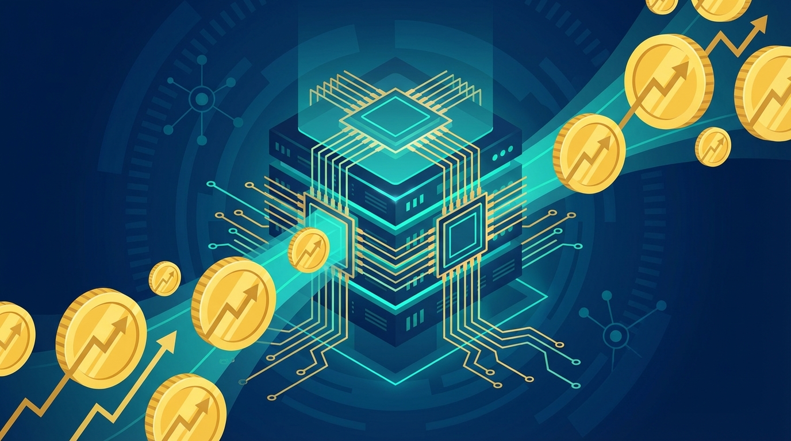
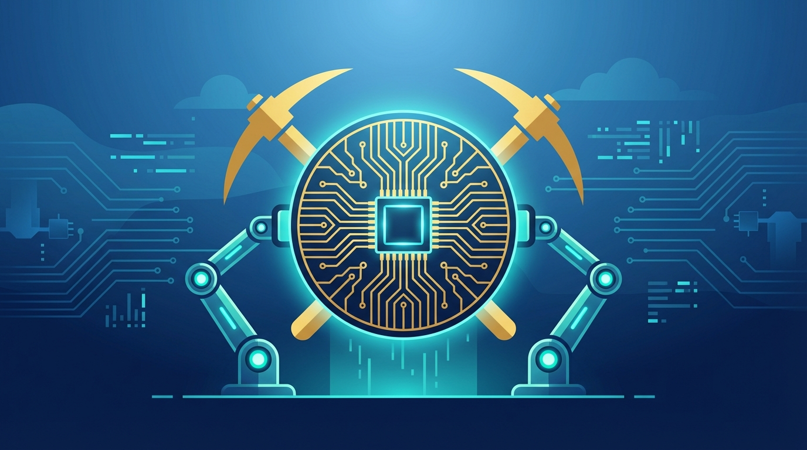

+++
title = 'Cơn Sốt Đầu Tư Hạ Tầng AI 2026: Cuộc Đua 725 Tỷ USD'
date = 2026-04-07T23:00:00Z
categories = ['Investment']
tags = ['AI', 'Bán dẫn', 'Big Tech', 'Data Center']
description = 'Năm 2026, các Big Tech dự kiến đổ 725 tỷ USD vào hạ tầng AI. Tìm hiểu tại sao các nhà đầu tư lại chuyển hướng sang nhóm cổ phiếu bán dẫn thay vì phần mềm.'
images = ['og-hero.jpg']
+++

Thị trường AI bước sang năm 2026 đang chứng kiến một sự dịch chuyển mang tính bước ngoặt. Không còn là những chuỗi ngày hưng phấn tột độ xoay quanh các startup xây dựng ứng dụng phần mềm hay chatbot, dòng tiền khổng lồ đang tìm đường chảy ngược về phần "móng" của hệ sinh thái: Hạ tầng phần cứng và năng lượng tính toán. 

Bức thư thường niên gửi cổ đông mới nhất của Jamie Dimon – CEO JPMorgan Chase – đã châm ngòi cho một làn sóng định giá lại (re-rating) trên diện rộng với chuỗi cung ứng công nghệ. Cùng giải mã bức tranh này thông qua 4 câu hỏi lớn nhất xoay quanh siêu chu kỳ đầu tư hạ tầng AI 2026.

## 1. Vì sao Big Tech sẵn sàng "đốt" 725 tỷ USD vào Capex trong năm 2026?

Theo dự báo mới nhất từ [JPMorgan](https://www.fool.com/investing/2026/04/07/dimon-says-ai-capital-spending-will-hit-725-billio/), 5 gã khổng lồ "hyperscalers" – Microsoft, Amazon, Alphabet (Google), Meta, và Apple – dự kiến sẽ nâng tổng mức chi tiêu vốn đầu tư (Capex) phục vụ AI lên mốc **725 tỷ USD** trong năm 2026, tăng mạnh từ mức 450 tỷ USD của năm 2025. 

Lý do đằng sau quyết định khổng lồ này thực chất đến từ nỗi sợ bị bỏ lại phía sau (FOMO) ở quy mô tập đoàn lớn. Việc đào tạo và vận hành các mô hình đa phương thức tiên tiến đòi hỏi năng lực tính toán thô (raw compute power) khổng lồ. Nếu không sở hữu đủ số lượng GPU tối tân, hoặc thiếu hụt các trung tâm dữ liệu quy mô siêu lớn, họ sẽ vĩnh viễn mất đi quyền định đoạt luật chơi AI. Số tiền 725 tỷ USD này, về bản chất, chính là một loại "phí bảo hiểm" để mua lấy vị thế độc tôn sinh tồn.

## 2. Trong nhịp điều chỉnh cổ phiếu AI gần đây, đâu là "vịnh tránh bão"?

Tháng 4 năm 2026 ghi nhận một nhịp điều chỉnh (sell-off) đáng kể của nhiều mã cổ phiếu "AI", đặc biệt là nhóm phần mềm đám mây. Tuy nhiên, giới chuyên gia phân tích đánh giá đây là cơ hội mua vào (buying opportunity) cho những cổ phiếu nằm trong chuỗi cung ứng phần cứng.

[Báo cáo từ Goldman Sachs](https://www.kotakneo.com/news/market-news/ai-demand-semiconductor-revenue-growth-2026/) nhận định: doanh thu từ mảng phần cứng AI có thể vượt mốc 700 tỷ USD vào cuối năm 2026. Trong khi các startup phần mềm AI (SaaS AI) có thể gặp rủi ro do rào cản gia nhập thấp và cạnh tranh dẫm chân nhau, thì những công ty cung cấp linh kiện vật lý (chips, máy chủ hiệu năng cao, thiết bị mạng) lại tạo ra một "vùng đệm an toàn". Đây là quy luật tất yếu: muốn phần mềm chạy được, bạn phải mua phần cứng trước.

## 3. Ai là người hưởng lợi thực sự trong "cơn sốt vàng" hạ tầng công nghệ?

Lời giải nằm ở chiến lược kinh điển của phố Wall: **Chiến lược "Pick-and-shovel" (Bán cuốc xẻng)**. Dòng tiền thông minh đang dồn vào những cái tên không thể thay thế ở tầng đáy kim tự tháp hạ tầng.

Có ba nhóm đại diện tiêu biểu nhất cho luận điểm đầu tư này:

**Thứ nhất là TSMC (Taiwan Semiconductor Manufacturing Company):** Đơn vị này giữ vị thế độc quyền gia công những con chip tiên tiến nhất thế giới cho Nvidia, AMD lẫn các chip "tự trồng" của Google hay AWS. TSMC dự báo sẽ duy trì tốc độ tăng trưởng kép (CAGR) cận 60% cho mảng chip AI từ nay đến năm 2029.

**Thứ hai là Nvidia và Broadcom:** Đây là hai "ông trùm" chi phối mảng huyết mạch bên trong các Data Center. Nvidia vô đối về GPU huấn luyện mô hình, còn Broadcom thống trị mảng networking giúp hàng trăm nghìn GPU giao tiếp với độ trễ cực thấp. Hào quang công nghệ của họ rất khó bị xô đổ trong chu kỳ ngắn hạn.

**Thứ ba là Data Center REITs:** Các quỹ tín thác bất động sản trung tâm dữ liệu mang tới một cách tiếp cận an toàn hơn. Các Hyperscalers dù dồi dào tài chính đến mấy cũng không thể tự đi xin giấy phép, tìm đất và xây đủ data center kịp tốc độ. Họ bắt buộc phải đi thuê lại không gian vật lý, giúp doanh thu của nhóm REITs trở nên cực kỳ ổn định.

## 4. Nhà đầu tư cá nhân nên phân bổ danh mục ra sao?

Nếu bạn là nhà đầu tư cá nhân có định hướng dài hạn, chiến lược tối ưu không phải là "all-in" vào công ty phần mềm nghe có vẻ hấp dẫn, mà là "làm chắc phần móng".

- **Giảm thiểu tỷ trọng ở nhóm rủi ro cao:** Tránh xa hoặc duy trì tỷ trọng tối thiểu đối với các công ty AI SaaS chưa chứng minh được khả năng sinh lời thực tế.
- **Tiếp cận qua các quỹ ETF bán dẫn:** Để hạn chế rủi ro chọn sai công ty, hãy phân bổ vốn vào các quỹ ETF chuyên ngành bán dẫn (ví dụ SMH, SOXX). Cách này giúp bạn mua "cả một hệ sinh thái".
- **Mở rộng sang hạ tầng bổ trợ:** Các công ty cung cấp giải pháp làm mát bằng chất lỏng (liquid cooling) cho máy chủ, hệ thống nguồn điện ổn định, và dự án Năng lượng Hạt nhân mô-đun nhỏ (SMR) đang trở thành "điểm nóng" phái sinh không thể bỏ qua.

## Tổng kết

Khi cuộc chơi AI toàn cầu chuyển mình từ thử nghiệm sang thực thi quy mô lớn, vòng nguyệt quế đang dần được trao cho những "người thợ xây" miệt mài đổ bê tông cho hệ thống hạ tầng tính toán. Cuộc đua 725 tỷ USD của Big Tech chỉ mới là hồi chuông báo hiệu cho phần hấp dẫn nhất của đại dương xanh AI năm 2026.
