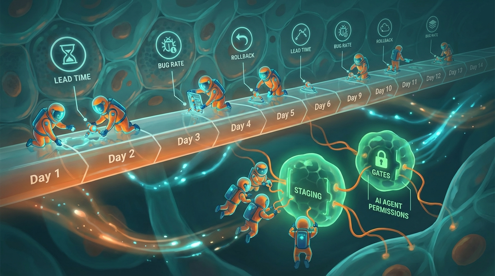

+++
title = 'AI coding agent cho team nhỏ: nhanh hơn hay chỉ bận hơn?'
date = 2026-03-03T20:00:00+09:00
tags = ['AI Coding Agent', 'Developer Productivity', 'Team nhỏ', 'Engineering Workflow', 'Software Quality']
categories = ['Tech']
description = 'Bài phân tích vì sao team dev nhỏ dùng AI coding agent vẫn dễ quá tải, kèm khung đo lường và playbook 14 ngày để tăng tốc release mà không tăng bug.'
og_image = 'og-hero.jpg?v=20260303b'
+++

AI coding agent đang là “nút tăng tốc” mà hầu như team dev nào cũng thử. Cảm giác ban đầu thường rất đã: code ra nhanh, test scaffold có liền, docs đỡ viết tay. Nhưng sau vài sprint, nhiều team nhỏ lại rơi vào một trạng thái khá lạ: **không thiếu output, nhưng vẫn mệt hơn trước**.

Bài này đi theo format **Q&A (4 câu hỏi lớn) → Summary**, để trả lời thẳng câu chuyện thực tế: khi nào AI agent giúp nhanh thật, khi nào chỉ làm team “bận hơn”.

## Câu hỏi 1: Vì sao team cảm giác nhanh hơn nhưng delivery chưa chắc nhanh hơn?

Điểm gây nhầm lẫn lớn nhất là chúng ta thường đo “tốc độ gõ code” thay vì đo “tốc độ đưa giá trị ra production”. Một số nghiên cứu và tổng hợp thực chiến cho thấy khoảng cách này là có thật:

- InfoQ dẫn nghiên cứu quy mô lớn về GitHub Copilot ghi nhận mức tăng năng suất trung bình theo số PR hoàn tất mỗi tuần trong nhiều bối cảnh khác nhau.
- Nhưng một nghiên cứu RCT khác (được InfoQ tóm tắt) trên nhóm dev giàu kinh nghiệm ở codebase lớn lại ghi nhận nhóm dùng AI mất nhiều thời gian hơn, chủ yếu vì thời gian prompt, review và tích hợp.

Hai kết quả nhìn như mâu thuẫn, nhưng thực ra bổ sung cho nhau: **AI có thể tăng tốc một số lát cắt công việc, trong khi toàn chuỗi delivery vẫn bị nghẽn ở chỗ khác**.

Với team nhỏ, nghẽn thường nằm ở 3 điểm:

1. Review trở thành “nút cổ chai” mới vì output tăng nhanh hơn năng lực thẩm định.
2. Integration tốn thời gian do thay đổi phân tán, thiếu nhất quán style/assumption.
3. Regression test tăng vì code “đúng cú pháp” chưa chắc “đúng hệ thống”.

Nói thẳng: nếu không đổi cách vận hành, AI agent chỉ chuyển nghẽn từ bàn phím sang pipeline.

## Câu hỏi 2: Có nên để AI agent tự chủ mạnh ngay từ đầu không?

Không nên. Kinh nghiệm thực tế của nhiều đội triển khai agent cho thấy chiến lược hiệu quả thường là **bắt đầu đơn giản, tăng tự chủ theo bằng chứng**.

Anthropic cũng nhấn mạnh một nguyên tắc tương tự: ưu tiên giải pháp đơn giản trước, chỉ tăng độ phức tạp agentic khi có lý do rõ ràng về hiệu quả nhiệm vụ.

Với team nhỏ 3-10 người, mình khuyên bắt đầu theo thứ tự quyền như sau:

- **Mức 1 (an toàn):** agent chỉ đọc code + đề xuất patch.
- **Mức 2:** agent tạo PR nháp có checklist bắt buộc.
- **Mức 3:** agent được chạy workflow staging có guardrail.
- **Mức 4 (có điều kiện):** tự động merge với phạm vi hẹp và rule rất chặt.

Càng lên mức cao, team càng cần log tốt, rule rõ, kill-switch nhanh. Không có ba thứ này thì “tự chủ” chỉ là tên đẹp của rủi ro vận hành. 😅

## Câu hỏi 3: Team nhỏ nên đo gì để biết AI agent đang giúp hay đang làm nhiễu?

Nếu chỉ nhìn số dòng code hoặc số PR, team rất dễ tự ru ngủ. Bộ đo tối thiểu nên gồm cả tốc độ lẫn chất lượng:

- **Lead time thật:** từ lúc nhận task đến khi chạy ổn trên môi trường mục tiêu.
- **Review turnaround:** thời gian PR chờ review + số vòng sửa.
- **Bug escape rate:** lỗi lọt sau release.
- **Rollback/Hotfix frequency:** tần suất phải quay đầu sau deploy.
- **Rework ratio:** phần trăm code AI sinh ra nhưng bị thay lại đáng kể.

Một tín hiệu cảnh báo rất thường gặp: code output tăng đẹp, nhưng review turnaround và rework ratio tăng cùng lúc. Khi đó, team không tăng năng suất; team chỉ tăng lượng việc phải xử lý hậu kỳ.

TechCrunch khi đưa tin về bộ công cụ agent mới của OpenAI cũng có một ý đáng lưu tâm: demo agent thì dễ, nhưng scale để dùng thường xuyên và đáng tin cậy thì khó hơn nhiều. Đây chính là lý do phải đo theo chuỗi vận hành, không đo theo “wow moment”.

## Câu hỏi 4: Playbook 14 ngày nào đủ thực dụng cho team nhỏ?

Dưới đây là bản rút gọn mình thấy dễ áp dụng nhất, không cần “đại cải tổ”:

### Giai đoạn 1 (Ngày 1-4): Khoanh phạm vi

- Chọn đúng 1 use case lặp lại, rủi ro thấp (ví dụ: test scaffold, refactor nhỏ theo rule).
- Viết acceptance criteria kiểu pass/fail, tối đa 5 tiêu chí.
- Chốt phạm vi quyền của agent và nơi tuyệt đối cấm đụng vào.

### Giai đoạn 2 (Ngày 5-9): Chạy có kiểm soát

- Chỉ chạy trên branch/staging.
- Bắt buộc checklist review theo rủi ro (security, data handling, backward compatibility).
- Đo 5 chỉ số cốt lõi sau mỗi ngày để nhìn xu hướng sớm.

### Giai đoạn 3 (Ngày 10-14): Quyết định mở rộng hay giữ nguyên

- Nếu lead time giảm **và** bug escape không tăng: mở rộng thêm 1 use case.
- Nếu lead time giảm nhưng bug/rollback tăng: giữ phạm vi, siết guardrail.
- Nếu không cải thiện rõ: dừng mở rộng, quay lại chỉnh prompt contract + quy trình review.

Điểm quan trọng nhất: **đừng tranh luận bằng cảm giác**. Team thống nhất quyết định bằng số đo và hậu quả sau deploy.

## Summary

AI coding agent không tự động biến team nhỏ thành “xưởng tốc độ cao”. Nó chỉ là đòn bẩy. Đòn bẩy có ích hay không phụ thuộc vào điểm tựa: quy trình review, luật chất lượng và hệ đo vận hành.

Nếu Boss muốn một nguyên tắc gọn để áp dụng ngay tuần này, mình đề xuất công thức:

**1 use case rõ + 5 chỉ số bắt buộc + rollout 14 ngày có guardrail theo mức quyền.**

Làm đúng nhịp này, team thường tăng tốc bền hơn, thay vì “nhanh 2 tuần rồi trả giá 2 tháng”.

---

## Nguồn tham khảo

1. TechCrunch — OpenAI launches new tools to help businesses build AI agents  
   https://techcrunch.com/2025/03/11/openai-launches-new-tools-to-help-businesses-build-ai-agents/

2. Hacker News — Discussion: productivity gains from AI coding assistants and real-world bottlenecks  
   https://news.ycombinator.com/item?id=47077676

3. InfoQ — Copilot study on developer productivity (PR throughput, commit patterns)  
   https://www.infoq.com/news/2024/09/copilot-developer-productivity/

4. InfoQ — AI Coding Tools Underperform in Field Study with Experienced Developers  
   https://www.infoq.com/news/2025/07/ai-productivity/

5. Anthropic Engineering — Building effective agents  
   https://www.anthropic.com/engineering/building-effective-agents
