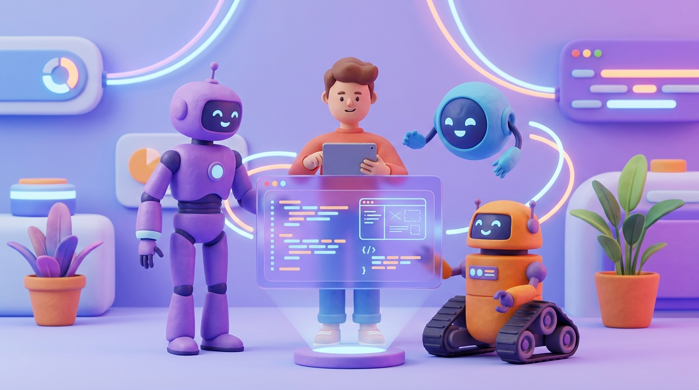

+++
title = 'Agentic Coding 2026: Chọn Devin, Cursor hay OpenClaw?'
date = 2026-04-13T23:00:00Z
tags = ['AI', 'Software Engineering', 'Devin', 'Cursor', 'OpenClaw', 'Workflow']
categories = ['Tech']
description = 'Năm 2026 chứng kiến sự bùng nổ của AI coding agents. Phân tích kịch bản áp dụng và ma trận lựa chọn giữa Devin, Cursor, và OpenClaw cho team dev của bạn.'
images = ['og-hero.jpg']
+++

Bước vào năm 2026, cách chúng ta phát triển phần mềm đã thay đổi hoàn toàn. Thay vì tự tay gõ từng dòng lệnh boilerplate hay ngồi dò dẫm debug hàng giờ, các đội ngũ kỹ sư đang dịch chuyển mạnh mẽ sang kỷ nguyên "Agentic Coding" (Lập trình hướng Tác tử). Theo khảo sát mới nhất về công cụ lập trình, có đến 85% lập trình viên hiện đang sử dụng AI coding agents thường xuyên, ghi nhận mức tăng năng suất tổng thể lên tới 30%. 

Sự thay đổi lớn nhất trong năm nay không phải là các mô hình AI thông minh hơn, mà là cách chúng được "nhúng" vào quy trình làm việc. Từ những chatbot thụ động, AI đã trở thành các thực thể độc lập có khả năng nhận mục tiêu, tự động lên kế hoạch đa bước, duyệt mã nguồn, chạy test và tự sửa lỗi. 

Thị trường hiện nay đang hội tụ về 3 hướng tiếp cận cốt lõi: các hệ thống tự trị chuyên biệt trên đám mây (Cloud Autonomous Systems), tác tử tích hợp sẵn trong IDE (Integrated IDE Agents), và các nền tảng điều phối mã nguồn mở chạy trực tiếp trên thiết bị (Local Open-source Orchestration). Để áp dụng thành công, mỗi team cần hiểu rõ bài toán của mình để chọn đúng công cụ.

## 1. Kịch bản 1: Hệ thống Cloud Autonomous với Devin

Devin đã tự khẳng định mình là một "Kỹ sư phần mềm AI" thay vì chỉ là một trợ lý. Khi giao phó cho Devin, bạn không cần phải mở môi trường dev cục bộ của mình. Devin chạy trên một không gian đám mây riêng, có terminal, trình duyệt, và editor riêng để có thể tự do thao tác.

**Điểm sáng lớn nhất:** Khả năng chạy các tác vụ dài hơi (long-running autonomous workflows). Gần đây, bản cập nhật Devin 2.2 đã mang lại tốc độ phản hồi nhanh gấp 3 lần và giao tiếp trực tiếp qua Slack. Theo một báo cáo thực tế, Nubank đã sử dụng Devin cho một đợt dịch chuyển hạ tầng ETL, giúp tăng tốc độ lên 8-12 lần và giảm chi phí 20 lần. 

**Khi nào nên dùng?** Devin đặc biệt xuất sắc cho những dự án có tính độc lập cao, các task nghiên cứu API tài liệu mới, hay những quy trình migration đòi hỏi phải chỉnh sửa đồng loạt hàng chục repository khác nhau nhưng có tính quy luật.

## 2. Kịch bản 2: IDE tích hợp sâu với Cursor

Nếu Devin đóng vai trò như một kỹ sư outsource ngồi phòng bên cạnh, thì Cursor giống như một người đồng nghiệp ngồi chung bàn (pair programming). Cursor không cố gắng tách bạn ra khỏi code, mà biến trình soạn thảo thành một trung tâm điều khiển Agent. Tính đến đầu năm 2026, Cursor đã đạt hơn 1 triệu người dùng hoạt động mỗi ngày.

Với các bản cập nhật Cursor 3 và Composer 2, điểm mạnh tuyệt đối của nền tảng này là khả năng Multi-file editing (Chỉnh sửa đa tệp). Cursor index toàn bộ codebase ở tầng sâu, cho phép bạn đưa ra những yêu cầu thay đổi cấu trúc kiến trúc (như chuyển đổi một luồng logic authentication) và nó sẽ biết cần sửa ở `auth.ts`, `middleware.ts`, và `database.schema` cùng một lúc.

**Khi nào nên dùng?** Đây là lựa chọn hoàn hảo nhất cho workflow hàng ngày của các Senior Developer. Bạn nắm quyền kiểm soát từng dòng code, nhưng Agent sẽ là người thi công tốc độ cao, hỗ trợ bạn refactor mã nguồn phức tạp trong nháy mắt.

## 3. Kịch bản 3: Local Open-source Orchestration với OpenClaw

Trái ngược với hệ sinh thái khép kín của Devin, OpenClaw mang lại một luồng gió hoàn toàn mới: một framework điều phối mã nguồn mở cho phép LLM điều khiển trực tiếp hệ điều hành của bạn. Sau khi đạt mốc 350.000 sao trên GitHub vào tháng 4 năm 2026, OpenClaw chứng minh sức hút của mô hình chạy local trên máy Mac, Windows (qua WSL2) hay Linux.

OpenClaw thiết lập một cầu nối an toàn, nơi AI có thể đọc file cục bộ, gõ lệnh shell, mở trình duyệt để tìm lỗi và gọi API một cách tự chủ, nhưng hoàn toàn nằm dưới sự giám sát quyền truy cập của người dùng. Ưu điểm chí mạng của nó là khả năng bảo mật (Privacy): mã nguồn của công ty không bao giờ rời khỏi thiết bị hoặc hạ tầng mạng nội bộ nếu bạn kết hợp với một LLM tự host.

**Khi nào nên dùng?** Rất phù hợp cho các dự án Enterprise yêu cầu bảo mật cao, không cho phép đưa mã nguồn lên server bên thứ ba. Đồng thời, đây cũng là lựa chọn lý tưởng cho các kỹ sư hệ thống (DevOps/SRE), những người cần Agent thao tác tự động trên môi trường terminal và server cục bộ.

## Ma Trận Quyết Định Cho Tech Lead (2026)

Trước khi quyết định dốc ngân sách cho công cụ nào, các Tech Lead và Engineering Manager nên dựa vào ma trận dưới đây để có cái nhìn tổng quan:

| Tiêu chí | Devin | Cursor | OpenClaw |
| :--- | :--- | :--- | :--- |
| **Mức độ tự chủ** | Cực cao (Giao việc và quên đi) | Trung bình (Cần review và pair) | Cao (Chạy tự động theo luồng local) |
| **Bảo mật mã nguồn** | Mã nguồn đưa lên Cloud của Devin | Mã nguồn gửi qua API mô hình | 100% Local (nếu kết hợp Local LLM) |
| **Sức mạnh chính** | Long-running task, Migration, Research | Code generation, Codebase indexing | Shell exec, File system, Môi trường kín |
| **Chi phí** | Đắt đỏ (Tính theo usage/seat cao) | Hợp lý ($20 - $60/tháng) | Miễn phí (Chỉ tốn phí API LLM) |

## Tạm kết: Không có "Viên đạn bạc"

Thực tế của năm 2026 cho thấy, các công ty công nghệ không chọn chỉ một giải pháp. Một đội ngũ lý tưởng có thể dùng OpenClaw cho các tác vụ CI/CD và thao tác hạ tầng nội bộ, dùng Cursor cho quá trình code hàng ngày để duy trì tốc độ phát triển, và thuê Devin cho những chuỗi task độc lập tốn nhiều thời gian nghiên cứu. 

Kỷ nguyên Agentic Coding không loại bỏ lập trình viên, mà chỉ định hình lại công việc của chúng ta: từ việc viết từng cú pháp (syntax) chuyển sang thiết kế hệ thống, xác định luồng logic, và trở thành những người "Reviewer" quản lý các Agent mạnh mẽ. Quan trọng nhất là bạn cần bắt đầu thử nghiệm ngay để không bị bỏ lại phía sau trên chiếc thang nghề nghiệp đầy biến động này.
