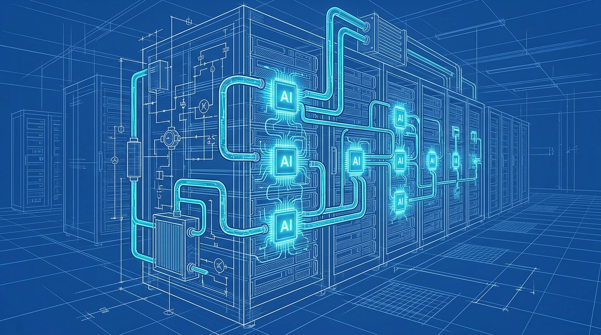
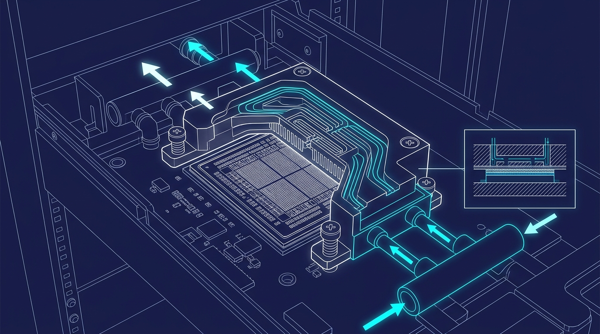

+++
title = 'Tản nhiệt lỏng AI Data Center: Mỏ vàng đầu tư 2026'
date = 2026-03-26T22:50:00+00:00
tags = ['AI', 'Infrastructure', 'Liquid Cooling', 'Investing']
categories = ['Investment']
description = 'Khi giới hạn tản nhiệt khí bị phá vỡ, tản nhiệt lỏng cho Data Center AI trở thành điểm nghẽn và cơ hội đầu tư hạ tầng tỷ đô không thể bỏ lỡ trong năm 2026.'
images = ['og-hero.jpg']
+++

Thế giới đang đổ dồn sự chú ý vào các thế hệ chip AI mới nhất. Nhưng đằng sau sức mạnh tính toán khổng lồ ấy là một bài toán vật lý đang thách thức toàn bộ ngành công nghiệp: Nhiệt lượng. Ở thời điểm 2026, các rack máy chủ AI tiêu chuẩn đã vượt mốc 30-40 kW, khiến hệ thống tản nhiệt khí (air cooling) truyền thống chính thức "giương cờ trắng". Lời giải duy nhất lúc này? Tản nhiệt lỏng (Liquid Cooling) – và đây đang là mỏ vàng mới cho giới đầu tư sành sỏi.

## Scenario 1: Kỷ nguyên "khát" năng lượng và sự sụp đổ của tản nhiệt khí

Sự bùng nổ của trí tuệ nhân tạo tạo sinh (Generative AI) đã thay đổi hoàn toàn cục diện của ngành công nghiệp trung tâm dữ liệu. Các mô hình ngôn ngữ lớn (LLM) đòi hỏi một lượng điện năng khổng lồ để huấn luyện và vận hành. 

Tại Việt Nam, các chuyên gia liên tục cảnh báo về áp lực điện năng khổng lồ từ các trung tâm dữ liệu AI [1]. Điển hình, dự án Data Center AI trị giá 2,1 tỷ USD dự kiến khởi công tại khu vực TP.HCM đòi hỏi hạ tầng tiêu thụ năng lượng ở mức chưa từng có trong lịch sử ngành công nghệ nước nhà [2]. Sự xuất hiện của các siêu dự án này khẳng định tham vọng gia nhập chuỗi cung ứng AI toàn cầu, nhưng đồng thời cũng phơi bày những giới hạn nghiêm trọng về hạ tầng vật lý.

Vấn đề cốt lõi không chỉ là việc hệ thống lấy đâu ra điện để chạy, mà là cách chúng ta xử lý phần năng lượng bị hao phí biến thành nhiệt. Tản nhiệt khí truyền thống đã chạm trần vật lý: khi thổi một lượng gió khổng lồ vào một rack công suất 40 kW, hiệu năng tiêu tán nhiệt đơn giản là không đủ nhanh. Hậu quả là các linh kiện bị quá nhiệt, buộc chip phải tự động hạ xung nhịp (thermal throttling), làm suy giảm hiệu năng tính toán và gây lãng phí hàng triệu đô la tiền đầu tư phần cứng. Việc duy trì "trung tâm dữ liệu xanh" giờ đây phụ thuộc hoàn toàn vào những công nghệ làm mát tiên tiến hơn.

## Scenario 2: Sự trỗi dậy của hạ tầng làm mát lỏng (Direct-to-Chip & Immersion)

Các phương pháp làm mát bằng chất lỏng trực tiếp (Direct-to-Chip) và ngâm (Immersion Cooling) không còn là món đồ chơi thử nghiệm của các viện nghiên cứu vật liệu. Bước sang năm 2026, chúng đã trở thành yêu cầu bắt buộc, mang tính sống còn đối với mọi Data Center chạy AI hiệu năng cao.

Về nguyên lý cơ bản, nước và các dung dịch chuyên dụng có khả năng dẫn nhiệt tốt hơn không khí gấp hàng nghìn lần. Công nghệ Direct-to-Chip bơm chất lỏng đi qua các tấm làm mát (cold plates) áp sát trực tiếp vào bề mặt của CPU và GPU, cuốn trôi nhiệt lượng ngay tại nguồn. Trong khi đó, Immersion Cooling thậm chí còn triệt để hơn: nhúng toàn bộ bo mạch chủ vào một bể chứa dung môi không dẫn điện. Điều này cho phép các kiến trúc sư thiết kế mật độ rack dày đặc hơn rất nhiều mà vẫn giữ chip ở nhiệt độ lý tưởng, tiết kiệm không gian vật lý lên tới 60%.

Quy mô của thị trường tản nhiệt này đang chứng kiến mức tăng trưởng bùng nổ vượt ngoài mọi dự báo trước đó. Theo các báo cáo phân tích mới nhất, thị trường làm mát bằng chất lỏng cho trung tâm dữ liệu dự kiến tăng trưởng phi mã. So với mức chỉ gần 3 tỷ USD vào năm 2025, quy mô thị trường được dự báo sẽ chạm mốc 7 tỷ USD trong tương lai gần và có khả năng lên tới 29,46 tỷ USD vào năm 2033 với tốc độ tăng trưởng kép hàng năm (CAGR) vượt trên 20% [3].

## Scenario 3: Sự dịch chuyển dòng tiền thông minh của giới tinh hoa tài chính

Sự chú ý của giới đầu tư đang thay đổi nhanh chóng. Thay vì tiếp tục đua mua cổ phiếu của những nhà sản xuất chip như Nvidia hay AMD – vốn đang neo ở mức định giá (P/E) "trên mây" – các nhà đầu tư tổ chức đang ráo riết săn lùng những doanh nghiệp cung cấp "xẻng và cuốc" cho cơn sốt đào vàng AI. Đó chính là các công ty chuyên về hạ tầng điện và tản nhiệt.

Đây là một chiến lược đầu tư mang tính phòng thủ thông minh. Dù cuộc chiến thị phần sản xuất chip AI thuộc về ai, thì mọi con chip đều sẽ cần đến điện năng và hệ thống làm mát.

Những cái tên sừng sỏ như Vertiv (VRT), Eaton (ETN), nVent, và Modine Manufacturing đang chứng kiến tốc độ tăng trưởng đơn hàng phi mã nhờ năng lực cung cấp các giải pháp làm mát lỏng toàn diện. Mạng lưới đối tác của họ gắn chặt với các ông lớn cung cấp dịch vụ đám mây (hyperscalers) như AWS, Microsoft Azure hay Google Cloud. Đáng chú ý, xu hướng này không chỉ giới hạn ở các công ty công nghệ phần cứng. Ngay cả những tập đoàn hóa chất và xử lý nước như Ecolab (ECL) cũng nhanh chân thâu tóm CoolIT Systems để đón đầu xu hướng "Cooling-as-a-Service", một bước đi chiến lược nhằm chuyển đổi mô hình kinh doanh sang bán giải pháp trọn gói dài hạn [4].

## Decision Matrix: Chiến lược giải ngân cho nhà đầu tư (2026)

Dựa trên những diễn biến vĩ mô và vi mô của thị trường hạ tầng AI, dưới đây là ma trận đánh giá cơ hội và rủi ro chi tiết khi phân bổ vốn vào nhóm ngành tản nhiệt lỏng:

### 1. Ngắn hạn (1-2 năm): Linh kiện Direct-to-Chip và CDU
- **Cơ hội:** Động lực tăng trưởng mạnh mẽ đến từ chu kỳ nâng cấp khẩn cấp hạ tầng cũ tại các Data Center hiện hữu (brownfield projects). Các doanh nghiệp có năng lực cung cấp số lượng lớn bộ phân phối chất làm mát (Coolant Distribution Unit - CDU) và tấm làm mát (cold plates) sẽ ghi nhận sự bùngড়ান্ত nổ về doanh thu gần như ngay lập tức. Đây là mảng dễ thương mại hóa và áp dụng nhanh nhất. Vertiv và Modine là những ví dụ điển hình cho nhóm này.
- **Rủi ro:** Cạnh tranh về giá cả sẽ ngày càng gắt gao khi các nhà sản xuất OEM từ khu vực châu Á (đặc biệt là Đài Loan và Trung Quốc) nhảy vào thị trường, làm biên lợi nhuận bị thu hẹp đáng kể.

### 2. Trung hạn (3-5 năm): Immersion Cooling và Heat Reuse
- **Cơ hội:** Các doanh nghiệp sở hữu bằng sáng chế về công nghệ ngâm (Immersion Cooling) 2 pha và có năng lực triển khai hệ thống tái sử dụng nhiệt (Heat Reuse) truyền nhiệt thừa vào lưới điện sưởi ấm dân dụng sẽ trở thành "con cưng" của làn sóng vốn quỹ xanh (ESG). Việc chuyển đổi từ trung tâm dữ liệu phát thải cao sang mô hình kinh tế tuần hoàn sẽ mang lại lợi thế cạnh tranh khổng lồ.
- **Rủi ro:** Công nghệ này đòi hỏi chi phí R&D cực cao, cùng với đó là những rào cản quy định về môi trường khi xử lý các chất làm mát chuyên dụng (như nhóm hóa chất fluorochemicals PFAS, vốn đang chịu sự giám sát nghiêm ngặt từ các cơ quan bảo vệ môi trường toàn cầu).

### 3. Dài hạn (Trên 5 năm): Kiến trúc làm mát tích hợp quang học
- **Cơ hội:** Giai đoạn này thuộc về các công ty công nghệ cao tích hợp khả năng làm mát lỏng trực tiếp vào các mô-đun quang học (liquid-cooled optics), giải quyết triệt để nút thắt cổ chai về băng thông truyền tải dữ liệu giữa các cụm GPU khổng lồ.
- **Rủi ro:** Sự xuất hiện của các kiến trúc chip điện toán lượng tử (quantum computing) hoặc chip quang học (photonic chips) tiêu thụ siêu ít năng lượng có thể làm thay đổi hoàn toàn cục diện, khiến hệ thống tản nhiệt khổng lồ hiện tại trở nên dư thừa.

## Tạm kết

Làn sóng đầu tư vào trí tuệ nhân tạo năm 2026 đã vươn xa khỏi biên giới của những con chip silicon bé nhỏ. Hạ tầng vật lý, và đặc biệt là tản nhiệt lỏng, chính là "mạch máu" quyết định sự sống còn và khả năng mở rộng của các siêu máy tính hiện đại. Đối với các nhà đầu tư, việc định vị dòng vốn thông minh vào "hệ sinh thái hỗ trợ" này không chỉ giúp giảm thiểu đáng kể rủi ro từ sự biến động định giá của các công ty thuần AI, mà còn đem lại tiềm năng lợi nhuận bền vững khi quy mô các trung tâm dữ liệu tiếp tục phình to không ngừng nghỉ trong thập kỷ tới.

---
**Nguồn tham khảo:**
- [1] VnEconomy - Biến cơn khát điện tại trung tâm dữ liệu AI thành động lực thúc đẩy chuyển dịch năng lượng xanh (https://vneconomy.vn/bien-con-khat-dien-tai-trung-tam-du-lieu-ai-thanh-dong-luc-thuc-day-chuyen-dich-nang-luong-xanh.htm)
- [2] CafeF - TP.HCM dự kiến xây trung tâm dữ liệu AI 2,1 tỷ USD (https://cafef.vn/tphcm-xay-trung-tam-du-lieu-ai-21-ti-usd-188260311131555465.chn)
- [3] ConnectMoney - Data Center Liquid Cooling Market Surge (https://www.connectmoney.com/stories/ai-boom-fuels-surge-in-data-center-liquid-cooling-market/)
- [4] Zacks - Ecolab (ECL) To Boost Data Center AI Cooling Platform With CoolIT Acquisition (https://www.zacks.com/stock/news/2888157/ecl-to-boost-data-center-ai-cooling-platform-with-coolit-acquisition)
