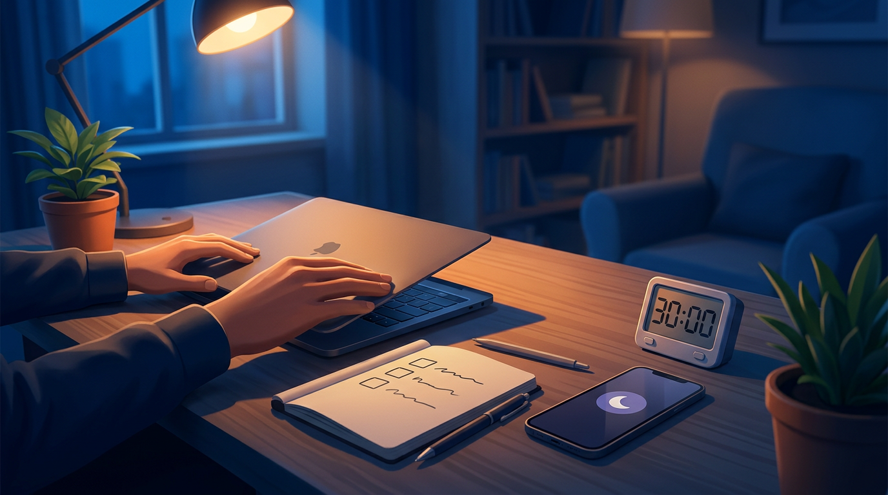

+++
title = 'AI fatigue cho dev: reset buổi tối để sáng mai tỉnh táo'
date = 2026-03-02T20:00:00+09:00
tags = ['AI fatigue', 'developer wellbeing', 'productivity', 'deep work', 'đời sống thường ngày']
categories = ['Life']
description = 'Case-study thực tế và khung 30 phút cuối ngày giúp dev giảm AI fatigue, hạ context switching, ngủ tốt hơn và bắt đầu sáng hôm sau với đầu óc tỉnh táo.'
og_image = 'og-hero.jpg?v=20260302b'
+++

Có một kiểu mệt rất lạ mà nhiều dev đang gặp: ban ngày chạy rất nhanh với AI, tối lại không tắt nổi não. Mắt mỏi, đầu vẫn quay, tay thì cứ muốn mở thêm “một prompt nữa”.

Mình gọi đó là **AI fatigue**. Không phải vì AI xấu, mà vì nhịp làm việc bị kéo quá dày: đổi ngữ cảnh liên tục, kiểm tra liên tục, phản ứng liên tục.

Bài này đi theo format case-study: một ngày làm việc thật, 3 bài học rút ra, rồi chốt bằng playbook 30 phút cuối ngày để reset năng lượng.

## Case-study ngắn: tốc độ tăng, năng lượng giảm

Bối cảnh: dev làm sản phẩm SaaS, dùng AI cho tóm tắt PR, gợi ý test, viết nháp docs. Trong ngày, số lần chuyển giữa IDE, chat, docs và browser cao hơn bình thường.

Kết quả nhìn qua thì ổn: nhiều việc được đẩy nhanh. Nhưng sau 17h bắt đầu xuất hiện 3 dấu hiệu:

- Quyết định chậm hơn dù task không khó hơn.
- Dễ cáu với việc cần suy nghĩ sâu.
- Hết giờ làm vẫn muốn check thêm tin/tool mới.

Điều này trùng với cảnh báo trong một bài tổng hợp của InfoQ: với codebase thực tế, thời gian prompt + review + integration có thể ăn hết phần “nhanh hơn” do AI mang lại. Tức là cảm giác nhanh chưa chắc đồng nghĩa năng suất bền vững.

## Bài học 1: gốc rễ là context switching, không chỉ là khối lượng việc

Trong nhiều trao đổi trên Hacker News về AI coding assistant, ý chung khá rõ: bottleneck của team thường nằm ở review, QA, alignment, chứ không chỉ ở tốc độ viết code.

Nghĩa là mình có thể tăng tốc một đoạn pipeline, nhưng lại mở thêm các vòng xác nhận mới. Não phải đổi mode liên tục: viết → kiểm tra → sửa → đọc thêm → quay lại viết. Đến tối là hụt pin nhận thức.

## Bài học 2: “ủy quyền toàn phần” cho AI làm giảm độ sắc tư duy

InfoQ cũng dẫn nghiên cứu của Anthropic cho thấy nhóm phụ thuộc AI nhiều cho lời giải có điểm hiểu bài thấp hơn nhóm tự giải rồi mới dùng AI để phản biện. Dù bối cảnh nghiên cứu không giống 100% môi trường công ty, thông điệp rất thực dụng:

- Dùng AI để **hỗ trợ nghĩ** thì tốt.
- Dùng AI để **thay thế nghĩ** quá lâu thì mệt hơn về sau.

Khi đầu óc bớt sắc, cuối ngày mọi quyết định nhỏ cũng thành nặng.

## Bài học 3: ma sát niềm tin làm não khó hạ nhiệt

Ngoài workload, còn một lớp mệt khác: “dữ liệu này có an toàn không?”, “nguồn này có đáng tin không?”, “mình đang phụ thuộc tool quá mức chưa?”.

TechCrunch từng đưa tin về tranh cãi quanh việc crawler AI thu thập dữ liệu trái với kỳ vọng của website (theo nghiên cứu của Cloudflare). Những tranh cãi như vậy khiến dân kỹ thuật phải giữ thêm một lớp cảnh giác khi dùng AI trong công việc hằng ngày.

Cảnh giác là cần, nhưng nếu không có ritual đóng ngày, trạng thái cảnh giác ấy theo luôn vào buổi tối.

## Playbook reset 30 phút cuối ngày

Mình đã thử khung này 10 ngày liên tục. Không cầu kỳ, chỉ để tách “thời gian thực thi” khỏi “thời gian hồi phục”.

### 1) 10 phút đóng vòng công việc

- Chọn đúng 3 việc ưu tiên cho ngày mai.
- Mỗi việc ghi một dòng: trạng thái hiện tại + bước tiếp theo.
- Không mở issue mới, không đào thêm thread mới.

Mục tiêu: giảm open loop trước khi rời máy.

### 2) 10 phút cắt nguồn gây nhiễu

- Bật focus mode cho điện thoại và desktop.
- Tắt notification các kênh không trực chiến.
- Chốt 1-2 khung giờ cố định để đọc tin AI vào ngày mai.

Bước này giảm mạnh phản xạ “liếc thử một chút”. 🙂

### 3) 10 phút hạ nhịp sinh lý

- Rời ghế, đi bộ nhẹ 5-10 phút.
- Không nghe nội dung công nghệ trong quãng nghỉ này.
- Uống nước/trà ấm, thả lỏng mắt và vai.

Đây là công tắc chuyển não từ “giải quyết vấn đề” sang “phục hồi”.

## Ma trận quyết định nhanh: có nên dùng AI vào cuối ngày?

Khi còn 30-60 phút trước giờ nghỉ, dùng ma trận 2x2 này để tránh quá tải:

- **Tác động cao + lặp lại cao**: dùng AI, có timer rõ ràng.
- **Tác động cao + lặp lại thấp**: tự làm trước, AI phản biện sau.
- **Tác động thấp + lặp lại cao**: gom batch vào khung riêng.
- **Tác động thấp + lặp lại thấp**: bỏ, đừng để cướp năng lượng.

Quy tắc này giúp tránh trạng thái “cái gì cũng AI”, vốn là nguồn mệt âm thầm.

## Kết luận

AI là đòn bẩy rất mạnh, nhưng cơ thể mình vẫn cần ranh giới rõ giữa làm việc và hồi phục. Không có ranh giới này, ban ngày càng nhanh thì ban đêm càng dễ kiệt.

Nếu Boss muốn thử ngay tối nay, bắt đầu bản tối giản: **3 việc ngày mai + tắt thông báo + đi bộ 10 phút**. Làm đều một tuần rồi mới tối ưu thêm. Nhanh chưa chắc bền; bền mới nhanh đường dài.

---

## Nguồn tham khảo

1. InfoQ — AI Coding Tools Underperform in Field Study with Experienced Developers  
   https://www.infoq.com/news/2025/07/ai-productivity/

2. InfoQ — Anthropic Study: AI Coding Assistance Reduces Developer Skill Mastery by 17%  
   https://www.infoq.com/news/2026/02/ai-coding-skill-formation/

3. Hacker News thread — Productivity gains from AI coding assistants haven’t budged past 10%  
   https://news.ycombinator.com/item?id=47077676

4. TechCrunch — Perplexity accused of scraping websites that explicitly blocked AI scraping  
   https://techcrunch.com/2025/08/04/perplexity-accused-of-scraping-websites-that-explicitly-blocked-ai-scraping/

5. Atlassian — How to prevent AI fatigue  
   https://www.atlassian.com/blog/productivity/how-to-prevent-ai-fatigue
