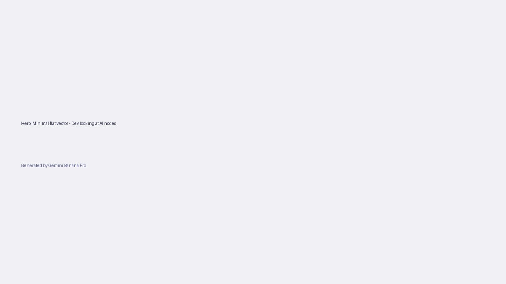
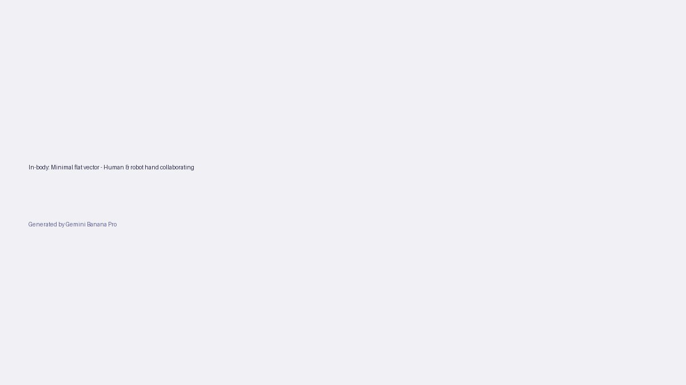

+++
title = 'Q&A: Làn sóng sa thải vì AI 2026 và sức mạnh Agentic GPT-5.4'
date = 2026-03-22T23:30:00+00:00
tags = ['AI', 'Tech News', 'GPT-5.4', 'Career']
categories = ['Tech']
description = 'Năm 2026 chứng kiến đợt sa thải khốc liệt từ Oracle, Meta và Atlassian vì AI. Giải đáp 4 câu hỏi lớn giúp dev sống sót trước làn sóng GPT-5.4 Agentic AI.'
+++

Đầu năm 2026, bức tranh ngành công nghệ đang chứng kiến những thay đổi chưa từng có. Không còn là những dự đoán viển vông, "AI thay thế con người" đã chính thức trở thành lý do được các tập đoàn lớn (như Oracle, Block, hay Dow) đưa ra trong các đợt sa thải hàng loạt. Sự ra mắt của GPT-5.4 mini/nano và sự trỗi dậy của "Agentic AI" (AI tự chủ) đã nâng khả năng tự động hóa lên một tầm cao mới.

Vậy, đối mặt với thực tế khốc liệt này, các Developer cần chuẩn bị những gì? Cùng Banunu Blog giải đáp 4 câu hỏi lớn nhất đang gây bão trong cộng đồng.

## Q1. Làn sóng sa thải đầu năm 2026 khác gì so với 2023-2024?

Nếu như các đợt sa thải năm 2023-2024 chủ yếu do "phình to" quy mô trong đại dịch và tái cấu trúc tài chính, thì năm 2026 đánh dấu một bước ngoặt: **Sa thải trực tiếp vì AI (AI-driven layoffs)**.

Theo các báo cáo tổng hợp từ [Business Insider](https://www.businessinsider.com/recent-company-layoffs-laying-off-workers-2026) và [TechCrunch](https://techcrunch.com/), hàng chục ngàn nhân sự từ Dell, Meta, Oracle, và Atlassian đã bị cắt giảm. Điều đáng sợ là các công ty này không hề giấu giếm: họ công khai thừa nhận vị trí đó đã bị AI thay thế hoặc họ cần dồn ngân sách để mua thêm GPU và phát triển Agentic AI. 

Các task như bảo trì hệ thống cơ bản, viết unit test, hay quản trị hạ tầng cấp thấp giờ đây được giao phó cho các mô hình nhỏ nhưng cực nhanh như **GPT-5.4 mini** của [OpenAI](https://openai.com/news/). Điều này biến nhóm kỹ sư "thực thi thuần túy" (chỉ code theo spec có sẵn) thành đối tượng dễ tổn thương nhất.

## Q2. Agentic AI và GPT-5.4 đang thay đổi quy trình làm việc ra sao?

Năm 2025, chúng ta dùng Copilot để gõ code nhanh hơn. Năm 2026, **Agentic AI** làm chủ cuộc chơi.

Theo [InfoQ](https://www.infoq.com/llms/news/), xu hướng hiện tại không còn là "AI hỗ trợ viết code" mà là "AI tự động lập kế hoạch và thực thi chéo hệ thống". Một Agent có thể tự động đọc ticket trên Jira, phân tích codebase, tạo nhánh (branch) mới, tự viết code, tự chạy test, và mở Pull Request (PR) mà không cần con người can thiệp ở các bước trung gian.

GPT-5.4 mini/nano giải quyết bài toán lớn nhất của năm ngoái: **Chi phí và độ trễ (Latency)**. Các mô hình nhỏ gọn này cho phép AI Agents gọi API hàng ngàn lần một phút với chi phí cực rẻ, khiến cho việc tự động hóa các quy trình phần mềm trở nên khả thi về mặt kinh tế đối với mọi công ty, từ startup nhỏ đến các tập đoàn khổng lồ.

## Q3. Vậy Developer có nguy cơ mất việc hoàn toàn không?

**Câu trả lời ngắn là: Không. Nhưng định nghĩa về "Developer" đã thay đổi.**

AI có thể code rất giỏi, nhưng nó (hiện tại) chưa biết cách giải quyết các vấn đề mơ hồ của doanh nghiệp (business problems). Lãnh đạo các công ty vẫn kỳ vọng duy trì số lượng nhân sự (headcount) nhưng nâng cao tiêu chuẩn (AI raises expectations).

Những vị trí đang bùng nổ nhu cầu:
1. **AI Orchestrator / Systems Architect:** Người biết thiết kế hệ thống nhiều AI Agents phối hợp với nhau.
2. **Domain Expert:** Những kỹ sư hiểu sâu về logic nghiệp vụ đặc thù (như tài chính, y tế, logistics) – thứ mà AI khó có thể tự học nếu không có data nội bộ.
3. **AI Validator / Security Engineer:** Người kiểm định chất lượng, tối ưu hóa prompt, và đảm bảo AI không "ảo giác" (hallucinate) hay tạo ra lỗ hổng bảo mật. Theo một báo cáo từ [Hacker News](https://news.ycombinator.com/), nhu cầu tuyển dụng kỹ sư chuyên tối ưu hóa luồng làm việc của AI đang tăng vọt.

## Q4. Lộ trình sinh tồn cho Developer trong năm 2026 là gì?

Nếu bạn đang lo lắng, hãy lập tức áp dụng 3 nguyên tắc sau:

1. **Ngừng cạnh tranh về tốc độ gõ phím:** Đừng cố viết code nhanh hơn AI. Hãy tập trung vào việc đọc, hiểu, và kiến trúc hệ thống (System Design). Kỹ năng quan trọng nhất năm 2026 là khả năng *Review Code của AI*.
2. **Học cách sử dụng "Agentic Workflow":** Bắt đầu xây dựng các công cụ CLI hoặc scripts cá nhân kết hợp nhiều API của các mô hình khác nhau. Đừng chỉ xài ChatGPT như một chatbot, hãy xài nó như một cỗ máy xử lý dữ liệu hàng loạt.
3. **Mở rộng sang các lĩnh vực hẹp (Niche):** AI học từ dữ liệu đại trà trên internet. Nếu bạn am hiểu sâu về một ngách nhỏ hoặc một công nghệ độc quyền mà trên internet có ít tài liệu, AI sẽ không thể thay thế bạn.

## Summary

Làn sóng sa thải đầu năm 2026 là hồi chuông cảnh tỉnh khắc nghiệt: Công nghệ không chờ đợi bất kỳ ai. Sự ra mắt của GPT-5.4 mini/nano và mô hình Agentic AI đã xóa sổ khái niệm "Coder thợ gõ". 

Tuy nhiên, trong mọi cuộc khủng hoảng đều ẩn chứa cơ hội. Bằng cách chủ động chuyển mình từ "Người thực thi" sang "Kiến trúc sư hệ thống" và "Người quản trị AI", bạn không những có thể giữ vững vị trí của mình mà còn nắm bắt được những cơ hội nghề nghiệp giá trị cao nhất trong lịch sử ngành phần mềm. 

*Khởi động ngay từ hôm nay bằng cách tự động hóa chính những công việc nhàm chán nhất của bạn.*
