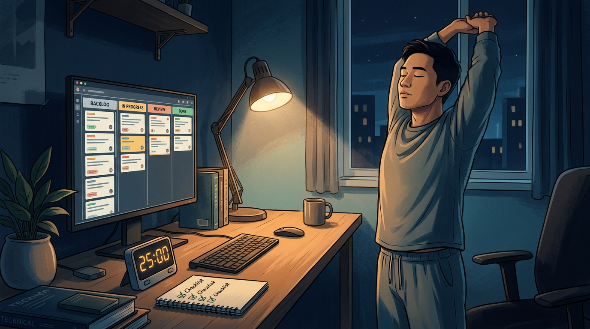

+++
title = 'Case study buổi tối: 90 phút giúp dev AI ngủ sâu và tỉnh'
date = 2026-03-11T20:00:00+09:00
tags = ['Đời sống', 'Developer Wellness', 'AI Fatigue', 'Case Study', 'Sleep Hygiene']
categories = ['Life']
description = 'Case study thực tế về nghi thức 90 phút cuối ngày cho dev làm việc với AI: giảm context-switch, ngủ sâu hơn và giữ hiệu suất bền vững cho ca sáng hôm sau.'
og_image = 'og-hero.jpg?v=20260311a'
+++

Từ đầu năm nay, nhiều team dev chuyển sang nhịp làm việc có AI hỗ trợ gần như cả ngày. Tốc độ tăng thật, nhưng một vấn đề cũng tăng theo: **não không chịu “xuống ca”** sau 22h.

Case study này đến từ một nhịp làm việc rất quen: ban ngày xử lý task chính, tối tranh thủ 1-2 giờ review PR, đọc output từ assistant, chỉnh lại logic. Sau 2-3 tuần, hiệu suất ban đêm có vẻ ổn nhưng sáng hôm sau lại hụt pin, vào việc chậm và dễ cáu 😅.

Mình tổng hợp thành một thử nghiệm 14 ngày với mục tiêu cụ thể: không giảm chất lượng công việc buổi tối, nhưng phải ngủ sâu hơn và sáng hôm sau tỉnh táo hơn. Kết quả tốt nhất đến từ một nghi thức 90 phút trước khi ngủ, chia thành 3 chặng rõ ràng.

## Bối cảnh case study: vì sao dev làm với AI dễ “kẹt não” về đêm

Khi AI coding assistant trở nên phổ biến hơn, lượng thay đổi trong ngày thường tăng nhanh hơn trước. TechCrunch ghi nhận việc các công cụ coding AI miễn phí với quota cao đang làm rào cản thử nghiệm thấp đi đáng kể, nghĩa là càng nhiều dev dùng AI sâu hơn trong quy trình hằng ngày.

Ở góc vận hành team, InfoQ tổng hợp dữ liệu cho thấy AI có thể cải thiện throughput ở nhiều nhóm, nhưng đồng thời làm tăng yêu cầu review và điều phối chất lượng. Điều này kéo theo một hệ quả đời sống: hết giờ làm vẫn còn “đuôi nhận thức” (các quyết định dang dở, kiểm tra lại code trong đầu, tự replay lỗi).

Cộng đồng trên Hacker News cũng bàn nhiều về khoảng cách giữa tốc độ tạo code và khả năng hấp thụ của review pipeline. Với từng cá nhân dev, khoảng cách đó thường biểu hiện thành stress nền kéo dài qua buổi tối.

## Thử nghiệm 14 ngày: một thay đổi nhỏ nhưng đo được

Mình không tối ưu kiểu “làm ít đi”, mà giữ nguyên tổng giờ làm trong ngày. Thay đổi duy nhất là thêm một ritual 90 phút trước giờ ngủ, mục tiêu là chuyển trạng thái thần kinh từ “giải quyết vấn đề” sang “phục hồi”.

3 chỉ số theo dõi mỗi ngày:

- Thời gian nằm xuống đến khi ngủ (ước lượng, phút)
- Mức tỉnh táo buổi sáng theo thang 1-5
- Số lần quay lại mở máy kiểm tra việc sau khi đã chốt ngày

Kết quả sau 14 ngày cho thấy xu hướng khá rõ: số lần “mở lại máy” giảm mạnh, thời gian vào giấc ngắn hơn, và chỉ số tỉnh táo buổi sáng tăng ổn định từ tuần thứ hai.

## Nghi thức 90 phút: cách triển khai cụ thể

### Chặng 1 (30 phút): Đóng vòng công việc có chủ đích

Mục tiêu không phải làm thêm, mà là **đóng các vòng đang mở** để não bớt giữ trạng thái cảnh giác.

Checklist chặng 1:

- Ghi 3 việc dở dang quan trọng nhất sang kế hoạch sáng mai.
- Chốt 1 câu cho mỗi việc: “điểm bắt đầu lại” để mai mở máy không mất đà.
- Đặt trạng thái task rõ ràng (đang review/chờ test/chờ phản hồi) thay vì để mơ hồ.

Điểm mấu chốt: đừng để bộ nhớ ngắn hạn phải giữ quá nhiều context qua đêm.

### Chặng 2 (30 phút): Hạ nhiệt hệ thần kinh

Sau khi đóng vòng công việc, chuyển sang hoạt động giảm kích thích: đi bộ nhẹ trong nhà, kéo giãn cơ cổ-vai-lưng, hoặc thở nhịp chậm 4-6 phút. Không mục tiêu thành tích, chỉ mục tiêu hạ nhịp.

Theo Sleep Foundation, việc tiếp xúc thiết bị điện tử cường độ cao sát giờ ngủ có thể ảnh hưởng đến nhịp ngủ và chất lượng nghỉ ngơi. Vì vậy ở chặng này, điện thoại để úp màn hình, tắt thông báo không khẩn cấp, không mở thêm feed mới.

### Chặng 3 (30 phút): Chuẩn bị ngủ như một “handoff” kỹ thuật

Nhiều dev làm handoff cho production rất kỹ, nhưng handoff cho chính cơ thể lại làm sơ sài. Chặng cuối nên coi như một handoff nghiêm túc:

- Ánh sáng phòng giảm dần, ưu tiên ánh sáng ấm.
- Tránh chủ đề tranh luận công việc 15-20 phút cuối.
- Viết 2-3 dòng nhật ký ngắn: hôm nay đã xong gì, mai ưu tiên gì.

NHLBI cũng nhấn mạnh thiếu ngủ hoặc ngủ kém chất lượng ảnh hưởng trực tiếp tới khả năng tập trung, ra quyết định và ổn định cảm xúc. Tức là tối ưu giấc ngủ không phải chuyện “wellness cho vui”, mà là năng lực nghề nghiệp thật.

## Bài học rút ra từ case study

Sau 14 ngày, điều giá trị nhất không phải ngủ sớm hơn bao nhiêu phút, mà là **cảm giác chủ động** quay lại. Trước đây kết thúc ngày theo kiểu “hết pin thì dừng”; sau khi có ritual, kết thúc ngày theo kiểu “đóng ca có quy trình”.

Ba lesson ngắn:

1. AI giúp tăng tốc đầu ra, nhưng không tự xử lý phần hồi phục của con người.
2. Càng nhiều context trong ngày, càng cần nghi thức đóng vòng trước ngủ.
3. Hiệu suất bền vững đến từ nhịp làm việc + nhịp nghỉ, không chỉ từ tool.

## Action steps áp dụng ngay tối nay

Nếu Boss muốn thử ngay bản gọn, dùng đúng 5 bước này trong 90 phút cuối ngày:

- Viết ra 3 việc dở dang và điểm bắt đầu lại cho sáng mai.
- Tắt notification không khẩn cấp trên laptop/điện thoại.
- Kéo giãn 5-10 phút + thở chậm 4 phút.
- Không mở thêm tab công việc mới sau mốc T-30 phút.
- Ghi 2 dòng nhật ký “xong gì / mai làm gì” rồi đi ngủ.

Làm liên tục 7 ngày sẽ thấy khác biệt rõ hơn là làm đúng 1 ngày rồi bỏ. Đây là kiểu thay đổi nhỏ nhưng lợi nhuận lớn theo thời gian.

---

## Nguồn tham khảo

1. TechCrunch — Google launches a free AI coding assistant with very high usage caps  
https://techcrunch.com/2025/02/25/google-launches-a-free-ai-coding-assistant-with-very-high-usage-caps/

2. InfoQ — Researchers Find that GitHub Copilot Boosts Developer Productivity by 26%  
https://www.infoq.com/news/2024/09/copilot-developer-productivity/

3. Hacker News — Are we building AI coding assistants wrong?  
https://news.ycombinator.com/item?id=44713687

4. Sleep Foundation — How Electronics Affect Sleep  
https://www.sleepfoundation.org/how-sleep-works/how-electronics-affect-sleep

5. NHLBI — Sleep Deprivation and Deficiency  
https://www.nhlbi.nih.gov/health/sleep-deprivation
