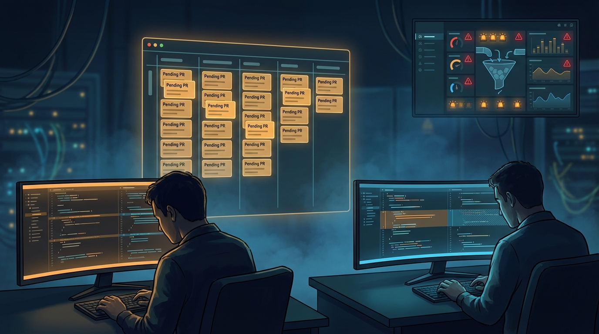

+++
title = 'Case study team nhỏ: dùng coding agent mà không vỡ nhịp'
date = 2026-03-05T20:00:00+09:00
tags = ['Case Study', 'AI Coding Agent', 'Team nhỏ', 'Engineering Workflow', 'Guardrail']
categories = ['Tech']
description = 'Case study thực chiến cho team dev nhỏ khi triển khai AI coding agent: cách đặt guardrail, đo hiệu quả thật và tránh tăng tốc giả dẫn tới lỗi production.'
og_image = 'og-hero.jpg?v=20260305b'
+++

Nếu nhìn từ ngoài vào, team dev nhỏ dùng AI coding agent thường có 2 trạng thái: **hoặc chạy rất nhanh**, hoặc **khựng lại vì review và bug**.

Mình vừa tổng hợp lại một case khá điển hình từ nhiều team 5-8 người: bắt đầu với kỳ vọng tăng tốc rõ rệt, rồi nhận ra nút thắt thật không nằm ở “viết code”, mà nằm ở “chốt chất lượng” trước khi merge.

Bài này đi theo format **story/case-study → lessons learned → action steps** để Boss có thể áp dụng ngay cho team nhỏ, không cần thay đổi toàn bộ quy trình trong một đêm.

## Case study: 3 tuần đầu tiên của một team 6 người

### Tuần 1: Mọi thứ có vẻ quá đẹp

Team bật AI coding agent cho các task quen thuộc: refactor nhẹ, thêm validation, cập nhật test, viết script migration nhỏ. PR mở ra tăng mạnh, dashboard nhìn rất “đã mắt”.

Nhìn theo activity thì ai cũng tưởng đã có “bước nhảy năng suất”. Nhưng đến cuối tuần, lead bắt đầu thấy một dấu hiệu lạ: thời gian từ PR mở đến merge không giảm bao nhiêu.

### Tuần 2: Nút thắt lộ rõ

Khi số PR tăng, reviewer bị ngợp context. Có PR đúng kỹ thuật nhưng thiếu hiểu biết business edge case; có PR pass test cục bộ nhưng làm chậm flow tích hợp.

Quan sát này khớp với phân tích của InfoQ về việc AI tool có thể tạo cảm giác nhanh, nhưng hiệu quả thực tế phụ thuộc mạnh vào cách team kiểm soát chất lượng và giữ năng lực hiểu codebase của dev.

TechCrunch khi đưa tin bộ công cụ AI agent cho doanh nghiệp cũng nhấn mạnh cùng bản chất: “có agent” chưa đồng nghĩa “vận hành trơn tru”. Hệ thống kiểm soát mới là phần khó.

### Tuần 3: Team đổi chiến lược

Thay vì mở thêm quyền cho agent, team quay lại câu hỏi gốc: _Giá trị thật cần tối ưu là gì?_ Câu trả lời không phải “nhiều PR hơn”, mà là “release đều hơn, lỗi production ít hơn”.

Team chuyển từ tư duy “AI làm càng nhiều càng tốt” sang “AI làm đúng phần, người giữ đúng chốt”. Kết quả sau đó ổn hơn hẳn: nhịp release đều, reviewer bớt quá tải, bug escape giảm.

## 4 bài học rút ra (lessons learned)

## 1) Đo đúng thứ cần đo, đừng đo cho vui

Nếu chỉ nhìn số dòng code hoặc số PR, team rất dễ rơi vào tăng tốc giả. Chỉ số nên theo dõi là:

- Lead time từ mở PR đến deploy
- Rework ratio (số vòng sửa sau review)
- Tỉ lệ bug escape sau release
- Tần suất rollback/hotfix

Khi đổi bộ chỉ số, team sẽ thấy rõ phần nào AI đang giúp thật, phần nào chỉ đang dồn việc sang công đoạn sau.

## 2) Guardrail phải đi trước autonomy

Anthropic chia sẻ khá rõ: nên bắt đầu từ pattern đơn giản, có thể kiểm soát, rồi mới tăng quyền cho agent khi đã có dữ liệu vận hành. Đây là điểm nhiều team bỏ qua vì nóng ruột muốn scale nhanh.

Một guardrail đủ dùng cho team nhỏ gồm:

- Allowlist loại task được agent xử lý
- Checklist rủi ro bắt buộc trong PR
- Rule: task liên quan auth/payment/data migration luôn cần human review

## 3) Review là năng lực lõi, không phải phần thừa

Khi có agent, vai trò senior không giảm đi; ngược lại, còn quan trọng hơn ở khâu trade-off và quyết định cuối. Hacker News có nhiều thảo luận đúng tinh thần này: AI có thể viết nhanh, nhưng review chất lượng vẫn là chỗ phân biệt team bền vững và team đốt tốc độ.

## 4) Chốt một “hợp đồng vận hành” rõ ràng trong team

Team trong case study chốt một nguyên tắc rất đời thường:

- AI chịu trách nhiệm đề xuất patch chất lượng tốt
- Dev chịu trách nhiệm hiểu tác động hệ thống
- Lead chịu trách nhiệm ngưỡng rủi ro khi merge

Nghe đơn giản, nhưng khi trách nhiệm rõ, tranh luận trong review giảm hẳn và quyết định merge nhanh hơn.

## Action steps: áp dụng trong 14 ngày cho team nhỏ

### Ngày 1-2: Thiết kế baseline

- Chốt 4 chỉ số chính (lead time, rework, bug escape, rollback)
- Chụp baseline 2 tuần gần nhất
- Xác định 2 loại task low-risk cho pilot

### Ngày 3-6: Pilot có giới hạn

- Cho agent xử lý task low-risk trong allowlist
- Bắt buộc có checklist “AI-generated changes” trong PR
- Cấm tự merge với module business-critical

### Ngày 7: Review giữa kỳ

- So baseline với dữ liệu pilot
- Nếu lead time không cải thiện mà rework tăng: giảm phạm vi ngay
- Nếu cải thiện nhẹ và ổn định: giữ nguyên thêm vài ngày để tránh kết luận sớm

### Ngày 8-11: Siết bottleneck lớn nhất

Thông thường sẽ rơi vào review queue hoặc test pipeline. Tập trung xử lý đúng điểm nghẽn này trước khi tăng quyền cho agent.

### Ngày 12-14: Quyết định mở rộng

- Mở rộng khi: tốc độ tốt hơn + chất lượng không xấu đi
- Giữ nguyên khi: chỉ số trái chiều
- Thu hẹp khi: bug/hotfix tăng hoặc reviewer quá tải

Nếu cần một câu chốt ngắn gọn: **đừng để AI tối ưu “cảm giác nhanh”, hãy bắt nó tối ưu “giá trị giao hàng an toàn”.** Khi giữ được nguyên tắc này, team nhỏ đi rất chắc mà vẫn nhanh. 🧠

---

## Nguồn tham khảo

1. TechCrunch — OpenAI launches new tools to help businesses build AI agents  
   https://techcrunch.com/2025/03/11/openai-launches-new-tools-to-help-businesses-build-ai-agents/

2. Hacker News — Discussion thread on AI coding productivity claims  
   https://news.ycombinator.com/item?id=47077676

3. InfoQ — AI Coding Tools Underperform in Field Study with Experienced Developers  
   https://www.infoq.com/news/2025/07/ai-productivity/

4. Anthropic Engineering — Building effective agents  
   https://www.anthropic.com/engineering/building-effective-agents

5. GitHub Blog — GitHub Copilot: meet the new coding agent  
   https://github.blog/news-insights/product-news/github-copilot-meet-the-new-coding-agent/
