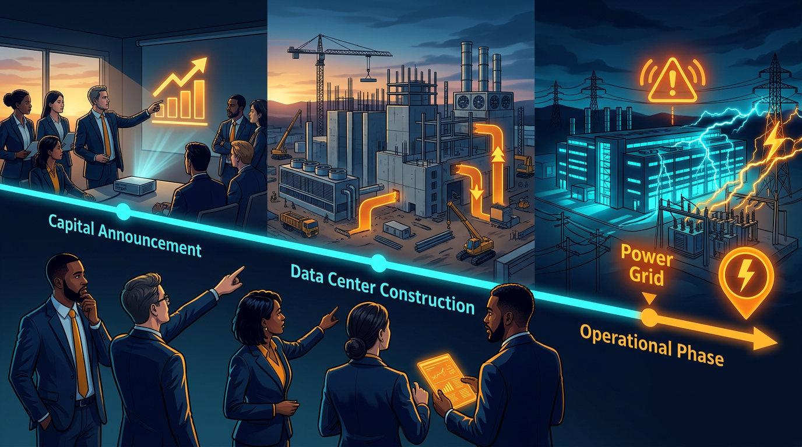
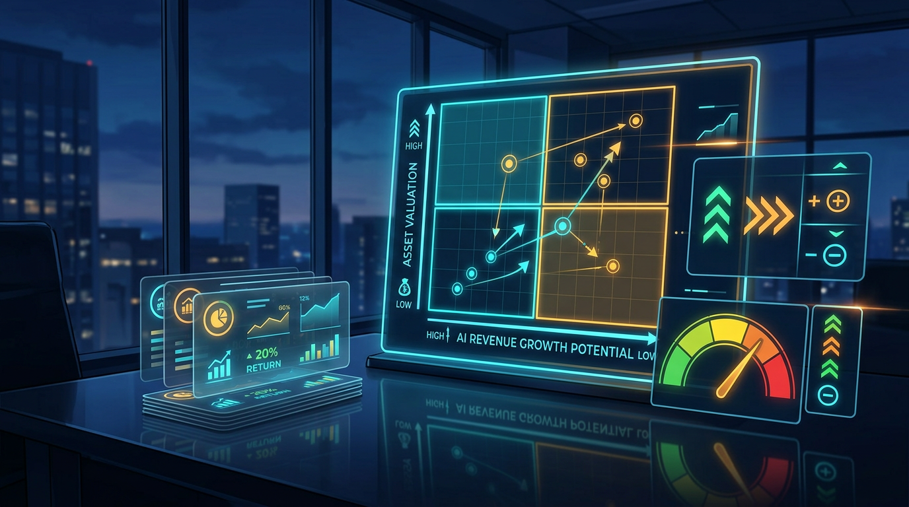

+++
title = 'Đầu tư AI 2026: ma trận quyết định trong cơn sốt hạ tầng'
date = 2026-03-06T20:00:00+09:00
tags = ['Đầu tư', 'AI Infrastructure', 'Data Center', 'Quản trị rủi ro', 'Decision Matrix']
categories = ['Investment']
description = 'Phân tích theo kịch bản làn sóng chi tiêu hạ tầng AI năm 2026 và ma trận quyết định thực dụng giúp nhà đầu tư cá nhân tránh FOMO, quản trị rủi ro rõ ràng.'
og_image = 'og-hero.jpg?v=20260306a'
+++

Nếu nhìn thị trường AI từ xa, cảm giác rất dễ là: “Ai cũng đang thắng, cứ mua là được”. Nhưng khi đi gần hơn vào lớp hạ tầng — data center, điện năng, GPU, cloud contract — bức tranh bớt màu hồng hơn nhiều.

Điểm mình thấy đáng chú ý trong 2026: đây không còn là câu chuyện “AI có hot hay không”, mà là **vòng quay vốn có chuyển thành dòng tiền bền vững hay không**. Với nhà đầu tư cá nhân, câu hỏi đúng không phải “đón sóng nào nhanh nhất”, mà là “đứng ở đâu trong chu kỳ để tỷ lệ risk/reward còn hợp lý”.

## Timeline 3 pha của cơn sốt hạ tầng AI

### Pha 1: Công bố vốn và kỳ vọng tăng trưởng

Các công bố gần đây về mở rộng hạ tầng cho thấy quy mô vốn đang ở mức rất lớn. OpenAI công bố mở rộng Stargate với thêm nhiều site mới tại Mỹ và mô tả mục tiêu năng lực hạ tầng theo hướng đa gigawatt trong vài năm tới. Khi những con số kiểu này xuất hiện, thị trường thường phản ứng trước bằng định giá kỳ vọng.

Song ở pha này, nhà đầu tư dễ mắc lỗi đồng nhất “quy mô capex” với “chắc chắn tăng EPS”. Hai biến này có liên quan, nhưng không đi cùng tốc độ.

### Pha 2: Thi công, vận hành, và bài toán năng lượng

Khi dự án đi vào thi công, rào cản thực tế bắt đầu lộ ra: năng lượng, hạ tầng lưới điện, thời gian đưa dự án vào vận hành. TechCrunch ghi nhận riêng Meta đã ký nhiều thỏa thuận năng lượng tái tạo quy mô lớn để hỗ trợ nhu cầu data center, phản ánh áp lực điện năng không còn là rủi ro “trên giấy” nữa.

Cùng lúc đó, các cuộc thảo luận trên thị trường ngày càng xoáy vào câu hỏi: mức đầu tư khổng lồ này cần tốc độ doanh thu AI thế nào để hợp lý hóa định giá. Trên Hacker News, nhiều ý kiến nhấn vào khoảng cách giữa narrative tăng trưởng và bài toán hoàn vốn thực tế — dù không phải nguồn định lượng chính thức, đây vẫn là tín hiệu tâm lý thị trường đáng theo dõi.

### Pha 3: Tối ưu hiệu suất và kỷ luật chi tiêu

Đến pha vận hành, lợi thế thuộc về doanh nghiệp tối ưu được cost/throughput, chứ không đơn thuần là bên chi tiêu mạnh nhất. InfoQ tổng hợp các thực hành tối ưu workload AI (chọn compute phù hợp, autoscaling, tối ưu container/pipeline) — tức là cuộc chơi bắt đầu chuyển từ “đốt vốn để giành vị trí” sang “vận hành kỷ luật để giữ biên”.

Vì thế, ở cấp độ đầu tư cổ phiếu, mình coi đây là pha phân hóa: doanh nghiệp nào biến capex thành năng suất thương mại sẽ giữ premium; doanh nghiệp nào chỉ tăng capex nhưng hiệu quả chậm cải thiện sẽ bị thị trường ép định giá lại.

## 3 kịch bản 12 tháng và ma trận quyết định

Thay vì dự đoán đúng một tương lai, mình khuyên dùng kịch bản + ngưỡng hành động.

### Kịch bản A: “Hạ cánh mềm” (xác suất trung bình-cao)

- Capex AI tiếp tục tăng nhưng tốc độ chậm dần.
- Doanh thu AI tăng đủ để hấp thụ phần lớn kỳ vọng.
- Định giá biến động theo quý nhưng chưa vỡ cấu trúc.

**Hành động:** giữ tỷ trọng core ở doanh nghiệp có dòng tiền mạnh, chỉ dùng phần nhỏ cho bet tăng trưởng cao.

### Kịch bản B: “Nén kỳ vọng” (xác suất trung bình)

- Tiến độ hạ tầng chậm do điện năng/supply chain.
- Doanh thu AI tăng nhưng thấp hơn kỳ vọng thị trường.
- Multiples co lại dù doanh nghiệp vẫn tăng trưởng.

**Hành động:** ưu tiên quản trị vị thế: giảm margin, tăng tiền mặt chiến lược, vào lệnh theo từng nhịp thay vì all-in.

### Kịch bản C: “Tái định giá mạnh” (xác suất thấp nhưng đau)

- Một số doanh nghiệp báo hiệu ROI hạ tầng thấp hơn dự kiến.
- Chi phí vốn tăng, narrative “growth at all costs” suy yếu.
- Cổ phiếu hạ tầng AI giảm đồng pha.

**Hành động:** tuân thủ điểm cắt lỗ theo hệ thống, không trung bình giá vô kỷ luật, chuyển trọng tâm sang nhóm có định giá hợp lý hơn.

## Ma trận quyết định cho nhà đầu tư cá nhân

Mình dùng ma trận 2x2 theo hai trục:

1. **Định giá hiện tại** (hợp lý ↔ căng)
2. **Khả năng chuyển capex thành dòng tiền** (rõ ↔ mờ)

- **Hợp lý + Rõ:** vùng có thể tích lũy theo kế hoạch, ưu tiên nắm trung hạn.
- **Hợp lý + Mờ:** chỉ giải ngân thăm dò, chờ thêm dữ liệu quarterly.
- **Căng + Rõ:** giao dịch theo kỷ luật vị thế nhỏ, chấp nhận biến động lớn.
- **Căng + Mờ:** vùng FOMO, tốt nhất đứng ngoài quan sát.

Điểm mấu chốt: ma trận này không giúp bạn “thắng mọi kèo”, nhưng giúp tránh sai lầm lớn nhất của chu kỳ AI hiện tại — **trả giá quá cao cho một câu chuyện chưa chứng minh xong**.

## Checklist hành động tuần này

- Rà lại danh mục: mã nào bạn mua vì “sợ lỡ sóng” thay vì thesis rõ ràng?
- Với mỗi mã AI/hạ tầng, trả lời 3 câu:
  - Doanh nghiệp đang ở pha nào của timeline (công bố vốn, thi công, hay tối ưu vận hành)?
  - Chỉ báo nào chứng minh ROI đang cải thiện thật?
  - Nếu thesis sai, điểm thoát cụ thể là bao nhiêu?
- Giới hạn tổng tỷ trọng cho nhóm rủi ro cao trong mức bạn ngủ ngon được.
- Dùng lệnh theo lớp (staggered entries), tránh vào một lần.

Nói vui nhưng thật 😅: thị trường không thưởng cho người dự đoán hay nhất; thị trường thường thưởng cho người **sống sót đủ lâu** để thesis đúng có thời gian phát huy.

## Kết luận

2026 có thể vẫn là năm “đầu tư theo AI”, nhưng lợi nhuận bền không nằm ở việc hô khẩu hiệu AI. Nó nằm ở kỷ luật đọc chu kỳ vốn, theo dõi chất lượng thực thi, và định giá đúng mức rủi ro.

Nếu phải chốt một câu: **đừng chọn phe “quá lạc quan” hay “quá bi quan”; hãy chọn phe có hệ thống ra quyết định rõ ràng**.

---

## Nguồn tham khảo

1. AP News — OpenAI, Oracle data center expansion (Stargate context)  
   https://apnews.com/article/openai-stargate-oracle-data-center-0b3f4fa6e8d8141b4c143e3e7f41aba1

2. TechCrunch — Meta bought 1 GW of solar this week  
   https://techcrunch.com/2025/10/31/meta-bought-1-gw-of-solar-this-week/

3. InfoQ — Optimize AI Workloads: Google Cloud’s Tips and Tricks  
   https://www.infoq.com/news/2025/04/optimize-ai-workload/

4. Hacker News — Big Tech Needs $2T in AI Revenue by 2030 (discussion)  
   https://news.ycombinator.com/item?id=45804873

5. The Guardian — US tech firms pledge to bear energy costs for datacenters  
   https://www.theguardian.com/us-news/2026/mar/04/us-tech-companies-energy-cost-pledge-white-house
