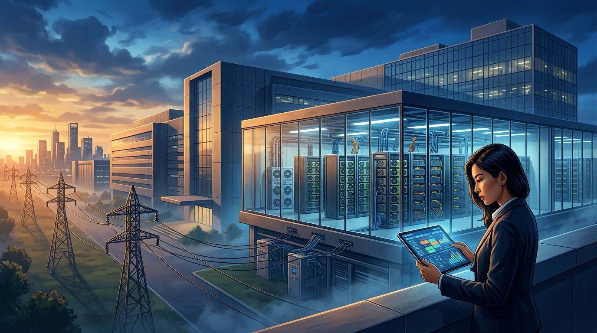
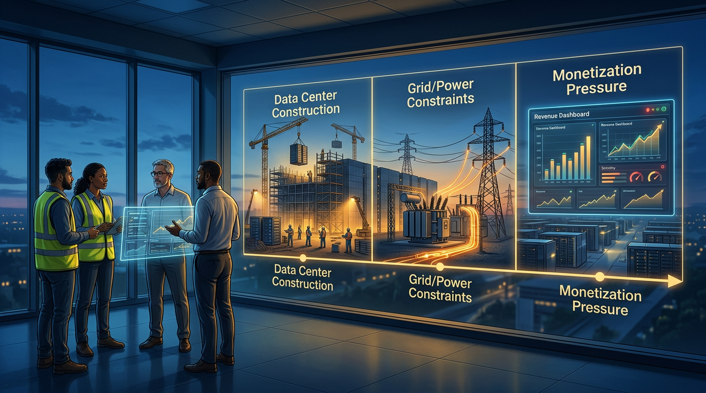
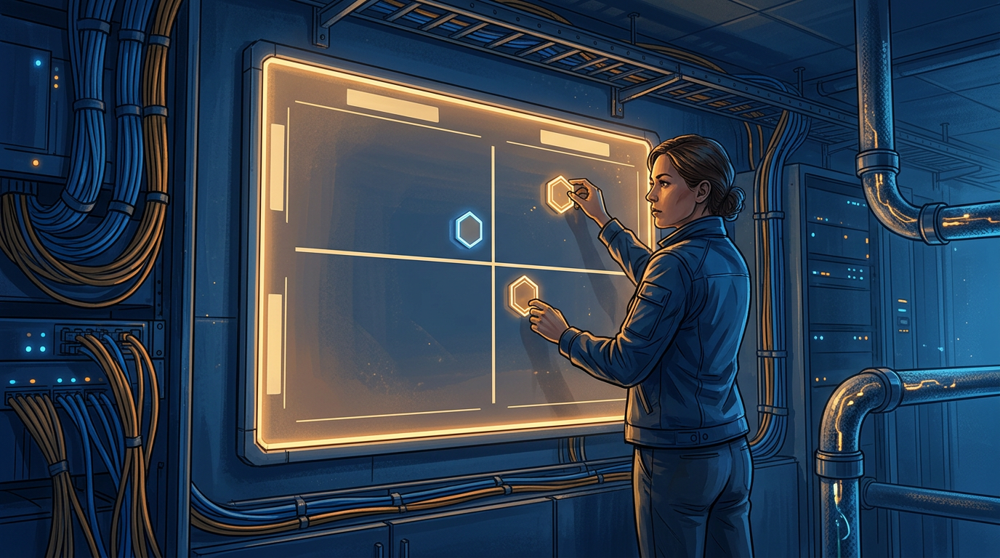

+++
title = 'Đầu tư AI 2026: tách hạ tầng thật khỏi cơn sốt định giá'
date = 2026-03-07T20:00:00+09:00
tags = ['Đầu tư', 'AI Infrastructure', 'Data Center', 'Capex']
categories = ['Investment']
description = 'Bài phân tích theo timeline giúp nhà đầu tư tách tăng trưởng hạ tầng AI có dòng tiền thật khỏi cơn sốt định giá, bằng ma trận quyết định gồm nhu cầu, điện năng và rủi ro triển khai.'
og_image = 'og-hero.jpg?v=20260307b'
+++

Nếu chỉ nhìn headline, bạn sẽ thấy một bức tranh rất dễ “say”: vốn đổ vào AI hạ tầng ở mức chưa từng có, data center mọc nhanh, chuỗi cung ứng chip nóng liên tục. Nhưng nếu nhìn bằng lăng kính đầu tư, câu hỏi quan trọng không phải là “nóng hay không”, mà là: **phần nào là hạ tầng có độ bền dòng tiền, phần nào chỉ là premium định giá ngắn hạn**.

Bài này dùng khung timeline + scenario để đi từ 2025 sang 2026, rồi chốt bằng ma trận quyết định thực dụng. Mục tiêu là giúp bạn tránh hai cực đoan: FOMO mua mọi thứ dính chữ AI, hoặc bi quan hóa toàn bộ thành bong bóng.

## Timeline 3 pha của chu kỳ hạ tầng AI

### Pha 1: Công bố vốn và năng lực (đã diễn ra mạnh từ 2025)

Các thông báo quy mô lớn từ liên minh hạ tầng AI và hyperscaler tạo hiệu ứng “forward guidance” rất mạnh cho thị trường. Đây là giai đoạn narrative dẫn dắt định giá: kỳ vọng tăng trước, chứng minh hiệu quả đến sau.

Điểm cần nhớ: ở pha này, thị trường thường định giá theo **tốc độ mở rộng công suất** chứ chưa theo **hiệu suất khai thác công suất**.

### Pha 2: Nút thắt điện, đất, và thời gian triển khai (đang lộ rõ trong 2026)

Khi dự án đi vào thi công thật, bottleneck lộ ra ở điện năng, lưới truyền tải, làm mát, cấp phép địa phương, và nhân lực vận hành. Báo cáo năng lượng cho thấy nhu cầu điện từ data center tăng nhanh hơn nhiều người dự đoán ban đầu; nghĩa là CAPEX chỉ là vé vào cửa, chưa phải bảo chứng cho biên lợi nhuận.

Nếu bạn đầu tư theo “tin khởi công”, đây là điểm dễ hụt kỳ vọng nhất, vì timeline doanh thu thường trễ hơn timeline thông báo.

### Pha 3: Áp lực monetization và kỷ luật vốn (nửa cuối 2026 trở đi)

Sau khi công suất tăng, thị trường sẽ hỏi thẳng: utilization bao nhiêu, giá thuê compute có giữ được không, khách hàng có lock-in hay dễ chuyển đổi. Lúc này, cổ phiếu bắt đầu phân hóa theo chất lượng vận hành thay vì cùng chạy theo một câu chuyện lớn.

Nói ngắn gọn: từ đây trở đi, “AI” không còn là tấm vé premium mặc định; doanh nghiệp phải chứng minh mô hình kinh tế đơn vị (unit economics).

## Ba kịch bản đầu tư cho 12 tháng tới

### Kịch bản A: Hạ tầng hấp thụ tốt, nhu cầu bền

Điều kiện xảy ra:
- Doanh nghiệp lớn duy trì ngân sách AI ở mức cao thay vì cắt mạnh sau thử nghiệm.
- Chi phí năng lượng và mạng được kiểm soát đủ tốt để biên lợi nhuận không xấu đi nhanh.
- Hệ sinh thái ứng dụng tạo traffic inference thật, không chỉ demo.

Hàm ý đầu tư: nhóm hạ tầng lõi có thể giữ định giá cao lâu hơn kỳ vọng thị trường thận trọng.

### Kịch bản B: Tăng trưởng có, nhưng định giá đi trước quá xa

Điều kiện xảy ra:
- Doanh thu tăng nhưng thấp hơn tốc độ mở rộng CAPEX.
- Dự án bàn giao chậm theo từng cụm địa lý.
- Nhà đầu tư chuyển từ “định giá tương lai xa” sang “đòi số liệu quý gần”.

Hàm ý đầu tư: xuất hiện giai đoạn nén multiple dù câu chuyện dài hạn không hề hỏng.

### Kịch bản C: Điều chỉnh mạnh vì kỳ vọng sai nhịp

Điều kiện xảy ra:
- Nhu cầu compute ngắn hạn yếu hơn dự phóng lạc quan nhất.
- Cạnh tranh giá ở một số lớp hạ tầng làm xói biên.
- Dòng tiền tự do không theo kịp chu kỳ đầu tư.

Hàm ý đầu tư: cơ hội chỉ đến với người có watchlist rõ ràng và kỷ luật giải ngân theo nhịp, không bắt đáy theo cảm xúc.

## Ma trận quyết định: nên ưu tiên nhóm nào?

Thay vì hỏi “công ty này có dính AI không”, hãy chấm theo hai trục:

- **Trục ngang:** Độ bền nhu cầu (1-5 năm)
- **Trục dọc:** Rủi ro triển khai (điện, supply chain, vận hành)

Gợi ý đọc ma trận:

1. **Nhu cầu cao + rủi ro thấp:** vùng ưu tiên giải ngân từng phần.
2. **Nhu cầu cao + rủi ro cao:** chỉ phù hợp khi có biên an toàn định giá.
3. **Nhu cầu thấp + rủi ro thấp:** vùng phòng thủ, kỳ vọng vừa phải.
4. **Nhu cầu thấp + rủi ro cao:** tránh để tiết kiệm “chi phí cơ hội”.

Điểm quan trọng là cập nhật ma trận theo quý, vì dữ liệu utilization và backlog có thể đổi nhanh hơn narrative thị trường.

## Checklist chống FOMO cho nhà đầu tư cá nhân

- Kiểm tra doanh nghiệp nói về AI bằng **chỉ số vận hành** hay chỉ bằng khẩu hiệu.
- Tách rõ doanh thu từ training và inference; hai mảng này có biên và chu kỳ khác nhau.
- Theo dõi rủi ro điện năng như một biến số tài chính, không phải chi tiết kỹ thuật phụ.
- Ưu tiên doanh nghiệp có lịch sử phân bổ vốn kỷ luật qua nhiều chu kỳ.
- Giữ tỷ trọng tiền mặt chiến thuật để xử lý biến động định giá ngắn hạn.

Một câu mình dùng để tự nhắc bản thân: **narrative tạo sóng, nhưng cash flow mới quyết định thủy triều**. 🌊

## Kết luận

AI hạ tầng 2026 không phải câu chuyện “all-in” hay “all-out”. Đây là thị trường cần góc nhìn phân lớp: lớp nào có nhu cầu bền và năng lực triển khai thật thì xứng đáng premium; lớp nào chỉ tăng bằng kỳ vọng thì sớm muộn cũng bị thị trường ép kiểm chứng.

Nếu giữ được khung timeline + scenario + ma trận quyết định, bạn sẽ đỡ bị cảm xúc dẫn dắt trong những phiên biến động mạnh, và ra quyết định giống một người phân bổ vốn, không phải một người chạy theo tiêu đề nóng.

---

## Nguồn tham khảo

1. TechCrunch — Meta bought 1 GW of solar this week  
   https://techcrunch.com/2025/10/31/meta-bought-1-gw-of-solar-this-week/

2. Hacker News — Discussion on AI infrastructure capex expectations  
   https://news.ycombinator.com/item?id=47268391

3. InfoQ — AI/ML and Data Engineering Trends 2025  
   https://www.infoq.com/articles/ai-ml-data-engineering-trends-2025/

4. The Guardian — OpenAI, Oracle and SoftBank AI infrastructure joint venture  
   https://www.theguardian.com/us-news/2025/jan/21/trump-ai-joint-venture-openai-oracle-softbank

5. IEA — Electricity 2024 (data center electricity demand context)  
   https://www.iea.org/reports/electricity-2024
