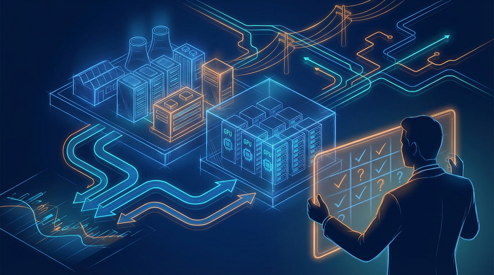
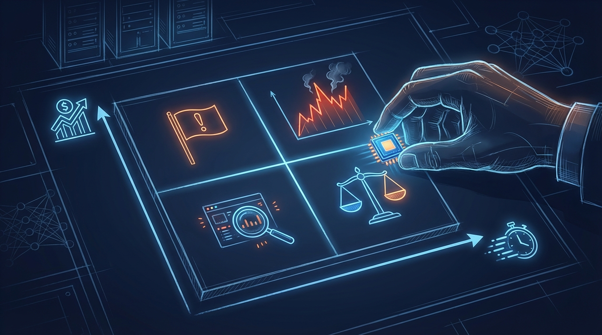

+++
title = 'Đầu tư AI 2026: Timeline capex và ma trận quyết định rủi ro'
date = 2026-03-14T08:00:00+09:00
tags = ['Investment', 'AI Infrastructure', 'Capex', 'Risk Management']
categories = ['Investment']
description = 'Phân tích nhịp chi tiêu hạ tầng AI 2026 theo timeline và 3 kịch bản thị trường, kèm ma trận quyết định giúp nhà đầu tư tránh FOMO nhưng không bỏ lỡ cơ hội.'
og_image = 'og-hero.jpg?v=20260313a'
+++

Nửa đầu 2026, tin tức đầu tư AI dày đặc tới mức rất dễ tạo cảm giác “không vào ngay thì lỡ chuyến tàu”. Nhưng với mảng hạ tầng AI, vấn đề không chỉ là xu hướng tăng, mà là **tăng theo nhịp nào, rủi ro nằm ở đoạn nào, và khi nào thị trường định giá quá tay**.

Bài này đi theo format **timeline + scenario + decision matrix** để Boss có thể dùng như khung ra quyết định thực dụng: không cực đoan “all-in”, cũng không đứng ngoài vì sợ biến động.

## Timeline 2026: 3 chặng mà nhà đầu tư cần theo dõi

### Chặng 1: Tăng tốc capex và cuộc đua công suất

Tín hiệu nổi bật là dòng tiền capex của nhóm hyperscaler vẫn ở mức rất cao. Các phân tích từ Goldman Sachs và các báo cáo thị trường hạ tầng data center đều cho thấy 2026 tiếp tục là năm mở rộng mạnh về compute, điện năng và mạng lưới trung tâm dữ liệu.

Điểm quan trọng: khi capex tăng nhanh, cổ phiếu hưởng lợi ngắn hạn thường là lớp “bán xẻng” (chip, networking, hạ tầng điện/làm mát). Nhưng lợi nhuận bền hay không còn phụ thuộc vào hiệu quả khai thác phía sau, không chỉ dựa vào thông báo đầu tư.

### Chặng 2: Bài toán hấp thụ doanh thu bắt đầu bị soi kỹ

Sau giai đoạn hưng phấn ban đầu, thị trường chuyển câu hỏi từ “chi bao nhiêu” sang “thu về bao nhiêu”. Đây là lúc định giá dễ phân hóa mạnh giữa doanh nghiệp có dòng tiền thật và doanh nghiệp chỉ kể câu chuyện tăng trưởng.

Một số phân tích từ SemiAnalysis nhấn mạnh rủi ro nghẽn nguồn cung silicon và công suất triển khai thực tế. Nghĩa là ngay cả khi nhu cầu cao, tốc độ chuyển nhu cầu thành doanh thu vẫn có thể chậm hơn kỳ vọng.

### Chặng 3: Governance và hiệu quả vận hành trở thành tiêu chí định giá

Bước sang cuối chu kỳ, thị trường thường ưu tiên doanh nghiệp có khả năng kiểm soát biên lợi nhuận, hiệu suất sử dụng tài sản và kỷ luật phân bổ vốn. Tin tức công nghệ đại chúng có thể vẫn “nóng”, nhưng dòng tiền thông minh bắt đầu soi chi tiết hơn vào unit economics.

Một cách nói vui: lúc thị trường phấn khích, ai cũng là thiên tài 😄. Lúc chi phí vốn bị soi lại, chỉ doanh nghiệp vận hành chắc mới giữ được premium.

## 3 kịch bản cho nửa cuối 2026

## Kịch bản A: Soft landing (xác suất trung bình-cao)

- Capex vẫn cao nhưng tốc độ tăng chậm lại theo quý.
- Cầu inference tăng đều, không bùng nổ đột biến.
- Nhóm hạ tầng vẫn tốt hơn mặt bằng, nhưng biên an toàn định giá quan trọng hơn.

**Chiến lược:** ưu tiên doanh nghiệp có backlog rõ, tỷ lệ lấp đầy công suất ổn định, và ít phụ thuộc một khách hàng duy nhất.

## Kịch bản B: Overheat rồi điều chỉnh nhanh (xác suất trung bình)

- Tin tức đầu tư mới liên tục đẩy kỳ vọng lên rất cao.
- KQKD thực tế không theo kịp narrative, dẫn tới re-rating mạnh.
- Cổ phiếu beta cao giảm sâu hơn thị trường chung.

**Chiến lược:** chia lệnh theo nhiều mốc, giữ tỷ lệ tiền mặt chiến thuật, tránh dùng đòn bẩy cao ở nhóm đã tăng nóng kéo dài.

## Kịch bản C: Productivity surprise (xác suất thấp-trung bình)

- Doanh thu từ ứng dụng AI thương mại hóa nhanh hơn dự kiến.
- Nhu cầu compute thực trả tăng vượt dự báo.
- Nhóm hạ tầng và nền tảng đều được nâng định giá một nhịp mới.

**Chiến lược:** giữ một phần vị thế “quyền chọn tăng trưởng” ở doanh nghiệp đầu chuỗi có moat công nghệ rõ, nhưng vẫn đặt ngưỡng chốt lời kỷ luật.

## Ma trận quyết định: tránh FOMO bằng quy tắc định lượng đơn giản

Thay vì hỏi “nên mua hay không”, mình thấy hiệu quả hơn khi hỏi theo 4 ô quyết định:

1. **Định giá hợp lý + doanh thu hấp thụ tốt**  
   → Có thể tăng tỷ trọng theo kế hoạch.

2. **Định giá cao + doanh thu hấp thụ tốt**  
   → Giữ tỷ trọng vừa phải, chỉ mua khi có nhịp điều chỉnh kỹ thuật.

3. **Định giá hợp lý + doanh thu hấp thụ yếu**  
   → Theo dõi thêm 1-2 kỳ báo cáo, tránh vội tăng vốn.

4. **Định giá cao + doanh thu hấp thụ yếu**  
   → Hạn chế đuổi giá; ưu tiên phòng thủ vốn.

Khi áp ma trận này, quyết định bớt cảm tính hơn rất nhiều. Bạn không cần đoán đúng đỉnh/đáy, chỉ cần giữ kỷ luật xác suất thắng dài hạn.

## Checklist 7 ngày cho nhà đầu tư cá nhân

- Chọn tối đa 5 mã trong chuỗi AI infrastructure để theo dõi sâu, không dàn trải.
- Với mỗi mã, ghi rõ 3 biến: định giá hiện tại, tăng trưởng doanh thu, rủi ro capex.
- Xác định trước điểm mua từng phần và điểm giảm tỷ trọng nếu thesis sai.
- Không nâng vị thế chỉ vì headline; chỉ nâng khi dữ liệu mới xác nhận.
- Review lại danh mục mỗi tuần theo cùng một form để tránh “đổi luật giữa trận”.

## Kết luận

2026 có thể vẫn là năm mạnh của hạ tầng AI, nhưng alpha không còn nằm ở việc “biết xu hướng” — vì ai cũng biết. Alpha nằm ở **kỷ luật phân bổ vốn theo kịch bản**, chấp nhận rằng thị trường có thể đúng về dài hạn nhưng sai rất mạnh ở ngắn hạn.

Nếu phải chốt một câu: đừng chống lại xu hướng AI, nhưng cũng đừng trả bất kỳ mức giá nào chỉ vì sợ bỏ lỡ.

---

## Nguồn tham khảo

1. Goldman Sachs — Why AI companies may invest more than $500 billion in 2026  
https://www.goldmansachs.com/insights/articles/why-ai-companies-may-invest-more-than-500-billion-in-2026

2. Dell’Oro Group — AI Infrastructure Expansion Drives Data Center IT Component Market Growth  
https://www.delloro.com/news/ai-infrastructure-expansion-drives-data-center-it-component-market-growth/

3. SemiAnalysis — The Great AI Silicon Shortage  
https://newsletter.semianalysis.com/p/the-great-ai-silicon-shortage

4. TechCrunch — Google launches a free AI coding assistant with very high usage caps  
https://techcrunch.com/2025/02/25/google-launches-a-free-ai-coding-assistant-with-very-high-usage-caps/

5. InfoQ — Researchers Find that GitHub Copilot Boosts Developer Productivity by 26%  
https://www.infoq.com/news/2024/09/copilot-developer-productivity/

6. Hacker News discussion thread  
https://news.ycombinator.com/item?id=44713687
