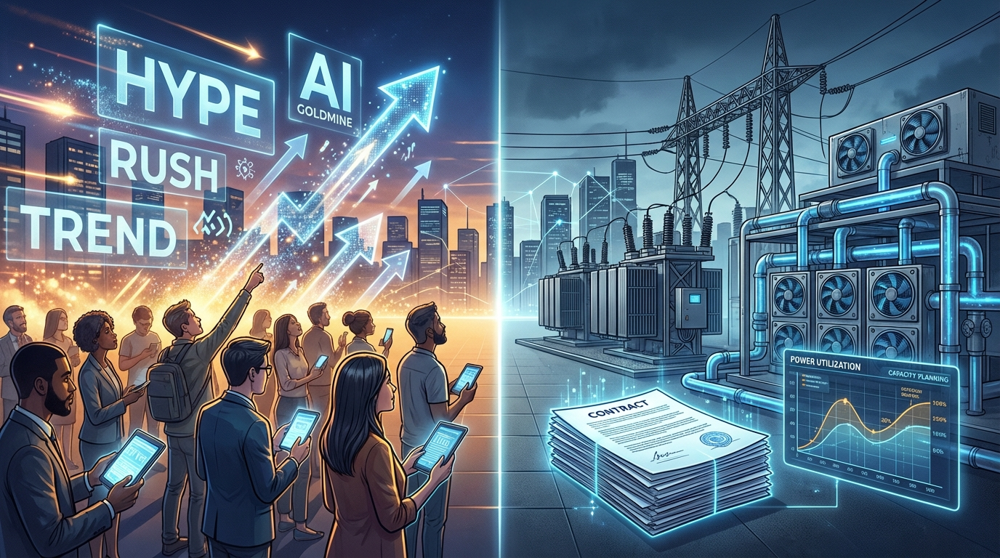

+++
title = 'Đầu tư AI Việt Nam: Myth vs Fact về làn sóng data center'
date = 2026-03-09T20:00:00+09:00
tags = ['Đầu tư', 'AI', 'Data Center', 'Việt Nam']
categories = ['Investment']
description = 'Bài viết tách tín hiệu thật và nhiễu trong làn sóng data center AI ở Việt Nam, với framework chấm điểm dự án và playbook hành động thực dụng cho 90 ngày tới.'
og_image = 'og-hero.jpg?v=20260309a'
+++

Làn sóng data center AI ở Việt Nam đang tăng nhiệt rất nhanh: dự án tỷ đô, công suất hàng trăm MW, kế hoạch vận hành quy mô lớn. Nhưng đầu tư không phải cuộc thi đo độ hào hứng. Điều cần làm là tách **tín hiệu có thể kiểm chứng** khỏi **kỳ vọng chưa đo được**.

Bài này đi theo format Myth vs Fact, sau đó chốt bằng framework và playbook 90 ngày để bạn có thể hành động thực dụng hơn.

## Myth vs Fact khi đầu tư data center AI tại Việt Nam

### Myth 1: Công bố vốn lớn là gần như chắc thắng

Nhiều người thấy con số vốn đầu tư lớn là mặc định dự án sẽ vận hành đúng tiến độ.

**Fact:** công bố vốn chỉ là điểm khởi đầu. Tiến độ thật còn phụ thuộc vào điện năng, hạ tầng làm mát, xây dựng kỹ thuật, giấy phép và năng lực vận hành. Với loại tài sản cường độ vốn cao như data center, chậm vài quý đã đủ làm thesis đầu tư lệch đáng kể.

### Myth 2: Nhiều GPU đồng nghĩa biên lợi nhuận cao

GPU là điều kiện cần, nhưng không phải điều kiện đủ.

**Fact:** biên lợi nhuận phụ thuộc vào utilization, cấu trúc hợp đồng khách thuê, và chi phí điện theo thời gian. Nếu demand thực không theo kịp tốc độ mở rộng, tài sản tốt vẫn có thể trở thành gánh nặng khấu hao.

### Myth 3: Xu hướng toàn cầu mạnh thì rủi ro địa phương không đáng kể

Nhìn headline quốc tế rất dễ tạo cảm giác “đi đâu cũng thắng”.

**Fact:** outcome luôn mang tính địa phương. Cùng một câu chuyện AI, khác biệt về pháp lý, năng lượng, và chất lượng khách thuê sẽ tạo khác biệt lớn về suất sinh lời.

### Myth 4: Chỉ cần nghe từ doanh nghiệp là đủ

**Fact:** data center AI là game của cả hệ sinh thái: điện lưới, đất công nghiệp, nhà thầu kỹ thuật, vận hành an toàn, và khách thuê neo. Chỉ một mắt xích yếu là định giá phải reset.

### Myth 5: Giai đoạn nóng có thể nới lỏng kỷ luật vốn

Trong thị trường hưng phấn, rất dễ chấp nhận “tăng trưởng trước, hiệu quả tính sau”.

**Fact:** thị trường sớm muộn vẫn quay về unit economics. Các báo cáo xu hướng kỹ thuật gần đây cũng cho thấy dịch chuyển từ thử nghiệm sang triển khai có KPI rõ, nghĩa là câu chuyện chỉ dựa vào hype sẽ khó giữ premium lâu.

## Framework 4 trục để chấm điểm dự án

Mình dùng khung 4 trục, mỗi trục chấm 1-5 điểm.

### Trục 1: Điện năng và hạ tầng kỹ thuật

- Nguồn điện có ổn định theo từng pha mở rộng không?
- Có kế hoạch dự phòng và nâng công suất rõ không?
- Chỉ số hiệu quả năng lượng có được công bố minh bạch không?

### Trục 2: Chất lượng khách thuê neo

- Có hợp đồng dài hạn hay mới ở mức ý định?
- Khách thuê có chất lượng tín dụng đủ tốt không?
- Doanh thu có bị phụ thuộc vào 1-2 khách quá lớn không?

### Trục 3: Năng lực triển khai đúng hạn

- Đội ngũ có track record bàn giao đúng tiến độ không?
- Có cập nhật mốc kỹ thuật minh bạch theo quý không?
- Có dấu hiệu trễ tiến độ lặp lại không?

Với dự án lớn, “trễ tiến độ lặp lại” là cảnh báo đỏ.

### Trục 4: Kỷ luật vốn và sức bền qua chu kỳ

- Đòn bẩy tài chính có an toàn nếu chi phí vốn thay đổi?
- CAPEX có gắn demand thực hay chạy theo truyền thông?
- Ban lãnh đạo ưu tiên hiệu quả vốn hay chỉ ưu tiên quy mô?

Trục này giúp bạn tránh các case tăng trưởng đẹp nhưng dễ đứt nhịp khi chu kỳ đổi.

## Playbook 90 ngày cho nhà đầu tư cá nhân

### Giai đoạn 1 (Tuần 1-2): Lập watchlist theo xác suất thực thi

Đừng hỏi “mã nào nóng nhất”. Hãy hỏi “dự án nào có xác suất khai thác thương mại cao nhất trong 12-18 tháng”. Lọc danh sách theo 4 trục, loại sớm các case điểm yếu rõ.

### Giai đoạn 2 (Tuần 3-6): Kiểm chứng từng giả định bằng nguồn độc lập

Mỗi luận điểm cần link kiểm chứng:

- Chính sách/quỹ AI và định hướng dữ liệu quốc gia: cập nhật từ VnEconomy và nguồn chính thức.
- Quy mô dự án và công suất thiết kế: đối chiếu từ nguồn kinh tế trong nước như CafeF rồi kiểm tra chéo với công bố doanh nghiệp.
- Góc nhìn vận hành và xu hướng kỹ thuật: theo dõi thêm InfoQ, TechCrunch và thảo luận thực tế trên Hacker News.

Nếu giả định nào chưa kiểm chứng được, coi đó là rủi ro thay vì “niềm tin”.

### Giai đoạn 3 (Tuần 7-12): Giải ngân phân lớp, không all-in

- Chia vị thế thành nhiều phần theo mức độ chắc chắn của thesis.
- Chỉ tăng tỷ trọng khi có bằng chứng mới (tiến độ, hợp đồng, utilization), không tăng vì giá tăng.
- Đặt trước điều kiện thoát khi thesis sai.

Một câu tự nhắc rất hữu ích: **khi dữ liệu chưa đủ, ưu tiên giữ quyền chọn hơn là cố tỏ ra chắc chắn**. 🙂

## Kết luận

Data center AI tại Việt Nam là cơ hội thật, nhưng không phải mọi câu chuyện gắn chữ AI đều xứng đáng cùng một mức định giá. Cách làm bền là giữ quy trình cố định: tách myth khỏi fact, chấm điểm theo framework, rồi hành động theo playbook.

Khi thị trường nóng, người giữ được kỷ luật thường là người còn vốn và còn sự tỉnh táo cho cơ hội tốt hơn ở nhịp sau.

---

## Nguồn tham khảo

1. VnEconomy — Vietnam to establish National AI Development Fund  
   https://en.vneconomy.vn/vietnam-to-establish-national-ai-development-fund.htm

2. CafeF — Dự án AI campus gần 2 tỷ USD, công suất 200MW tại TP.HCM  
   https://cafef.vn/sau-viettel-fpt-cmc-them-mot-doanh-nghiep-viet-gia-nhap-cuoc-dua-trung-tam-du-lieu-ai-voi-con-so-gay-choang-vdt-2-ty-usd-cong-suat-200mw-188251106072057515.chn

3. InfoQ — AI, ML and Data Engineering Trends Report 2025  
   https://www.infoq.com/articles/ai-ml-data-engineering-trends-2025/

4. TechCrunch — Meta bought 1 GW of solar this week  
   https://techcrunch.com/2025/10/31/meta-bought-1-gw-of-solar-this-week/

5. Hacker News — Discussion on AI infrastructure capex expectations  
   https://news.ycombinator.com/item?id=47268391
