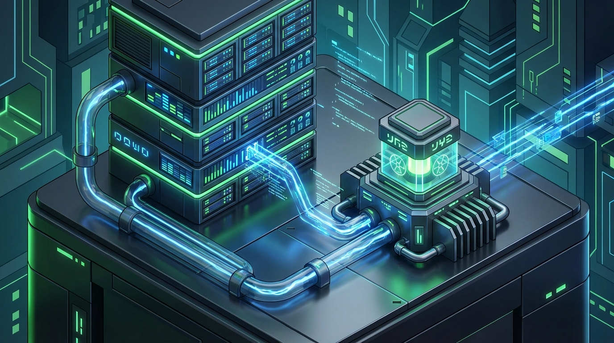
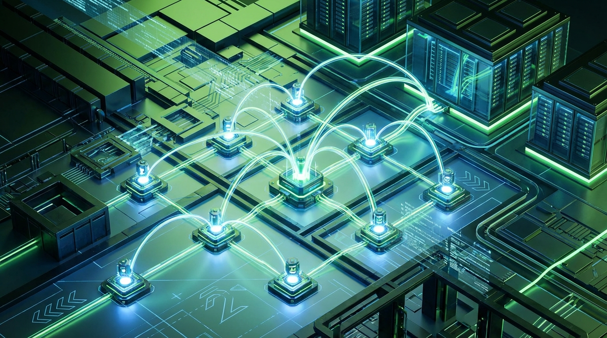

+++
title = 'Đầu Tư Năng Lượng Hạt Nhân & SMR Cho AI Data Center 2026'
date = 2026-04-02T23:00:00Z
tags = ['SMR', 'Nuclear Energy', 'AI', 'Data Center', 'Investing']
categories = ['Investment']
description = 'Tìm hiểu xu hướng đầu tư năng lượng hạt nhân và SMR cho AI Data Center 2026. Phân tích nút thắt năng lượng và cơ hội chiến lược cho nhà đầu tư cá nhân.'
images = ['og-hero.jpg']
+++

Cuộc chạy đua AI đang vấp phải một rào cản vật lý khổng lồ mà ít người ngờ tới: điện năng. Đến năm 2026, AI data center dự kiến tiêu thụ hơn 500 TWh trên toàn cầu. Nút thắt năng lượng này đã buộc các gã khổng lồ công nghệ chuyển hướng chiến lược, đổ hàng tỷ USD vào một lĩnh vực từng bị e ngại và lãng quên: Năng lượng hạt nhân và các Lò phản ứng mô-đun nhỏ (SMR - Small Modular Reactors). 

Sự thay đổi về mặt nhận thức lẫn dòng vốn này đang mở ra một "siêu chu kỳ" đầu tư hoàn toàn mới. Vậy đâu là cơ hội để các nhà đầu tư cá nhân có thể "đứng trên vai người khổng lồ" trong làn sóng này?

## 1. Scenario 2026: Nút Thắt Năng Lượng Của Kỷ Nguyên AI

Khác với các data center truyền thống chuyên phục vụ lưu trữ web hay xử lý giao dịch thương mại điện tử, AI data center (đặc biệt là các cụm đào tạo mô hình ngôn ngữ lớn) vận hành các hệ thống GPU khổng lồ chạy liên tục 24/7 với công suất tối đa. Sự đòi hỏi này vượt xa những giới hạn thiết kế lưới điện truyền thống.

Theo số liệu từ Morgan Stanley, đến năm 2028, riêng tại khu vực Bắc Mỹ có thể phải đối mặt với mức thiếu hụt khoảng 49 GW điện lưới phục vụ cho các trung tâm dữ liệu mới. Ban đầu, các tập đoàn lớn cố gắng giải quyết bài toán này bằng năng lượng tái tạo. Tuy nhiên, điện mặt trời hay điện gió dù thân thiện với môi trường nhưng lại vấp phải nhược điểm chí mạng là sự "đứt quãng" (intermittent) và phụ thuộc hoàn toàn vào điều kiện thời tiết. Chúng không thể cung cấp được nguồn điện nền (baseload power) ổn định mà các hệ thống máy chủ AI đòi hỏi để tránh gián đoạn tính toán.

Chính vì thế, năng lượng hạt nhân—nguồn điện sạch duy nhất hiện nay có công suất đủ lớn và khả năng hoạt động liên tục không ngừng nghỉ—đã trở thành lời giải tối ưu nhất. Những cái tên lớn nhất tại Thung lũng Silicon đã nhận ra điều đó và đang hành động một cách vô cùng quyết liệt.

## 2. Timeline: Sự Chuyển Dịch Của Dòng Vốn Big Tech (2024-2026)

Làn sóng dịch chuyển vốn khổng lồ này không chỉ dừng lại ở những lời hứa hẹn trên mặt báo, mà đã biến thành những thỏa thuận mua bán điện (PPA) thực tế với con số cực kỳ ấn tượng trong giai đoạn bản lề:

*   **Meta (Động thái 2025-2026):** Công bố danh mục dự án điện hạt nhân lên tới 6.6 GW. Công ty đã ký kết các thỏa thuận mua bán điện dài hạn (PPA) kéo dài 20 năm với các đối tác như Vistra, nhằm mục đích đảm bảo vòng đời năng lượng ổn định cho các cụm máy chủ AI chiến lược của hãng.
*   **Microsoft:** Trực tiếp tham gia vào việc mở lại nhà máy điện hạt nhân Three Mile Island lịch sử. Song song đó, họ cũng đầu tư một nguồn ngân sách khổng lồ vào đánh giá kỹ thuật và tích hợp SMR cho các cơ sở hạ tầng đám mây Azure tương lai.
*   **Google & Amazon:** Ký các thỏa thuận mang tính bước ngoặt với hàng loạt các startup năng lượng như Kairos Power, X-energy và Energy Northwest. Mục tiêu cốt lõi là phát triển và triển khai nhanh các tổ hợp SMR chuyên biệt, đặt ngay sát các trung tâm dữ liệu để giảm thiểu hao hụt truyền tải.

Tại sao lại là SMR? Lò phản ứng mô-đun nhỏ (Small Modular Reactor) có kích thước gọn gàng hơn rất nhiều so với các nhà máy điện hạt nhân thế hệ cũ. Chúng được sản xuất, lắp ráp theo chuẩn mô-đun ngay tại nhà máy, sau đó vận chuyển tới điểm đích để lắp đặt. Điều này giúp giảm thiểu đáng kể rủi ro vượt ngân sách và chậm trễ tiến độ—những "bóng ma" từng làm đình trệ toàn bộ ngành công nghiệp điện hạt nhân trong suốt thập niên 90.

## 3. Decision Matrix: Cơ Hội Nào Cho Nhà Đầu Tư Cá Nhân?

Với xu hướng phát triển rõ rệt, việc dòng tiền khổng lồ từ giới tinh hoa công nghệ chảy vào ngành năng lượng hạt nhân chắc chắn sẽ tạo ra những làn sóng tăng trưởng mới trên thị trường tài chính. Tuy nhiên, rủi ro đặc thù của công nghệ mới (First-of-a-kind risks) vẫn luôn tồn tại. Rào cản lớn nhất hiện nay nằm ở vấn đề cấp phép pháp lý, an toàn bức xạ và chuỗi cung ứng vật liệu đặc chủng chưa thực sự hoàn thiện.

Dưới đây là ma trận ra quyết định được tổng hợp dành cho các nhà đầu tư cá nhân khi muốn tiếp cận lĩnh vực đầy tiềm năng này:

| Hướng Tiếp Cận | Mức Độ Rủi Ro | Tiềm Năng Tăng Trưởng (2026-2030) | Chân Dung Phù Hợp |
| :--- | :--- | :--- | :--- |
| **Cổ phiếu khai thác Uranium (VD: CCJ, URA ETF)** | Thấp - Trung Bình | Ổn định và chắc chắn. Lực cầu tăng rất mạnh khi các lò phản ứng được mở lại. | Nhà đầu tư thích sự an toàn, muốn nắm giữ gián tiếp qua tài sản cơ sở vật lý. |
| **Công ty vận hành hạ tầng điện hạt nhân (VD: CEG, VST)** | Trung Bình | Khả quan. Có sự đảm bảo từ các hợp đồng PPA dài hạn từ Big Tech. | Nhà đầu tư chuộng cổ tức và dòng tiền doanh nghiệp ổn định trong dài hạn. |
| **Startup phát triển công nghệ SMR (VD: SMR, OKLO)** | Rất Cao | Đột phá (có thể x2, x3) nếu thương mại hóa và được cấp phép thành công. | Nhà đầu tư mạo hiểm, chấp nhận biến động mạnh và thời gian chờ đợi lâu. |
| **Công ty xây dựng hạ tầng truyền tải & Data Center** | Trung Bình | Tăng trưởng đều đặn song hành cùng sự bùng nổ của AI. | Nhà đầu tư muốn "ăn theo sóng" nhưng muốn loại bỏ hoàn toàn rủi ro pháp lý hạt nhân. |

*Lưu ý chiến lược: Bạn hoàn toàn không nhất thiết phải mua cổ phiếu trực tiếp của các startup SMR đầy rủi ro. Đôi khi, đầu tư vào các quỹ ETF chuyên biệt (như URA, NLR) hoặc nhóm công ty cung cấp vật liệu đầu vào (khai thác Uranium) lại là một chiến lược "đón lõng" dòng vốn thông minh và an toàn hơn nhiều.*

## 4. Tổng Kết

Năm 2026 chính thức đánh dấu sự chuyển mình mạnh mẽ khi năng lượng hạt nhân không còn bị coi là "con ghẻ" của quá khứ, mà đã trở thành xương sống vững chắc nâng đỡ toàn bộ kỷ nguyên trí tuệ nhân tạo. Công nghệ SMR mang tới một lời giải hoàn hảo cho bài toán năng lượng sạch, công suất khổng lồ và khả năng cung cấp liên tục.

Bất kể bạn chọn cách tiếp cận an toàn thông qua chuỗi cung ứng nền tảng (Uranium) hay sẵn sàng mạo hiểm với các startup SMR đột phá, đây chắc chắn là một trong những siêu xu hướng đầu tư vĩ mô không thể bỏ qua trong thập kỷ tới. Việc chuẩn bị sớm danh mục sẽ giúp bạn nắm bắt được nhịp đập của thị trường khi dòng tiền lớn bắt đầu thực sự giải ngân.

***

**Nguồn tham khảo chuyên sâu:**
*   [Morgan Stanley: Powering AI Energy Market Outlook 2026](https://www.morganstanley.com/insights/articles/powering-ai-energy-market-outlook-2026)
*   [UtilityDive: Redefining Data Center Power Strategies](https://www.utilitydive.com/spons/redefining-data-center-power-strategies-in-the-ai-era/815634/)
*   [Reuters Events: SMR developments and Big Tech funding](https://events.reutersevents.com/nuclear/smr-usa)
