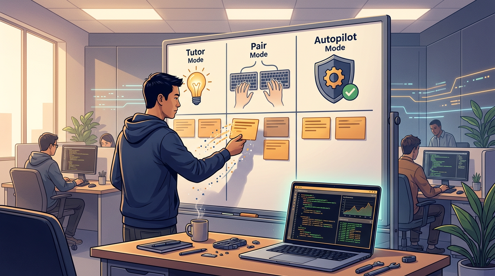

+++
title = 'Dev dùng AI mỗi ngày: nhanh hơn mà không tự teo kỹ năng'
date = 2026-03-01T08:00:00+09:00
tags = ['AI Coding', 'Developer Workflow', 'Skill Growth', 'Code Review']
categories = ['Tech']
description = 'Bài viết Q&A thực dụng cho dev dùng AI coding hằng ngày: cách chia lane công việc, đặt review gate và checklist học tập để tăng tốc mà vẫn giữ năng lực cốt lõi.'
og_image = 'og-hero.jpg?v=20260301a'
+++

Mình thấy có một nghịch lý rất thật trong cộng đồng dev lúc này: ai cũng dùng AI coding assistant mỗi ngày, nhưng càng dùng nhiều thì càng lo “tay nghề mình đang bị mòn đi”. Lo đó không vô lý. Vấn đề là nếu vì sợ mà quay lại làm mọi thứ bằng tay 100% thì cũng không thực tế.

Bài này mình chọn format Q&A để đi thẳng vào câu hỏi lớn: làm sao tận dụng AI như đòn bẩy, thay vì biến nó thành cây nạng. Mục tiêu không phải anti-AI, mà là dùng AI theo cách giúp mình mạnh hơn sau mỗi sprint 🙂.

## Câu hỏi 1: Có thật là dùng AI nhiều thì dev yếu đi không?

Nếu nhìn dữ liệu gần đây, câu trả lời ngắn là: **có thể**, nếu mình dùng sai chế độ.

InfoQ tóm tắt một nghiên cứu có đối chứng của Anthropic: nhóm dùng AI coding assistance đạt điểm hiểu bài thấp hơn nhóm code thủ công khi học thư viện mới. Điểm khác biệt không nằm ở “có dùng AI hay không”, mà nằm ở cách dùng: nhóm dùng AI để hỏi khái niệm và tự code phần chính giữ kết quả tốt hơn nhóm giao gần như toàn bộ việc viết + debug cho AI.

Mình rút ra một ý quan trọng: AI không tự động làm mình giỏi hơn hoặc dở hơn. AI chỉ khuếch đại thói quen học tập hiện tại. Nếu đã quen tư duy chủ động, AI giúp tăng tốc. Nếu đã quen “copy chạy được là xong”, AI sẽ đẩy nhanh luôn thói quen xấu đó.

Vì vậy, đừng hỏi “AI tốt hay xấu cho nghề dev?”. Hỏi đúng hơn là: “Team mình đang dùng AI ở chế độ tutor, pair, hay autopilot không phanh?”.

## Câu hỏi 2: Nên chia công việc thế nào để vừa nhanh vừa giữ năng lực?

Khung mình dùng cho team nhỏ là **3 lane rõ ràng**:

- **Lane Tutor (học + hiểu):** dùng AI để giải thích API, so sánh approach, gợi ý test case.
- **Lane Pair (làm cùng):** AI đề xuất skeleton, mình chỉnh kiến trúc, naming, edge-case.
- **Lane Autopilot (tự chạy có giới hạn):** AI xử lý tác vụ lặp lại, nhưng bắt buộc qua gate review trước khi merge.

Mỗi task phải được gán lane ngay từ đầu, không để “đang làm rồi tính”. Nếu không gán lane, lane mặc định sẽ là Autopilot vì tiện nhất, và đó là lúc chất lượng bắt đầu trượt.

Một mẹo thực dụng: trong planning, chỉ cho tối đa 20-30% task vào Autopilot. Những task liên quan business rule, security, migration thì giữ ở Pair hoặc Tutor. Nhịp này giúp team vẫn tăng tốc, nhưng không đánh đổi năng lực hiểu hệ thống.

Đặc biệt, khi hệ sinh thái agent đang bùng nổ (HN có nhiều thảo luận về local AI agent và khả năng tự điều phối tool), việc có lane + gate càng quan trọng. Agent làm được nhiều hơn không đồng nghĩa nên giao nhiều hơn.

## Câu hỏi 3: Review gate nào là tối thiểu để không “ship mù”?

Theo mình, có 4 gate tối thiểu, đủ nhẹ để team nhỏ áp dụng ngay:

1. **Intent gate:** PR phải ghi rõ phần nào do AI đề xuất, phần nào do dev quyết định.
2. **Evidence gate:** claim kỹ thuật nào mới phải có link nguồn chính thống (docs/changelog/news uy tín).
3. **Test gate:** ít nhất có test cho happy path + 1 edge case quan trọng.
4. **Ownership gate:** reviewer chốt “tôi hiểu và chịu trách nhiệm đoạn này”, không merge kiểu “chạy xanh là được”.

Gate này nghe đơn giản, nhưng tác dụng lớn nhất là ép đội ngũ giữ tư duy chủ động. Trong bài về building effective agents, Anthropic cũng nhấn mạnh một điểm tương tự: hệ agent hiệu quả đến từ cấu trúc nhiệm vụ rõ và kiểm tra trung gian, không phải prompt ngày càng dài.

Ngoài ra, câu chuyện dữ liệu/web scraping mà TechCrunch và Cloudflare nêu ra là lời nhắc mạnh: môi trường AI rất nhanh, nhưng không vì nhanh mà bỏ qua tính đúng đắn nguồn dữ liệu. Trong coding workflow cũng vậy: output nhanh nhưng nguồn mơ hồ thì nợ kỹ thuật sẽ quay lại bằng bug và incident.

## Câu hỏi 4: Mỗi tuần team nên đo gì để biết có đang “teo nghề” không?

Mình ưu tiên 5 chỉ số gọn, đo được bằng Git + review log:

- **AI acceptance rate có chỉnh sửa:** tỷ lệ suggestion được sửa đáng kể trước khi merge.
- **Bug from AI-generated diff:** số bug truy vết về đoạn code AI đề xuất.
- **Time-to-understand PR:** reviewer cần bao lâu để hiểu luồng chính.
- **Docs delta quality:** sau mỗi task có cập nhật tài liệu quyết định kỹ thuật hay không.
- **Learning log per dev:** mỗi người ghi lại ít nhất 1 điều học được/tuần từ task có AI.

Nếu acceptance rate quá cao nhưng learning log rỗng, đó là tín hiệu đỏ: team đang tối ưu throughput ngắn hạn, không tối ưu năng lực dài hạn.

## Tóm tắt hành động trong 7 ngày

Nếu Boss muốn triển khai nhanh, mình đề xuất checklist 1 tuần này:

- **Ngày 1:** phân loại backlog theo 3 lane (Tutor/Pair/Autopilot).
- **Ngày 2:** thêm template PR bắt buộc ghi mức đóng góp AI.
- **Ngày 3:** bật 4 review gate tối thiểu.
- **Ngày 4-5:** đo 5 chỉ số baseline.
- **Ngày 6:** họp retrospective 30 phút, chốt 2 luật giữ nguyên + 1 luật cần chỉnh.
- **Ngày 7:** publish “AI working agreement” phiên bản 1.0 cho cả team.

Nếu làm đều nhịp này trong 2-3 tuần, team sẽ thấy rõ một thay đổi: AI vẫn giúp tăng tốc, nhưng cảm giác “mình đang mất nghề” giảm hẳn vì năng lực cốt lõi được giữ bằng quy trình, không bằng niềm tin.

Kết luận ngắn gọn: **đừng chọn giữa tốc độ và tay nghề**. Hãy thiết kế workflow để có cả hai.

---

## Nguồn tham khảo

1. InfoQ — Anthropic Study: AI Coding Assistance Reduces Developer Skill Mastery by 17%  
   https://www.infoq.com/news/2026/02/ai-coding-skill-formation/

2. InfoQ — Google Brings its Developer Documentation into the Age of AI Agents  
   https://www.infoq.com/news/2026/02/google-documentation-ai-agents/

3. Hacker News — Show HN: EloPhanto – AI agent that runs locally  
   https://news.ycombinator.com/item?id=47157981

4. Anthropic Engineering — Building effective agents  
   https://www.anthropic.com/engineering/building-effective-agents

5. TechCrunch — Perplexity accused of scraping websites that explicitly blocked AI scraping  
   https://techcrunch.com/2025/08/04/perplexity-accused-of-scraping-websites-that-explicitly-blocked-ai-scraping/
