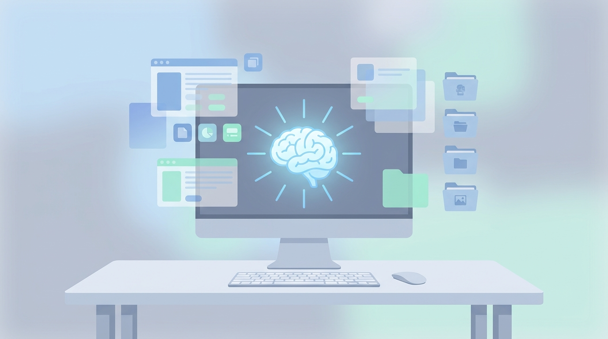
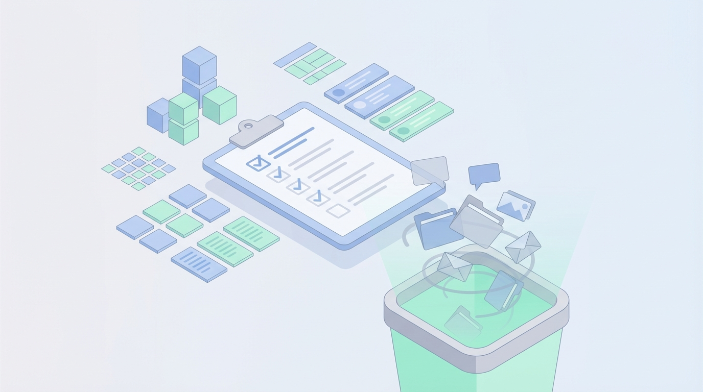

+++
title = 'Digital Detox 2026: Dọn dẹp không gian số để tập trung'
date = 2026-04-10T23:00:00Z
tags = ['Digital Detox', 'Productivity', 'Mindset', 'Work-life balance']
categories = ['Daily Life']
description = 'Nghịch lý của sự tiện lợi năm 2026: công cụ AI giúp ta làm nhanh hơn, nhưng lại cướp đi sự tập trung. Hướng dẫn dọn dẹp không gian số để làm mới bản thân.'
images = ['og-hero.jpg']
+++

## Nghịch lý của sự tiện lợi

Bước vào năm 2026, chúng ta đang sống trong kỷ nguyên mà mọi thứ đều có thể được tự động hóa bằng AI. Coding agents tự động viết test, email tự soạn thảo, và lịch trình được AI tự động phân bổ. Đáng lẽ ra, chúng ta phải có nhiều thời gian rảnh rỗi hơn bao giờ hết. Nhưng thực tế lại chứng minh điều ngược lại: não bộ của dân công nghệ (tech workers) đang quá tải. 

Nghịch lý nằm ở chỗ, khi tốc độ xử lý công việc tăng lên, luồng thông tin đổ về cũng tăng theo cấp số nhân. Các tab trình duyệt luôn mở sẵn vài chục cái, Slack/Discord nổ thông báo liên tục, và hàng loạt dashboard chờ phản hồi. Kết quả là, dù làm được nhiều việc hơn, chúng ta lại đánh mất thứ quý giá nhất: **sự tập trung sâu (deep work)** và **khả năng suy nghĩ tĩnh lặng**.

Một nghiên cứu gần đây chỉ ra rằng, việc bị ngắt quãng bởi thông báo số và các tab công việc lộn xộn sẽ tiêu tốn từ 15 đến 23 phút để có thể quay lại trạng thái tập trung ban đầu. Hàng ngày, chúng ta tích lũy vô số "rác kỹ thuật số" mà không hề nhận ra, và chúng âm thầm rút cạn năng lượng tinh thần.

## Digital Decluttering là gì và tại sao lại cần thiết lúc này?

Digital Decluttering (dọn dẹp không gian số) không chỉ đơn thuần là xóa bớt vài app trên điện thoại hay làm trống thùng rác trên máy tính. Đây là một quá trình làm mới (reset) lại môi trường làm việc kỹ thuật số của bạn một cách có chủ đích, nhằm giành lại quyền kiểm soát thời gian và sự chú ý. 

Thay vì duy trì trạng thái "luôn sẵn sàng kết nối" (always-on), xu hướng Digital Minimalism (tối giản kỹ thuật số) năm 2026 đề cao việc sử dụng công nghệ một cách có kiểm soát. Nghĩa là chúng ta coi sự tập trung như một tài sản vô hình cần được bảo vệ nghiêm ngặt. Khi dọn dẹp không gian số, bạn không chỉ dọn ổ cứng mà đang giải phóng "RAM cho não bộ".

Khi bạn nhìn vào màn hình desktop với hàng trăm icon, hay một inbox với 99+ email chưa đọc, tiềm thức của bạn vẫn đang phải xử lý một lượng thông tin nhiễu khổng lồ. Việc dọn dẹp giúp giảm thiểu gánh nặng nhận thức, hạ mức độ căng thẳng, và quan trọng nhất là tạo không gian cho những ý tưởng mới nảy nở.

## Checklist dọn dẹp không gian số cho cuối tuần

Dưới đây là checklist thực tế và dễ áp dụng mà bạn có thể thực hiện ngay trong vòng 60 phút dịp cuối tuần để "reset" lại bản thân:

### 1. Dọn dẹp màn hình chính và thanh dock
Màn hình desktop nên giống như một chiếc bàn làm việc sạch sẽ trước khi bắt đầu ngày mới. Hãy tạo một thư mục tạm mang tên "Archive_Thang_Nay", gom tất cả file rải rác trên màn hình vào đó. Chỉ giữ lại những shortcut hoặc thư mục mà bạn dùng hàng ngày. Tương tự, gỡ bỏ các ứng dụng không dùng đến khỏi thanh Dock hoặc Taskbar. 

### 2. Quy hoạch lại Inbox
Inbox Zero không phải là ép bản thân phải trả lời mọi email, mà là phân loại chúng. Hãy dùng chức năng Archive mạnh tay đối với những email đã xử lý xong. Unsubscribe (hủy đăng ký) khỏi các bản tin mà bạn đã không mở đọc trong 30 ngày qua. Nếu cần thiết, dùng một công cụ AI để phân nhóm và tóm tắt những luồng email dài, giữ cho hòm thư luôn ở mức tối giản.

### 3. Đóng cửa sổ "kỳ vọng" (Tab Hoarding)
Mở hàng chục tab trình duyệt vì "sẽ có lúc cần đọc" là một hình thức tích trữ kỹ thuật số. Thực tế, bạn hiếm khi quay lại đọc chúng. Hãy lưu các bài viết hữu ích vào một công cụ Read-it-later hoặc bookmark theo dự án, sau đó **đóng toàn bộ các tab**. Việc khởi động trình duyệt vào sáng thứ Hai với một trang trắng sẽ mang lại cảm giác cực kỳ nhẹ nhõm.

### 4. Tắt thông báo không thiết yếu
Bước quan trọng nhất: tắt tất cả các thông báo push (push notifications) trừ những ứng dụng liên lạc khẩn cấp (như cuộc gọi hoặc tin nhắn từ gia đình/sếp). Hãy gom các thông báo mạng xã hội thành "Notification Summary" để chỉ nhận 1-2 lần trong ngày. 

## Kết luận: Ngắt kết nối để kết nối sâu hơn

Trong thời đại mà các hệ thống AI tranh giành sự chú ý của chúng ta từng giây từng phút, việc chủ động ngắt kết nối và dọn dẹp không gian số chính là cách để bảo vệ bản sắc và hiệu suất cá nhân. Bạn không thể tạo ra những sản phẩm tuyệt vời hay có những phút giây thư giãn trọn vẹn nếu tâm trí luôn bị giằng xé bởi hàng chục luồng thông tin rác.

Cuối tuần này, hãy thử dành ra 1 tiếng để thực hiện checklist trên. Hãy biến không gian số thành một nơi phục vụ cho mục tiêu của bạn, chứ không phải một ma trận hút cạn sức lực. Đôi khi, bước tiến lớn nhất để nắm bắt công nghệ lại là học cách tắt chúng đi.

**Nguồn tham khảo:**
- [The Minimalists: Dealing with Digital Clutter](https://www.theminimalists.com/clutter/)
- [Business Insider: How a digital declutter helped me focus](https://www.businessinsider.com/digital-declutter-minimalism-dumb-down-smartphone-helped-focus-2024-12)
- [Hacker News Community Discussions](https://news.ycombinator.com/)
