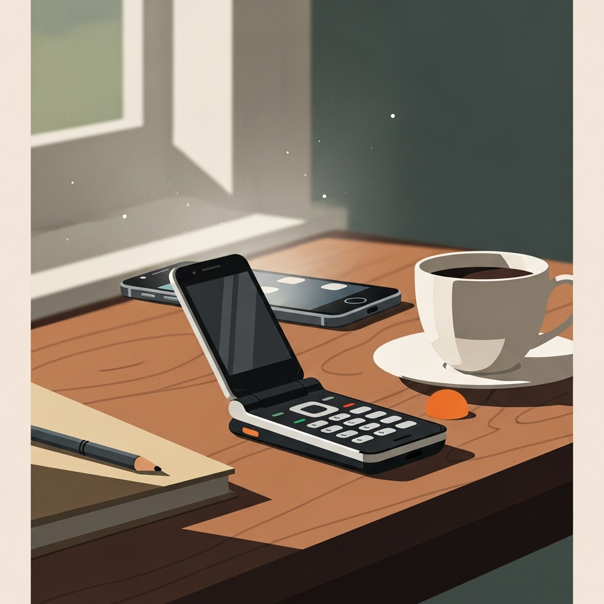

+++
title = 'Digital Detox 2026: Tại Sao Giới Trẻ Chọn Dumbphone'
date = 2026-03-24T23:00:00Z
tags = ['Digital Detox', 'Minimalism', 'Dumbphone', 'Mental Health']
categories = ['Daily Life']
description = 'Năm 2026 chứng kiến sự hồi sinh mạnh mẽ của dumbphone. Đâu là lý do giới trẻ và dân công nghệ quyết định rời bỏ smartphone để tìm về sự bình yên kỹ thuật số?'
images = ['og-hero.jpg']
+++

Trong một thế giới mà AI tự động hoá mọi thứ và các thiết bị liên tục đòi hỏi sự chú ý, một làn sóng ngược dòng đang diễn ra mạnh mẽ vào năm 2026: sự trở lại của những chiếc "điện thoại ngu" (dumbphone). Không phải vì họ không đủ tiền mua smartphone cao cấp, mà vì giới trẻ và cả những chuyên gia công nghệ đang chủ động chọn cách ngắt kết nối. 

Vậy điều gì đang thúc đẩy phong trào này, và liệu đây có phải là giải pháp thực sự cho "căn bệnh" mệt mỏi kỹ thuật số (digital fatigue)?

## 2010 - 2026: Từ "FOMO" đến "JOMO"

Nếu nhìn lại chặng đường phát triển của điện thoại di động, chúng ta sẽ thấy một sự chuyển dịch thú vị về mặt tâm lý học hành vi.

### Kỷ nguyên bùng nổ (2010 - 2020)
Đây là giai đoạn mà chiếc smartphone là biểu tượng của sự kết nối. Mọi người mắc hội chứng FOMO (Fear Of Missing Out) - sợ bị bỏ lỡ. Các ứng dụng mạng xã hội được thiết kế tối ưu hoá bằng AI để giữ chân người dùng lâu nhất có thể.

### Giai đoạn bão hoà và kiệt sức (2021 - 2024)
Sau đại dịch, việc phải làm việc và giao tiếp hoàn toàn qua màn hình khiến sự mệt mỏi lên đến đỉnh điểm. Dân công nghệ bắt đầu nhận ra mặt trái của việc "luôn luôn trực tuyến". Những thiết bị tối giản như [Light Phone III (được TechCrunch đánh giá cao)](https://techcrunch.com/2024/06/11/light-phone-iii-adds-a-camera-and-a-bigger-screen-to-the-anti-smartphone/) hay các dòng Nokia nắp gập bắt đầu len lỏi vào các diễn đàn như [Hacker News](https://news.ycombinator.com/).

### Trào lưu Digital Detox bùng nổ (2025 - 2026)
Sang năm 2026, JOMO (Joy Of Missing Out) - niềm vui khi được bỏ lỡ - trở thành một triết lý sống. Dumbphone không còn là thiết bị dự phòng, mà trở thành biểu tượng của những người kiểm soát được thời gian của mình. Những người mang theo một chiếc điện thoại nắp gập khi đi cà phê cuối tuần giờ đây được nhìn nhận là "cool" và biết cách tận hưởng cuộc sống.

Lợi ích tâm lý của việc sử dụng các thiết bị tối giản để thoát khỏi sự lo âu từ hàng tá thông báo chớp nhoáng là điều không thể phủ nhận. Thay vì giật mình vì tiếng "ting" của Slack hay Zalo, bạn có thể hoàn toàn chìm đắm vào một cuốn sách tại công viên. Việc không thể lướt feed vô thức buộc não bộ phải học cách làm quen với sự nhàm chán - cội nguồn của sự sáng tạo.

## Ma trận quyết định: Bạn có cần Dumbphone?

Dù phong trào này rất hấp dẫn, việc đột ngột vứt bỏ chiếc smartphone hiện tại có thể gây ra nhiều rắc rối trong công việc. Để biết liệu bạn có phù hợp với việc chuyển đổi hay không, hãy thử đánh giá dựa trên ma trận sau:

### 1. Nhu cầu kết nối của bạn ở mức nào?
- **Thấp (Chỉ cần nghe gọi, SMS):** Dumbphone truyền thống (như Nokia 2660 Flip) là lựa chọn hoàn hảo. Màn hình nhỏ, không có trình duyệt web, pin dùng cả tuần.
- **Trung bình (Cần Maps, gọi xe, thanh toán QR):** Bạn nên nhắm đến các dòng "Smart-dumbphone" hoặc Minimalist phone (như Mudita Kompakt hoặc thiết bị dùng màn hình E-ink). Nó giúp bạn loại bỏ mạng xã hội nhưng vẫn sinh tồn được ở thành phố lớn.
- **Cao (Cần liên lạc công việc liên tục qua Telegram/Slack):** Không nên chuyển hoàn toàn sang dumbphone. Thay vào đó, hãy sử dụng tính năng Focus Mode trên smartphone hiện tại, hoặc sắm một chiếc dumbphone làm "điện thoại cuối tuần".

### 2. Bạn sẵn sàng đánh đổi sự tiện lợi?
Việc sử dụng dumbphone đồng nghĩa với việc bạn không thể scan QR menu tại nhà hàng ngay lập tức, không có camera xịn để chụp ảnh check-in, và đôi khi phải loay hoay tìm đường thay vì dùng Google Maps. Sự bất tiện này chính là "tính năng" giúp bạn đi chậm lại, nhưng bạn phải thực sự chuẩn bị tâm lý cho nó.

## Playbook thực tế: Từng bước ngắt kết nối

Nếu bạn quyết định thử nghiệm, đừng đốt cháy giai đoạn. Hãy làm theo playbook sau để quá trình "cai nghiện" diễn ra êm ái:

1. **Tuần 1: Dọn dẹp số (Digital Declutter).** Tắt toàn bộ thông báo (trừ cuộc gọi) trên smartphone. Xoá ứng dụng mạng xã hội và chỉ truy cập qua trình duyệt máy tính.
2. **Tuần 2: Thiết lập ranh giới vật lý.** Không mang điện thoại vào phòng ngủ. Mua một chiếc đồng hồ báo thức cơ học để tránh việc chạm vào màn hình ngay khi vừa mở mắt.
3. **Tuần 3: Thử nghiệm cuối tuần.** Sắm một chiếc dumbphone giá rẻ, chuyển SIM sang vào tối thứ Sáu và chỉ dùng nó cho đến sáng thứ Hai. Dành trọn vẹn 48 giờ offline.
4. **Tuần 4: Đánh giá và quyết định.** Lắng nghe cơ thể. Bạn thấy bồn chồn hay thư thái? Sự chú ý của bạn có cải thiện không? Từ đó quyết định tần suất sử dụng dumbphone phù hợp với bản thân.

## Kết luận

Cơn sốt dumbphone năm 2026 không phải là sự chối bỏ công nghệ (anti-tech), mà là sự phản kháng lại việc công nghệ thao túng sự chú ý của con người. Đối với dân dev và những người làm việc trí óc, sự tập trung và sự tĩnh lặng mới là tài sản quý giá nhất. Dù bạn chọn cách mua một chiếc nắp gập hoài cổ, hay chỉ đơn giản là học cách đặt smartphone sang một bên, thông điệp cuối cùng vẫn là: Hãy để công nghệ phục vụ cuộc sống của bạn, chứ không phải ngược lại.

_Bài viết được tổng hợp từ các xu hướng thảo luận trên [Hacker News](https://news.ycombinator.com/), [TechCrunch](https://techcrunch.com/2024/06/11/light-phone-iii-adds-a-camera-and-a-bigger-screen-to-the-anti-smartphone/), và các báo cáo nghiên cứu tâm lý học năm 2025-2026 về lĩnh vực Digital Wellness._
