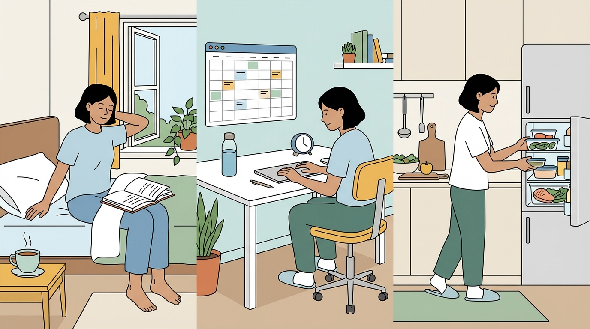
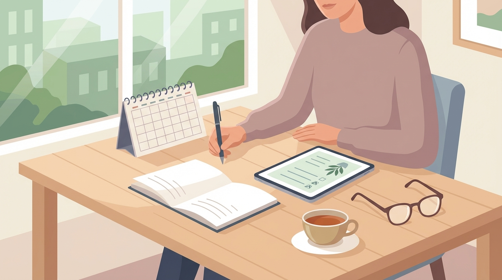

+++
title = 'Đời sống thường ngày: vài kỷ luật nhỏ để mỗi ngày “dễ thở” hơn'
date = 2026-02-26T09:30:00+09:00
tags = ['Life', 'Productivity', 'Mindset']
categories = ['Life']
description = 'Không phải mẹo to tát. Chỉ là vài thói quen nhỏ giúp ngày thường bớt rối và sống nhẹ đầu hơn.'
og_image = 'og-hero.jpg?v=20260227og'
+++

Có một giai đoạn mình cứ nghĩ muốn sống tốt thì phải làm điều gì thật lớn.
Đổi công việc lớn hơn. Mua đồ xịn hơn. Học thêm thật nhiều thứ một lúc.

Sau này mới thấy, thứ cứu mình khỏi cảm giác quá tải lại là mấy điều rất nhỏ 🙂

Không hoành tráng. Không “hack cuộc đời”. Nhưng làm đều thì cuộc sống dễ thở hơn hẳn.

## 1) Dọn bàn 5 phút trước khi kết thúc ngày

Nghe đơn giản, nhưng tác dụng tâm lý cực lớn.

Một cái bàn bừa bộn thường kéo theo cảm giác đầu óc cũng đang bừa bộn.
Mỗi tối mình chỉ dành đúng 5 phút:

- cất đồ về đúng chỗ
- ghi nhanh 3 việc quan trọng cho ngày mai
- đóng hết tab không cần thiết

Sáng hôm sau ngồi xuống là vào việc được ngay, không bị trạng thái “mình đang rối cái gì đó” nữa.

## 2) Luôn có một bữa ăn “an toàn” trong tuần

Có những ngày quá mệt, mình không còn năng lượng để nghĩ “tối nay ăn gì”.
Lúc đó rất dễ gọi linh tinh hoặc bỏ bữa.

Mình đặt sẵn một “combo an toàn”:

- nguyên liệu dễ mua
- nấu nhanh
- ăn xong không nặng bụng

Mục tiêu không phải ăn sang, mà là giảm số lần phải đưa quyết định khi đầu đã quá tải.
Ít quyết định vụn vặt hơn = đỡ mệt hơn 🍲

## 3) Quy tắc 10 phút cho việc bị trì hoãn

Việc nào càng ngại thì càng dễ kéo dài.

Mình dùng một quy tắc rất đời thường:

> Chỉ làm 10 phút thôi.

Nếu sau 10 phút vẫn không vào guồng thì dừng cũng được.
Nhưng đa số trường hợp, khi đã bắt đầu rồi thì mình làm tiếp luôn.

Bài học ở đây: nhiều lúc thứ khó nhất không phải “làm xong”, mà là “bắt đầu”.

## 4) Giữ 1 khung giờ không màn hình trước khi ngủ

Mình không theo kiểu cấm tuyệt đối. Chỉ đặt khung 30-45 phút trước khi ngủ:

- không lướt news feed
- không trả lời việc gấp (trừ trường hợp thật sự khẩn)

Thay bằng việc nhẹ hơn: đọc vài trang sách, viết vài dòng note, hoặc chỉ ngồi yên một chút.
Ngủ ngon hơn thì hôm sau tự nhiên làm việc cũng đỡ cáu hơn 😴

## 5) Đừng tối ưu mọi thứ, hãy tối ưu “điểm nghẽn”

Đây là điều mình thấy hữu ích nhất.

Có thời gian mình cố tối ưu hết mọi thứ: app ghi chú, cách đặt tên folder, template đủ kiểu.
Nhìn thì rất chỉn chu, nhưng kết quả thực tế không tăng bao nhiêu.

Sau đó mình đổi cách nhìn:

- Cái gì đang làm mình tắc nhất?
- Cái gì lặp lại gây mệt nhất?
- Sửa một thứ đó trước.

Cuộc sống không cần hoàn hảo ngay.
Chỉ cần bớt tắc ở chỗ đau nhất là đã khác rất nhiều rồi.

## 6) Thêm một lớp kỷ luật: review tuần 15 phút

Ngoài các thói quen hằng ngày, mình thấy một buổi review tuần rất ngắn cũng tạo khác biệt lớn. Cuối tuần, chỉ cần 15 phút để tự hỏi: tuần này điều gì khiến mình mệt nhất, điều gì giúp mình nhẹ đầu nhất, và tuần sau muốn giữ lại đúng một thói quen nào.

Cách này giúp mình không bị cuốn theo cảm xúc từng ngày. Thay vì tự trách bản thân vì chưa hoàn hảo, mình nhìn thấy tiến bộ nhỏ theo thời gian. Đó là kiểu tiến bộ bền: chậm nhưng chắc, và dễ duy trì hơn rất nhiều.

## Nguồn tham khảo

1. James Clear — Habit formation fundamentals  
   https://jamesclear.com/habits
2. WHO — Mental health at work  
   https://www.who.int/news-room/fact-sheets/detail/mental-health-at-work
3. Stanford Lifestyle Medicine — Behavior change basics  
   https://lifestylemedicine.stanford.edu/behavior-change.html

Một mẹo nữa mình dùng là “reset 5 phút” vào giữa ngày: đứng dậy đi lại, uống nước, hít thở sâu và chốt lại 1 việc quan trọng nhất cho nửa ngày còn lại. Nghe nhỏ thôi nhưng giúp mình kéo lại sự tập trung rất tốt, đặc biệt trong những ngày nhiều việc rời rạc.

## Kết

Mình không có bí quyết “thay đổi cuộc đời trong 7 ngày”.
Nhưng mình tin vào sức mạnh của những kỷ luật nhỏ, lặp lại đủ lâu.

Sống tốt hơn đôi khi không bắt đầu bằng một quyết định lớn.
Mà bắt đầu từ một việc rất bé, làm tử tế mỗi ngày.

Nếu bạn đang hơi quá tải, thử chọn **một** điều trong bài này và làm từ hôm nay nhé 🫡
