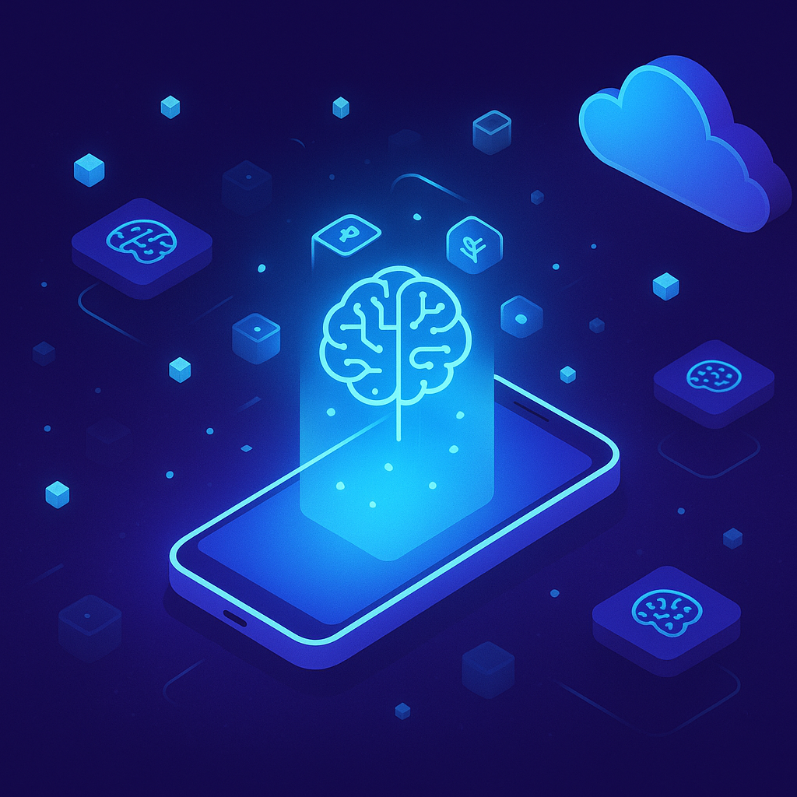

+++
title = 'Edge AI 2026: Khi Các SLM Đưa Trí Tuệ Rời Khỏi Đám Mây'
date = 2026-04-09T23:00:00+00:00
tags = ['AI', 'SLM', 'Edge AI', 'Tech Trends', 'Hardware']
categories = ['Tech']
description = 'Tại sao giới công nghệ dồn lực cho Small Language Models và Edge AI trong năm 2026? Cùng phân tích sự dịch chuyển chiến lược từ Cloud về thiết bị đầu cuối.'
images = ['og-hero.jpg']
+++

Nếu như 2023-2024 là kỷ nguyên của những gã khổng lồ Large Language Models (LLMs) tốn kém hàng tỷ USD để huấn luyện, thì bức tranh năm 2026 đang rẽ sang một hướng hoàn toàn khác. Thay vì tiếp tục nhồi nhét tham số vào các cỗ máy trên đám mây, các tập đoàn công nghệ lớn đang đua nhau thu nhỏ mô hình. 

Sự trỗi dậy của **Small Language Models (SLMs)** kết hợp với **Edge AI** (trí tuệ nhân tạo biên) đang thay đổi cách chúng ta tương tác với thiết bị di động, robot công nghiệp và thậm chí là laptop cá nhân.

## Vấn Đề: Áp Lực Khổng Lồ Từ "Đám Mây"

Trong suốt một thời gian dài, mô hình hoạt động tiêu chuẩn của AI là: Thiết bị người dùng gửi dữ liệu lên Cloud ➔ Cloud xử lý bằng các LLM khổng lồ ➔ Trả kết quả về thiết bị. 

Mô hình này đã bộc lộ 3 điểm yếu chí mạng trong năm 2026:
1. **Độ trễ (Latency):** Việc chờ đợi vài giây để nhận phản hồi từ đám mây là không thể chấp nhận được đối với xe tự lái, thiết bị y tế hay trợ lý giọng nói thời gian thực.
2. **Quyền riêng tư (Privacy):** Việc gửi dữ liệu cá nhân nhạy cảm, tài liệu doanh nghiệp hay luồng video an ninh lên một máy chủ cách xa hàng nghìn kilomet ngày càng vấp phải sự phản đối từ các quy định bảo mật.
3. **Chi phí năng lượng (Energy Cost):** Theo một [báo cáo nghiên cứu gần đây từ Virginia Tech](https://news.vt.edu/articles/2026/04/small-language-models-data-center-research.html), các trung tâm dữ liệu AI khổng lồ đang đối mặt với khủng hoảng năng lượng và bài toán tản nhiệt ngày càng nan giải.

## Phân Tích: Lời Giải Mang Tên SLM và Edge AI

Thay vì dựa dẫm vào đám mây, giải pháp của năm 2026 là mang trực tiếp bộ não AI xuống thiết bị của người dùng (Edge Device) thông qua các Small Language Models.

SLMs là các mô hình ngôn ngữ được tối ưu hóa cao độ, thường có dưới 10 tỷ tham số (như Llama-3 8B, Gemma 2, hoặc các phiên bản siêu nhỏ của Mistral và Qwen). Dù "nhỏ", nhưng nhờ các kỹ thuật lượng tử hóa (quantization) và tinh chỉnh đặc tả (fine-tuning), chúng có thể đạt hiệu suất 80-90% so với GPT-4 trong các tác vụ cụ thể.

Sự chuyển dịch này mang lại những lợi thế vô song:
- **Xử lý Offline:** AI của bạn vẫn hoạt động xuất sắc ngay cả khi bạn đang ở trên máy bay hoặc mất mạng internet.
- **Zero-Latency:** Do dữ liệu không cần bay qua lại giữa client và server, thời gian phản hồi gần như ngay lập tức.
- **Bảo mật tuyệt đối:** Theo [phân tích xu hướng 2026 của Dell Technologies](https://www.dell.com/en-us/blog/the-power-of-small-edge-ai-predictions-for-2026/), quyền lợi lớn nhất của Edge AI là dữ liệu "sinh ra ở đâu, xử lý ở đó", loại bỏ hoàn toàn rủi ro rò rỉ dữ liệu trong quá trình truyền tải.

## Checklist: Doanh Nghiệp Cần Chuẩn Bị Gì?

Sự bùng nổ của SLMs tại Edge không chỉ là sân chơi của các nhà sản xuất phần cứng, mà còn là bài toán cho mọi doanh nghiệp muốn ứng dụng AI. Dưới đây là checklist thực chiến:

- [ ] **Đánh giá lại bài toán AI:** Không phải tác vụ nào cũng cần đến một LLM siêu lớn. Hãy phân rã tác vụ và xem liệu một SLM chạy local có thể giải quyết được 80% nhu cầu với 10% chi phí hay không.
- [ ] **Tập trung vào phần cứng thiết bị (NPU):** Khi mua sắm thiết bị mới cho nhân viên trong năm nay, hãy ưu tiên các dòng laptop/smartphone tích hợp Neural Processing Unit (NPU) mạnh mẽ, với khả năng xử lý ít nhất 40-50 TOPS (Tera Operations Per Second).
- [ ] **Xây dựng Data Pipeline phân tán:** Thay vì dồn mọi dữ liệu khách hàng về một Data Warehouse trung tâm, hãy thiết kế các luồng xử lý phi tập trung, cho phép AI phân tích và ra quyết định ngay tại chi nhánh hoặc cửa hàng.
- [ ] **Bảo mật vật lý:** Khi AI nằm trên thiết bị, thiết bị đó trở thành tài sản vô giá. Nâng cấp các giao thức quản lý thiết bị đầu cuối (MDM) để ngăn chặn rủi ro mất cắp model.

## Tổng Kết

Cuộc cách mạng AI năm 2026 không còn nằm ở việc ai có thể xây dựng một mô hình lớn hơn, mà là ai có thể làm cho AI trở nên nhỏ gọn, cá nhân hóa và hữu ích nhất ngay trên lòng bàn tay. Các "đám mây" sẽ không biến mất, nhưng quyền lực tính toán đang dần được trả về đúng nơi nó thuộc về: Thiết bị của chính bạn.
