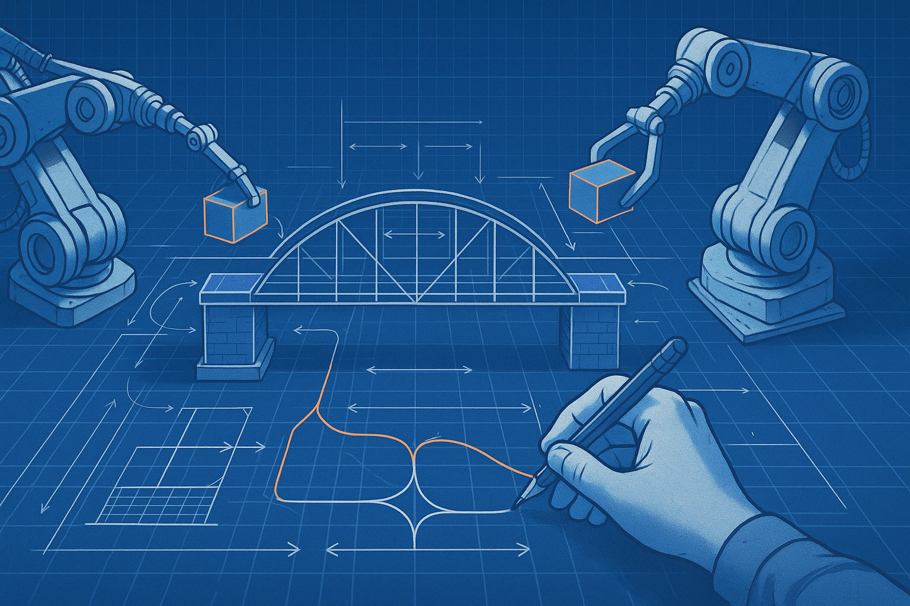
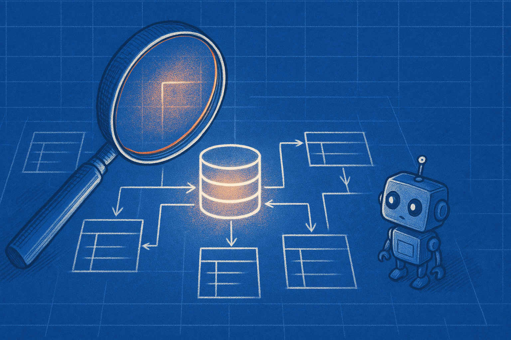

+++
title = 'Nghề Dev 2026: Vượt Lời Nguyền Hollowed-out Khi Có AI'
date = 2026-04-11T23:00:00Z
tags = ['AI', 'Career', 'Junior Developer', 'System Design', 'Workflow']
categories = ['Career']
description = 'AI đang làm thay việc của Junior Dev trong năm 2026. Đây là cách thoát khỏi bẫy hollowed-out và xây dựng nền tảng vững chắc để thăng tiến lên Senior.'
images = ['og-hero.jpg']
+++

Thị trường việc làm cho kỹ sư phần mềm mới ra trường đang trải qua một đợt thay đổi lớn nhất trong thập kỷ. Khi các công cụ AI như Copilot, Cursor hay OpenClaw dễ dàng xử lý những đoạn code boilerplate và API CRUD đơn giản, câu hỏi đặt ra không còn là *"Junior Dev có bị thay thế không?"* mà là *"Làm sao để Junior Dev có thể sống sót và trưởng thành?"*.

Theo AWS CEO Matt Garman, việc cắt giảm vị trí Junior là "một trong những điều ngu ngốc nhất" mà các công ty có thể làm [^1]. Dù vậy, thực tế là tính chất công việc của một lập trình viên mới vào nghề đã hoàn toàn thay đổi. Hãy cùng bóc tách lầm tưởng lớn nhất về nghề Dev trong năm 2026 và cách xây dựng nền tảng vững chắc để không rơi vào "hollowed-out career ladder" (chiếc thang nghề nghiệp rỗng ruột).

## Myth vs Fact: Lầm Tưởng Về Lập Trình Bằng AI

**Lầm tưởng (Myth):** "AI đã viết hết code rồi, Junior Dev không cần phải học cách viết code tay nữa."

Nhiều bạn trẻ bước vào ngành với suy nghĩ rằng chỉ cần biết cách viết prompt là đủ. Họ giao phó toàn bộ logic cho AI và trở thành những "người lắp ráp" một cách máy móc. Hậu quả là khi hệ thống phình to, họ không thể debug và không hiểu luồng dữ liệu chạy thế nào. Đây chính là bẫy "hollowed-out" – nơi bạn mất đi cơ hội học hỏi những kiến thức nền tảng từ các task nhỏ bé nhất [^2].

**Sự thật (Fact):** "AI viết code tay để bạn có thể học kiến trúc hệ thống (System Design) sớm hơn."

Thay vì mất vài ngày để gõ lại một form đăng nhập hoặc setup một database schema cơ bản, AI giúp bạn hoàn thành trong vài phút. Nhưng trách nhiệm của bạn không giảm đi. Bạn phải đọc, hiểu và review đoạn code đó như một Senior thực thụ. AI đang ép Junior Dev phải nâng cấp tư duy từ "người gõ code" (Coder) thành "người giải quyết vấn đề" (Problem Solver) ngay từ những ngày đầu tiên [^3].

## Framework: 3 Trụ Cột Tư Duy Mới Cho Junior Dev

Để không bị đào thải và nhanh chóng bước lên Mid-level hoặc Senior, bạn cần xây dựng năng lực xoay quanh 3 trụ cột sau:

### 1. Nắm Vững Luồng Dữ Liệu (Data Flow) Hơn Là Cú Pháp
Cú pháp (Syntax) là thứ AI giỏi nhất. Thay vì thuộc lòng các hàm của một framework, hãy tập trung vào cách dữ liệu di chuyển: request đi từ client, qua API gateway, vào controller, xuống database, và trả về như thế nào. Nếu hiểu được Data Flow, bạn sẽ luôn biết code AI sinh ra đang đặt sai ở bước nào.

### 2. Tư Duy Review Code Bắt Buộc
Đừng bao giờ copy-paste code từ AI mà không review. Hãy tập thói quen tự hỏi: "Tại sao AI lại chọn cấu trúc dữ liệu này?", "Đoạn code này có xử lý được edge cases không?", "Nó có nguy cơ bị SQL Injection không?". Các vòng phỏng vấn Junior năm 2026 thường đưa cho ứng viên một đoạn code AI viết lỗi và yêu cầu họ tìm, giải thích và sửa chữa.

### 3. Hiểu Biết Về Kiến Trúc Hệ Thống (System Design)
Đây từng là kỹ năng của Senior, nhưng nay đã trở thành yêu cầu tối thiểu cho Junior [^4]. Khi không còn bận tâm về code chân tay, bạn cần học cách lắp ghép các module lại với nhau: khi nào dùng microservices, khi nào dùng cache, và làm sao để hệ thống scale được.

## Practical Playbook: Các Bước Rèn Luyện Hàng Ngày

Để biến Framework trên thành hành động cụ thể, hãy áp dụng "Practical Playbook" này vào công việc hàng ngày của bạn:

- **Bước 1: Prompt với Context Rõ Ràng.** Không bảo AI "Viết cho tôi một API". Hãy bảo AI "Viết API đăng ký user, nhận JSON, trả về JWT, sử dụng bcrypt để mã hóa password, và xử lý lỗi duplicate email". Việc này rèn cho bạn khả năng đặc tả yêu cầu hệ thống.
- **Bước 2: Viết Test Trước Khi Dùng AI.** Áp dụng Test-Driven Development (TDD). Viết các test case mà logic của bạn cần vượt qua, sau đó để AI viết code pass các test đó. Nếu bạn không biết test gì, bạn chưa hiểu vấn đề.
- **Bước 3: Tự Code Lại Những Phần Cốt Lõi.** Trong các dự án cá nhân, hãy thử tự tay cấu hình CI/CD, tự viết các query database phức tạp ít nhất một lần để hiểu nguyên lý hoạt động trước khi giao lại việc đó cho AI ở các dự án sau.
- **Bước 4: Học Cách Đọc Code Người Khác.** Tham gia đóng góp mã nguồn mở hoặc đọc các thư viện phổ biến. Việc đọc và phân tích code giỏi sẽ giúp bạn kiểm soát được đống code khổng lồ mà AI sinh ra hàng ngày.

## Tóm Lại

Năm 2026 không phải là năm đánh dấu sự kết thúc của Junior Developer, mà là năm đòi hỏi sự tiến hóa. Sự xuất hiện của AI không cướp đi cơ hội học hỏi, mà chỉ tước bỏ lớp vỏ bọc "gõ phím" để lộ ra giá trị thật sự của kỹ sư phần mềm: tư duy giải quyết vấn đề. Hãy dùng AI như một đòn bẩy để nắm bắt System Design nhanh hơn, thay vì để nó biến bạn thành một con robot chỉ biết copy-paste.

---
**Nguồn tham khảo:**
[^1]: [AWS CEO: Cutting juniors is 'one of the dumbest things'](https://codeconductor.ai/blog/future-of-junior-developers-ai/)
[^2]: [The Hollowed-Out Career Ladder in Tech](https://coursecareers.com/blog-posts/ai-changes-entry-level-jobs)
[^3]: [How AI is reshaping entry-level tech roles](https://www.ironhack.com/us/blog/how-ai-is-reshaping-entry-level-tech-roles)
[^4]: [Software Engineering 2026: AI Reshapes Developer Jobs](https://byteiota.com/software-engineering-2026-ai-reshapes-developer-jobs/)
