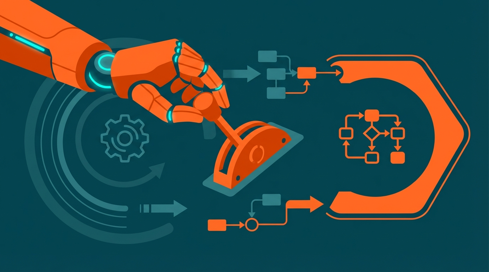
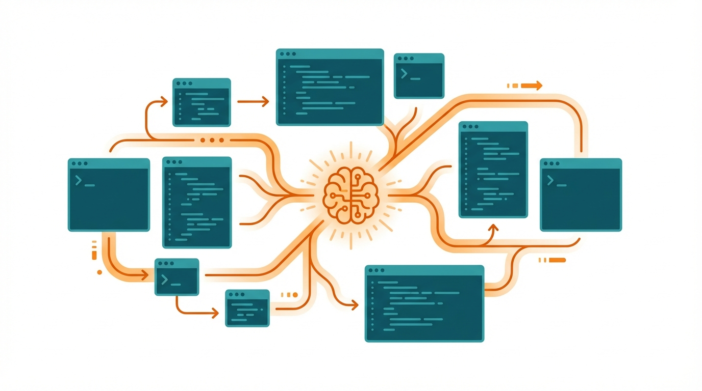

+++
title = 'Kỷ Nguyên Agentic AI 2026: Từ Trả Lời Sang Hành Động'
date = 2026-04-03T23:00:00Z
tags = ['AI', 'Agentic AI', 'Tech Trends 2026', 'Software Development']
categories = ['Tech']
description = 'Agentic AI đánh dấu bước nhảy vọt trong năm 2026, chuyển hướng từ việc thụ động tạo nội dung sang khả năng tự chủ hành động giải quyết công việc phức tạp.'
images = ['og-hero.jpg']
+++

Năm 2026 đánh dấu một bước chuyển mình vô cùng sâu sắc trong bức tranh toàn cảnh của trí tuệ nhân tạo. Nếu như những năm trước, chúng ta chứng kiến sự bùng nổ của Generative AI với khả năng tạo ra văn bản và hình ảnh đáng kinh ngạc, thì hiện tại trọng tâm đã dời sang một khái niệm mạnh mẽ và thực dụng hơn rất nhiều: Agentic AI. 

Các hệ thống AI giờ đây không chỉ đơn thuần đóng vai trò như một cỗ máy tìm kiếm hay một chuyên gia trả lời câu hỏi. Chúng được thiết kế để hiểu các mục tiêu tổng thể, tự động lập kế hoạch chiến lược và tương tác độc lập với các công cụ phần mềm khác để thực thi những quy trình làm việc gồm nhiều bước phức tạp. Bài viết này sẽ đi sâu phân tích các kịch bản ứng dụng Agentic AI đang định hình lại nhiều ngành công nghiệp mũi nhọn và đưa ra ma trận đánh giá cho các doanh nghiệp muốn nắm bắt xu hướng này.

## Scenario 1: Agentic AI tái định hình quy trình phát triển phần mềm (SDLC)

Sự thay đổi mạnh mẽ nhất và dễ nhận thấy nhất đang diễn ra ngay trong quy trình phát triển phần mềm. Theo các báo cáo và phân tích trong Quý 1 năm 2026, Agentic AI đang thực sự tái định hình Software Development Lifecycle (SDLC) bằng cách tự động hóa những tác vụ tốn thời gian như viết mã, kiểm thử, phát hiện lỗi và thậm chí là viết tài liệu kỹ thuật. Quá trình này giúp giảm chu kỳ phát triển ứng dụng từ vài tuần xuống chỉ còn vài giờ đồng hồ.

Trong kịch bản này, các đặc vụ AI có thể hoạt động độc lập nhiều ngày liên tục để xây dựng hoàn chỉnh một module hệ thống hoặc một ứng dụng nhỏ với sự can thiệp tối thiểu từ con người. Điều này tạo ra một sự dịch chuyển trong vai trò của các lập trình viên. Các kỹ sư phần mềm giờ đây đóng vai trò như những kiến trúc sư hệ thống, tập trung nhiều hơn vào các điểm quyết định mang tính chiến lược, rà soát tính bảo mật và kiểm duyệt kết quả đầu ra của AI. 

Không dừng lại ở đó, khả năng tự lập trình cũng đang được dân chủ hóa. Những người làm việc trong các đội ngũ phi kỹ thuật như bán hàng, tiếp thị, pháp lý và vận hành giờ đây có thể sử dụng các AI Agent để tự động hóa quy trình làm việc, tự xây dựng các công cụ nội bộ mà không cần phải chờ đợi hay phụ thuộc hoàn toàn vào đội ngũ IT.

## Scenario 2: Cuộc chạy đua hạ tầng và sự dịch chuyển mô hình vận hành doanh nghiệp

Để hỗ trợ cho sự tự chủ của Agentic AI, một lượng vốn khổng lồ đang được đổ vào hạ tầng công nghệ. Đầu năm 2026, chúng ta đã chứng kiến nguồn vốn đầu tư mạo hiểm kỷ lục đổ vào lĩnh vực này, cùng với các thương vụ hợp tác tỷ đô nhằm xây dựng các siêu trung tâm dữ liệu. Đây là tiền đề bắt buộc để Agentic AI có thể thay thế các mô hình cũ.

Agentic AI đang nhanh chóng trở thành cốt lõi trong mô hình vận hành của các doanh nghiệp hiện đại. Sự xuất hiện của nó đánh dấu quá trình chuyển đổi vị thế từ một "trợ lý ảo" sang một "người điều hành số" tự chủ. Các doanh nghiệp đang dần từ bỏ việc tập trung hóa dữ liệu một cách cứng nhắc, thay vào đó chuyển sang quản lý dữ liệu phân tán có logic, xây dựng các sản phẩm dữ liệu chất lượng cao nhằm cung cấp nhiên liệu đầu vào chuẩn xác cho các AI agent đặc thù của từng phòng ban.

Trong lĩnh vực tiếp thị và tương tác khách hàng, sự thay đổi cũng diễn ra vô cùng mạnh mẽ. Các dự báo chiến lược cho thấy đến năm 2028, 60% các thương hiệu lớn sẽ ứng dụng Agentic AI để tối ưu hóa tương tác 1:1, dần thay thế hoàn toàn các chiến dịch tiếp thị đại trà. Những AI agent này sẽ hoạt động như những nhân viên hỗ trợ số tận tụy, mang lại trải nghiệm siêu cá nhân hóa trong cả bán hàng và chăm sóc khách hàng, ghi nhớ thói quen và chủ động đưa ra đề xuất cho người dùng.

## Scenario 3: Agentic AI bước vào môi trường sản xuất công nghiệp

Ngành sản xuất công nghiệp và chuỗi cung ứng cũng không nằm ngoài quỹ đạo của Agentic AI. Khác với những lo ngại tiêu cực về việc robot sẽ cướp đi việc làm, thực tế triển khai tại các nhà máy trong năm 2026 cho thấy AI đang giúp lực lượng lao động kết nối và nắm bắt thông tin tốt hơn rất nhiều. Agentic AI mang lại sự thông minh, khả năng tự sửa lỗi và sự phục hồi cho các hoạt động hàng ngày.

Thông qua các thiết bị đầu cuối như máy tính bảng, trạm thông tin hay kính thực tế tăng cường, các ứng dụng doanh nghiệp được trang bị Agentic AI có khả năng cung cấp những phân tích sâu và hướng dẫn thao tác theo thời gian thực. Điều này giúp các kỹ sư và công nhân tại hiện trường đưa ra quyết định chính xác hơn, dự đoán trước các hỏng hóc hoặc sự cố thiết bị để có kế hoạch bảo trì từ sớm, đồng thời tự động điều chỉnh dây chuyền sản xuất một cách chủ động nhằm tối ưu hóa năng suất.

## Quyết định và Chính sách: Cập nhật kỹ năng cho kỷ nguyên mới

Song song với sự phát triển về mặt công nghệ, các vấn đề về chính sách và phát triển lực lượng lao động cũng đang được các quốc gia quan tâm hàng đầu. Chẳng hạn, các cơ quan chức năng tại Mỹ và Nhật Bản đều đang triển khai các sáng kiến lớn để tích hợp kỹ năng làm việc với AI vào các chương trình đào tạo nghề và nâng cao năng lực cho hàng triệu lao động. Đồng thời, những tiêu chuẩn mới về an ninh, minh bạch và quản lý rủi ro cho Agentic AI cũng đang được các viện tiêu chuẩn quốc gia thảo luận và áp dụng thực tiễn.

## Decision Matrix: Bảng tiêu chí đánh giá mức độ sẵn sàng ứng dụng Agentic AI

Để ứng dụng Agentic AI thành công, tổ chức và doanh nghiệp không thể chỉ vội vàng mua sắm các phần mềm mới nhất mà cần có sự chuẩn bị kỹ lưỡng về mặt nền tảng. Dưới đây là ma trận giúp đánh giá mức độ sẵn sàng của một tổ chức:

| Tiêu chí | Mức độ cơ bản (Chưa sẵn sàng) | Mức độ tối ưu (Sẵn sàng cho Agentic AI) |
| --- | --- | --- |
| Dữ liệu (Data) | Phân mảnh, chưa được làm sạch, lưu trữ thủ công trong các tệp riêng lẻ. | Quản trị dữ liệu chặt chẽ, dữ liệu thời gian thực, có khả năng truy xuất tự động qua API. |
| Quy trình (Process) | Cứng nhắc, không có tài liệu chuẩn, phụ thuộc vào quyết định của con người ở mọi khâu. | Chuẩn hóa cao, tự động hóa các bước lặp lại, có các điểm kiểm soát (approval gate) rõ ràng. |
| Giám sát (Observability) | Theo dõi log hệ thống cơ bản, chỉ phản ứng sau khi xảy ra lỗi nghiêm trọng. | Giám sát toàn diện 360 độ, đo lường kết quả theo thời gian thực, có khả năng truy vết quyết định của AI. |
| Nhân sự (Culture) | Kháng cự sự thay đổi, coi AI như một mối đe dọa hoặc chỉ là công cụ phụ trợ đơn thuần. | Cởi mở, nhân viên đóng vai trò kiểm duyệt, tối ưu hóa và định hướng thay vì chỉ trực tiếp thực thi. |

## Lời kết

Năm 2026 đang thực sự chứng kiến sự trưởng thành của Agentic AI khi công nghệ này tự tin bước ra khỏi môi trường thử nghiệm và bắt đầu giải quyết những bài toán hóc búa của thế giới thực. Dù vẫn còn đó những rào cản về độ tin cậy, bảo mật và sự phức tạp trong quá trình tích hợp, nhưng với sự giám sát chặt chẽ và nền tảng dữ liệu vững chắc, các nhà lãnh đạo công nghệ hoàn toàn có thể nắm bắt lợi thế cạnh tranh khổng lồ từ cuộc cách mạng này. 

Sự thay đổi quan trọng nhất không chỉ nằm ở bản thân công nghệ, mà chính là tư duy của chúng ta trong việc tận dụng AI: từ việc chỉ ra lệnh cho chúng tạo ra câu trả lời, bước sang việc giao phó, trao quyền và tin tưởng chúng có thể tự chủ hoàn thành một mục tiêu trọn vẹn.
