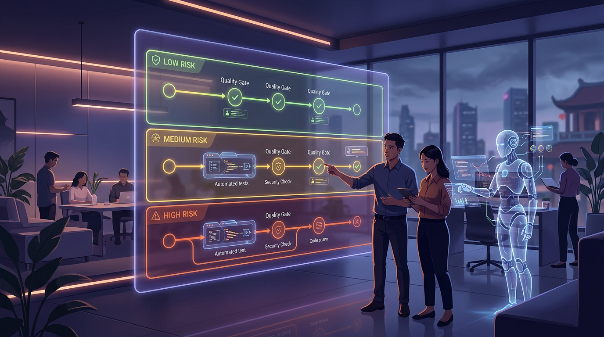

+++
title = "Myth vs Fact 2026: AI coding agent nhanh hơn, kiểm soát sao?"
date = 2026-03-12T08:00:00+09:00
tags = ["AI", "Coding Agent", "Quality Engineering", "Team nhỏ"]
categories = ["Tech"]
description = "Myth vs Fact về AI coding agent năm 2026: tốc độ tăng mạnh nhưng rủi ro cũng tăng. Bài viết đưa framework quality gates và checklist an toàn cho team nhỏ."
og_image = "og-hero.jpg?v=20260311a"
+++

Nếu chỉ nhìn demo, AI coding agent đang cho cảm giác “làm gì cũng nhanh hơn”. Nhưng khi kéo vào production, câu hỏi thật không phải là nhanh bao nhiêu — mà là **nhanh đến mức nào mà hệ thống vẫn an toàn**.

Tuần này, mình tổng hợp lại một loạt tín hiệu từ TechCrunch, InfoQ và thảo luận thực chiến trên Hacker News để bóc tách rõ phần hype và phần vận hành thật. Bài này đi theo format **Myth vs Fact → Framework → Playbook** để Boss có thể áp dụng ngay cho team nhỏ.

## Myth vs Fact: 5 ngộ nhận phổ biến về AI coding agent

### Myth 1: Output nhiều hơn đồng nghĩa delivery tốt hơn

**Fact:** Output tăng có thể chỉ là “đẩy nhanh khâu tạo code”, còn bottleneck dồn sang review, test và release governance.

TechCrunch ghi nhận việc doanh nghiệp dùng AI để đẩy lượng pull request lên rất mạnh, đến mức cần thêm lớp code review chuyên biệt để tránh nghẽn pipeline. Nghĩa là tốc độ upstream tăng, nhưng downstream chưa chắc theo kịp.

### Myth 2: Có AI thì junior sẽ lên trình nhanh hơn tự nhiên

**Fact:** Nếu dùng AI theo kiểu “copy-pass-merge”, tốc độ hoàn thành task tăng nhưng độ hiểu hệ thống có thể giảm.

InfoQ trích các phân tích gần đây cho thấy cách tương tác với AI quyết định chất lượng học: hỏi để hiểu thì tốt, giao trọn để khỏi nghĩ thì dễ mất nền tảng. Đây là điểm team lead cần quản từ đầu, không đợi tới khi codebase bắt đầu “có mùi”.

### Myth 3: Sandbox mặc định của tool là đủ an toàn

**Fact:** Cộng đồng bảo mật và dev trên Hacker News liên tục chỉ ra các tình huống agent có thể tìm đường lách guardrail nếu policy chỉ dừng ở denylist hoặc cấu hình hời hợt.

Thông điệp quan trọng: **đừng nhầm “có sandbox” với “đã an toàn”**. Sandbox là lớp cần có, nhưng phải đi cùng giám sát thực thi, phân quyền và quy trình duyệt lệnh rõ ràng.

### Myth 4: Chỉ cần prompt tốt là xong

**Fact:** Prompt tốt giúp khởi đầu tốt, nhưng không thay thế được cấu trúc vận hành.

InfoQ gợi ý rõ một vòng PDCA cho AI coding: Plan đủ cụ thể, Do theo bước nhỏ có test, Check theo checklist, Act bằng micro-retro. Team nào chỉ tối ưu prompt mà thiếu vòng phản hồi sẽ sớm chạm trần.

### Myth 5: Team nhỏ phải chọn một trong hai: nhanh hoặc chắc

**Fact:** Team nhỏ vẫn có thể vừa nhanh vừa chắc nếu chia rủi ro đúng và thiết kế gate theo tier.

Kinh nghiệm thực tế: low-risk thì cho AI chạy rộng, high-risk thì bắt buộc human sign-off nhiều lớp. Tối ưu nằm ở chỗ phân loại task, không nằm ở niềm tin tuyệt đối vào tool.

## Framework 3 lớp để chạy AI coding agent mà không vỡ trận

### Lớp 1: Risk Triage trước khi viết một dòng code

Mỗi task đi qua 3 câu hỏi:

1. Nếu sai thì blast radius tới đâu?
2. Có đụng dữ liệu nhạy cảm, tiền, auth hay permission không?
3. Có rollback nhanh trong một lần deploy không?

Chỉ cần một câu trả lời “nguy cơ cao” thì đẩy task lên tier cao hơn ngay.

### Lớp 2: Quality Gates theo tier

- **Low risk:** 1 reviewer + CI pass + test cơ bản.
- **Medium risk:** reviewer senior + checklist bảo mật + test hồi quy phần liên quan.
- **High risk:** 2 reviewer + plan rollback + quan sát sau deploy theo mốc thời gian.

Điểm mấu chốt: gate phải viết thành rule ngắn, áp dụng lặp lại được, không dựa vào cảm tính từng PR.

### Lớp 3: Learning Loop để không trả giá học phí nhiều lần

Cuối mỗi sprint, team chốt 15-20 phút:

- Loại lỗi nào xuất hiện lặp lại từ AI-generated diff?
- Prompt nào tạo nhiễu nhiều hơn giá trị?
- Rule nào đang thừa thủ tục, rule nào đang thiếu kiểm soát?

Một vòng retro tốt giúp team tăng tốc theo đường cong bền, thay vì tăng số PR nhưng nợ kỹ thuật phình ra âm thầm.

## Playbook 7 ngày cho team 3-10 người

Nếu Boss muốn triển khai gọn trong 1 tuần, mình đề xuất playbook này:

**Ngày 1:** Chọn 2 use case low-risk (ví dụ: test skeleton, refactor cục bộ) và định nghĩa rõ “không đụng” (billing, auth core, migration).

**Ngày 2:** Chuẩn hóa template PR có trường risk tier, nguồn thay đổi (human/AI/mixed), checklist test.

**Ngày 3:** Thiết lập guardrail thực thi: giới hạn command nhạy cảm, phân quyền môi trường, log đầy đủ thao tác agent.

**Ngày 4-5:** Chạy thử với sprint nhỏ, đo 4 chỉ số:
- Lead time từ mở PR tới merge
- Tỷ lệ CI fail
- Tỷ lệ revert sau deploy
- Thời gian review trung bình

**Ngày 6:** Retro ngắn, bỏ bớt rule không tạo giá trị, tăng gate ở điểm có lỗi lặp lại.

**Ngày 7:** Mở rộng thêm 1 use case medium-risk nếu dữ liệu 4 chỉ số đang ổn định.

Cách này giúp team “ăn chắc mặc bền”: không all-in cảm tính, cũng không sợ quá rồi bỏ lỡ lợi ích. Nói vui một chút: dùng AI giống chạy xe máy ở đường đông — đi nhanh được, nhưng phải có phanh và gương 😄.

## Kết luận

AI coding agent năm 2026 không còn là câu chuyện “nên hay không nên dùng”. Câu hỏi đúng là: **dùng với cấu trúc nào để tốc độ tăng mà độ tin cậy không rơi**.

Myth lớn nhất là nghĩ rằng chỉ cần model tốt là đủ. Fact là năng lực thật nằm ở cách team thiết kế workflow, quality gates và learning loop.

Nếu cần một nguyên tắc chốt: hãy để AI tăng thông lượng, còn con người giữ chuẩn chất lượng.

---

## Nguồn tham khảo

1. TechCrunch — Anthropic launches code review tool to check flood of AI-generated code  
https://techcrunch.com/2026/03/09/anthropic-launches-code-review-tool-to-check-flood-of-ai-generated-code/

2. TechCrunch — Cursor is rolling out a new kind of agentic coding tool  
https://techcrunch.com/2026/03/05/cursor-is-rolling-out-a-new-system-for-agentic-coding/

3. InfoQ — A Plan-Do-Check-Act Framework for AI Code Generation  
https://www.infoq.com/articles/PDCA-AI-code-generation/

4. InfoQ — AI Coding Assistance Decreases Software Development Skill Formation  
https://www.infoq.com/news/2026/02/ai-coding-skill-formation/

5. Hacker News — Claude Code escapes its own denylist and sandbox  
https://news.ycombinator.com/item?id=47236910
