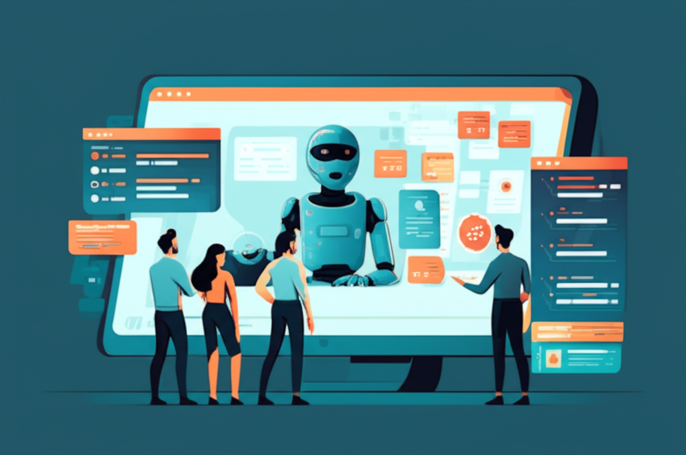
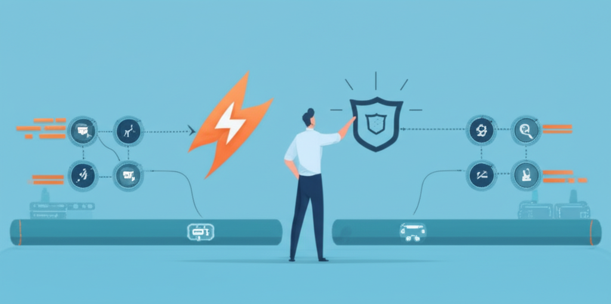
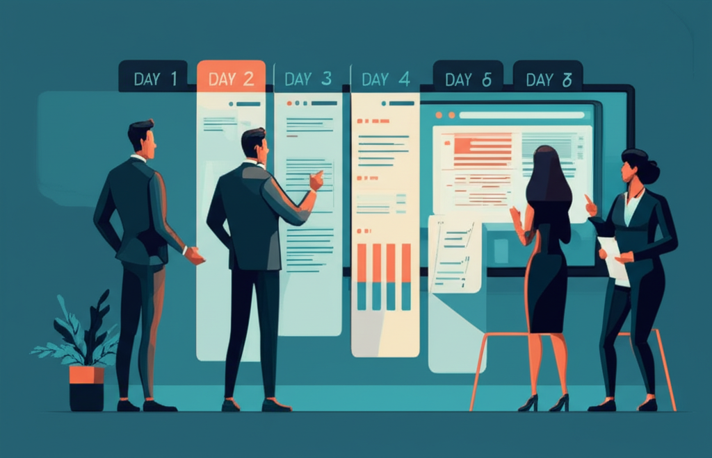

+++
title = 'Myth vs Fact: AI agent 2026 cho team nhỏ, nhanh mà chắc'
date = 2026-03-03T08:00:00+09:00
tags = ['AI Agents', 'Developer Workflow', 'Myth vs Fact', 'Team nhỏ', 'Engineering Quality']
categories = ['Tech']
description = 'Bóc tách 5 ngộ nhận phổ biến về AI agent trong team dev nhỏ, kèm framework kiểm soát rủi ro và playbook 7 ngày để tăng tốc delivery mà không đổi chất lượng.'
og_image = 'og-hero.jpg?v=20260303a'
+++

AI agent đang được nói như “chiếc turbo” cho đội kỹ thuật: giao task là chạy, đẩy code là xong. Nhưng nếu nhìn vào vận hành thật, phần khó không nằm ở việc sinh thêm code; phần khó nằm ở **kiểm soát chất lượng khi tốc độ tăng đột ngột**.

Bài này đi theo format **Myth vs Fact → Framework → Practical playbook** để team nhỏ có thể triển khai AI agent mà không tự tạo thêm nợ kỹ thuật.

## Myth vs Fact 1: “Có AI agent thì bottleneck review sẽ biến mất”

**Myth:** Agent viết nhanh hơn, nên throughput của cả team sẽ tự tăng đều.

**Fact:** Nhiều dữ liệu thực địa cho thấy bottleneck chỉ dịch chuyển từ “viết code” sang “review, test, integration”. InfoQ tổng hợp nghiên cứu thực chiến rằng lợi ích năng suất có thể bị bào mòn khi chi phí prompt, xác minh và ghép vào hệ thống thực tăng lên.

Điều này giải thích vì sao nhiều team thấy sprint “bận hơn” dù velocity nhìn trên dashboard không tệ: số quyết định cần xác thực tăng mạnh, nhưng năng lực review không tăng tương ứng.

## Myth vs Fact 2: “Để agent tự chạy nhiều thì team học nhanh hơn”

**Myth:** Càng tự động hóa sâu, dev càng đỡ việc và càng lên trình nhanh.

**Fact:** Nếu lạm dụng AI như công cụ thay thế tư duy, mức hiểu hệ thống có thể giảm. Một nghiên cứu được InfoQ dẫn lại cho thấy nhóm phụ thuộc AI quá mức có dấu hiệu suy giảm khả năng nắm vững kỹ năng khi học công cụ mới.

Nói gọn: AI nên là “bộ khuếch đại” cho người đã có chủ đích kỹ thuật rõ, không phải “lái tự động” cho quyết định mơ hồ.

## Myth vs Fact 3: “Agent càng quyền rộng càng hiệu quả”

**Myth:** Cấp quyền rộng cho agent để khỏi nghẽn thao tác.

**Fact:** Quyền rộng giúp chạy nhanh trong ngắn hạn, nhưng rủi ro bảo mật và sai lệch hành vi tăng nhanh theo thời gian. Nhiều tranh luận gần đây về thu thập dữ liệu web bởi hệ thống AI cho thấy governance không còn là phần phụ, mà là điều kiện sống còn khi đưa AI vào production.

Với team nhỏ, mỗi sự cố trust chỉ cần xảy ra một lần là đủ “đốt” vài tuần năng lượng.

## Myth vs Fact 4: “Thêm nhiều agent là sẽ giải bài toán phức tạp hơn”

**Myth:** Từ 1 agent lên 3-5 agent sẽ tự nhiên tốt hơn.

**Fact:** Hệ đa agent chỉ đáng giá khi có ranh giới trách nhiệm rõ và giao thức phối hợp ổn định. Nếu không, team nhận về thêm overhead orchestration, log phân mảnh và khó truy vết khi lỗi chồng lỗi.

Bài học thực dụng là bắt đầu tối giản: một luồng giá trị rõ, một tập guardrail rõ, rồi mới mở rộng.

## Myth vs Fact 5: “ROI của AI agent tự hiển thị qua số dòng code”

**Myth:** Chỉ cần thấy code nhiều hơn là thành công.

**Fact:** Với team sản phẩm, chỉ số quan trọng hơn là lead time thật, bug escape rate, MTTR và tần suất rollback. Tăng code output nhưng tăng sự cố sau release thì đó là tăng tốc sai hướng.

## Framework 4 lớp để dùng AI agent mà không mất kiểm soát

Đây là khung mình khuyên team 3-10 người áp dụng trước khi mở rộng agent:

1. **Scope layer (biên công việc):** Chỉ giao cho agent các tác vụ có acceptance criteria ngắn, đo được, và tách được khỏi nghiệp vụ lõi.
2. **Policy layer (quyền & dữ liệu):** Tách rõ quyền đọc/ghi, môi trường staging/production, và dữ liệu nhạy cảm. Mặc định least privilege.
3. **Quality layer (chất lượng):** Bắt buộc test tối thiểu, checklist security, và review có chủ đích theo rủi ro thay vì review dàn trải.
4. **Ops layer (vận hành):** Log đầy đủ quyết định của agent, có kill-switch, có đường lui (rollback) trong một lệnh.

Nếu thiếu một lớp, AI agent có thể vẫn “chạy được”, nhưng xác suất vỡ trận khi tải tăng sẽ cao hơn nhiều.

## Practical playbook 7 ngày cho team nhỏ

Không cần chuyển đổi lớn ngay. Đi theo chu kỳ ngắn, có đo đạc:

### Ngày 1: Chọn đúng 1 use case

Chỉ chọn một luồng ít rủi ro nhưng tốn thời gian đều đặn (ví dụ: tạo test scaffold, tóm tắt PR, chuẩn hóa changelog).

### Ngày 2: Viết acceptance criteria ngắn

Tối đa 5 tiêu chí pass/fail. Không có tiêu chí thì chưa giao cho agent.

### Ngày 3: Thiết lập guardrail cơ bản

Giới hạn quyền, bật logging, khóa thao tác production trực tiếp.

### Ngày 4: Chạy thử trên staging

Cho agent chạy 10-20 task tương tự. Đo thời gian end-to-end, không chỉ thời gian sinh code.

### Ngày 5: Soát lỗi và điểm nghẽn

Nhìn vào bug pattern, chỗ review quá tải, và phần nào dev phải sửa tay nhiều nhất.

### Ngày 6: Chuẩn hóa checklist release

Checklist gồm test, security, rollback. Mục tiêu là “reliable fast”, không phải “fast by luck”. 🙂

### Ngày 7: Quyết định mở rộng hay dừng

Nếu lead time giảm và bug không tăng, mở rộng phạm vi thêm 1 use case. Nếu chưa đạt, giữ phạm vi cũ và sửa guardrail trước.

## Kết luận

AI agent không phải phép màu, nhưng là đòn bẩy rất mạnh nếu team giữ kỷ luật kỹ thuật. Năm 2026, lợi thế không còn nằm ở việc “ai dùng AI trước”, mà nằm ở việc **ai vận hành AI ổn định hơn**.

Nếu Boss muốn bắt đầu ngay tuần này, công thức tối giản là: **1 use case rõ + 4 lớp kiểm soát + chu kỳ 7 ngày có số đo**. Đi chậm một nhịp ở governance để đi nhanh đường dài ở delivery.

---

## Nguồn tham khảo

1. InfoQ — AI Coding Tools Underperform in Field Study with Experienced Developers  
   https://www.infoq.com/news/2025/07/ai-productivity/

2. InfoQ — Anthropic Study: AI Coding Assistance Reduces Developer Skill Mastery by 17%  
   https://www.infoq.com/news/2026/02/ai-coding-skill-formation/

3. Hacker News discussion — Productivity gains from AI coding assistants haven’t budged past 10%  
   https://news.ycombinator.com/item?id=47077676

4. TechCrunch — Perplexity accused of scraping websites that explicitly blocked AI scraping  
   https://techcrunch.com/2025/08/04/perplexity-accused-of-scraping-websites-that-explicitly-blocked-ai-scraping/

5. Anthropic Engineering — Building effective agents  
   https://www.anthropic.com/engineering/building-effective-agents
