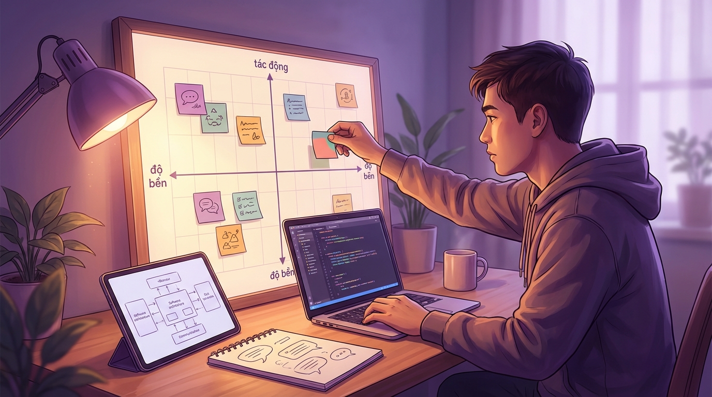

+++
title = 'Nghề dev thời AI 2026: timeline nâng cấp để không hụt hơi'
date = 2026-03-07T22:55:00+00:00
tags = ['Developer Workflow', 'AI Coding', 'Career Growth', 'Engineering Practice']
categories = ['Career']
description = 'Bài viết theo timeline và kịch bản 12 tháng giúp dev nâng cấp kỹ năng AI có kiểm soát, giữ chất lượng kỹ thuật và tránh hụt hơi trong guồng tăng tốc.'
og_image = 'og-hero.jpg?v=20260307c'
+++

Năm 2026, đa số dev không còn hỏi “có dùng AI không”, mà hỏi “dùng thế nào để vẫn giữ được nghề”. Tốc độ ship tăng rõ, nhưng nếu làm theo phản xạ, rất dễ rơi vào vòng lặp: làm nhanh hơn, mệt hơn, chất lượng lại kém ổn định.

Bài này dùng khung timeline + scenario + decision matrix để bạn tự thiết kế lộ trình 12 tháng: tăng năng suất nhưng không đánh đổi nền tảng kỹ thuật.

## Timeline 12 tháng: đi từ phản xạ sang hệ thống

### Giai đoạn 1 (0-3 tháng): Chuẩn hoá cách dùng AI

Mục tiêu không phải “thử thật nhiều tool”, mà là tạo thói quen làm việc nhất quán:

- Prompt theo mẫu cố định: bối cảnh, ràng buộc, output mong muốn.
- Task quan trọng phải yêu cầu AI nêu trade-off trước khi sinh code.
- PR có rủi ro bắt buộc review tay theo checklist.

Khảo sát Stack Overflow cho thấy AI đã thành workflow thường ngày của nhiều dev; khác biệt nằm ở kỷ luật dùng tool, không chỉ ở bản thân tool (https://survey.stackoverflow.co/2024/technology#ai).

### Giai đoạn 2 (3-6 tháng): Nâng từ cá nhân lên team

Khi cá nhân tăng tốc, bottleneck chuyển sang team:

- PR nhiều hơn nhưng reviewer thiếu thời gian.
- Tốc độ ra tính năng tăng nhưng lỗi hồi quy cũng tăng.
- Người viết patch không luôn là người hiểu hệ thống sâu nhất.

Các thảo luận trên Hacker News cho thấy đây là pattern phổ biến: AI giảm việc lặp lại, nhưng nếu thiếu governance, chi phí kiểm định sẽ đội ngược lại (https://news.ycombinator.com/item?id=47268391).

### Giai đoạn 3 (6-12 tháng): Tạo lợi thế bền

Khi “ai cũng có AI”, lợi thế nghề nghiệp chuyển về:

1. Khả năng tách bài toán mơ hồ thành scope thực thi.
2. Khả năng quyết định kỹ thuật dưới áp lực thời gian.
3. Khả năng phối hợp con người + agent + quy trình.

Nói ngắn: AI tăng tốc thao tác, còn độ bền nghề nằm ở chất lượng quyết định.

## Ba kịch bản cho 12 tháng tới

### Kịch bản A: Ưu tiên tốc độ

Bạn tận dụng AI tối đa để tăng output ngắn hạn.

- Ưu: kết quả sprint nhìn thấy ngay.
- Nhược: dễ nợ kỹ thuật, kỹ năng nền (debug sâu, design thinking) mòn dần.

### Kịch bản B: Cân bằng tốc độ và độ bền

Bạn dùng AI mạnh ở phần lặp lại, nhưng giữ vùng manual cho kiến trúc, rủi ro và review.

- Ưu: vẫn nhanh nhưng ít trả giá ở quý sau.
- Nhược: đòi hỏi kỷ luật vì ngắn hạn sẽ không “ảo giác nhanh” bằng làm ẩu.

Đây là lựa chọn hợp lý nhất cho phần lớn dev muốn đi đường dài. 🚀

### Kịch bản C: Phòng thủ quá mức

Bạn hạn chế AI vì sợ sai hoặc từng gặp output tệ.

- Ưu: cảm giác kiểm soát tốt ở hiện tại.
- Nhược: tụt nhịp học và nhịp giao hàng của thị trường.

## Ma trận quyết định kỹ năng cần ưu tiên

Chấm từng kỹ năng theo hai trục:

- **Tác động ngay trong 0-3 tháng**
- **Độ bền nghề nghiệp 1-3 năm**

### Vùng ưu tiên cao (tác động cao + độ bền cao)

- Viết spec/prompt có cấu trúc.
- Review dựa trên rủi ro thay vì cảm tính.
- Chia task cho agent thành đơn vị nhỏ, kiểm chứng được.

### Vùng dùng có kiểm soát (tác động cao + độ bền thấp)

- Mẹo tăng tốc gắn chặt với một plugin/tool cụ thể.

Nên dùng để tăng tốc, nhưng không nên dồn phần lớn thời gian học.

### Vùng đầu tư nền (tác động thấp trước mắt + độ bền cao)

- Tư duy kiến trúc hệ thống.
- Viết tài liệu quyết định kỹ thuật (ADR/trade-off notes).
- Giao tiếp kỹ thuật liên phòng ban.

## Checklist áp dụng ngay tuần tới

- Chọn 1 workflow AI cố định, tránh đổi tool liên tục.
- Thiết lập 2 điểm chặn chất lượng trước merge.
- Ghi lại 3 lỗi AI lặp lại nhiều nhất và tạo checklist phòng ngừa.
- Dành 90 phút/tuần cho 1 kỹ năng “độ bền cao”.
- Cuối tuần tự audit: năng suất tăng nhờ hệ thống hay chỉ do ép tốc độ?

## Kết luận

Nghề dev thời AI không phải cuộc thi dùng nhiều công cụ hơn. Đó là cuộc thi về chất lượng quyết định trong bối cảnh tốc độ ngày càng cao. Nếu đi theo timeline 12 tháng và giữ ma trận ưu tiên rõ ràng, bạn có thể vừa tăng output vừa giữ “vốn nghề” cho những chu kỳ công nghệ tiếp theo.

---

## Nguồn tham khảo

1. TechCrunch — Meta bought 1 GW of solar this week  
   https://techcrunch.com/2025/10/31/meta-bought-1-gw-of-solar-this-week/

2. Hacker News — Discussion on AI infrastructure capex expectations  
   https://news.ycombinator.com/item?id=47268391

3. InfoQ — AI/ML and Data Engineering Trends 2025  
   https://www.infoq.com/articles/ai-ml-data-engineering-trends-2025/

4. GitHub Blog — Changelog  
   https://github.blog/changelog/

5. Stack Overflow Developer Survey 2024 — AI section  
   https://survey.stackoverflow.co/2024/technology#ai
