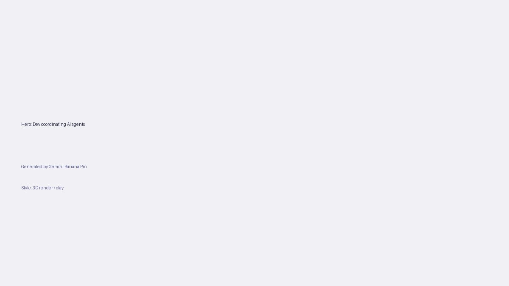
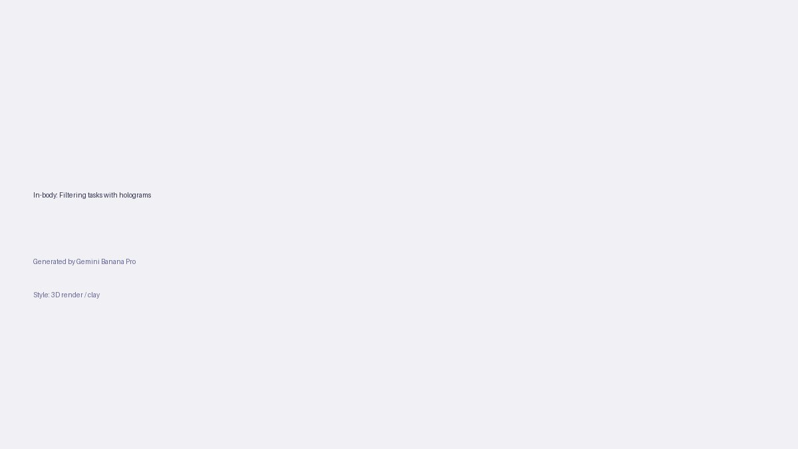

+++
title = 'Nghề dev thời AI: 60 phút sáng định hình cả ngày làm việc'
date = 2026-03-27T23:00:00+00:00
tags = ['Nghề dev', 'AI', 'Developer Workflow', 'Productivity']
categories = ['Career']
description = 'Làm dev năm 2026 không còn bắt đầu bằng việc gõ code. Case study và 3 bài học giúp bạn tận dụng 60 phút buổi sáng để điều phối AI hiệu quả, tránh kiệt sức.'
images = ['og-hero.jpg']
+++

Có một thói quen mà nhiều developer từng rất thích: đến văn phòng, pha ly cà phê, mở IDE và bắt đầu viết những dòng code đầu tiên. Cảm giác "vào luồng" (flow state) ngay từ đầu ngày giúp định hình sự tập trung cho cả chục tiếng đồng hồ sau đó.

Nhưng năm 2026, mọi thứ đã thay đổi. Buổi sáng của bạn không còn bắt đầu bằng một file trống, mà là 5-10 Pull Request (PR) do các AI Agent tự động tạo ra từ đêm hôm trước. Cảm giác háo hức ban đầu dễ dàng biến thành "AI fatigue" (hội chứng mệt mỏi vì AI) nếu bạn không biết cách điều phối.

Bài viết này đi theo cấu trúc **Story/Case-study → Lessons learned → Action steps**, giúp bạn xây dựng một nhịp điệu 60 phút buổi sáng để làm chủ các công cụ AI thay vì bị chúng cuốn đi.

## Case-study: Áp lực từ "cơn mưa" Pull Request buổi sáng

Bối cảnh: Một team dev nhỏ 5 người đang phát triển sản phẩm SaaS. Họ quyết định cấp quyền cho các AI coding assistant tự động chạy test, fix bug và đề xuất tính năng phụ trong lúc họ ngủ.

**Thực trạng tuần đầu tiên:** Tốc độ tạo code tăng vọt. Nhưng mỗi sáng thức dậy, thay vì bắt tay vào xử lý logic cốt lõi, cả team phải cắm mặt đọc hàng ngàn dòng code do AI sinh ra. TechCrunch từng gọi đây là hội chứng "vibe coding hangover" - khi cơn say tốc độ qua đi, để lại đống nợ kỹ thuật khổng lồ cần con người giải quyết. Các thành viên trong team bắt đầu cảm thấy quá tải nhận thức ngay từ 9 giờ sáng. Không ai còn thời gian để suy nghĩ về kiến trúc hệ thống hay thiết kế tính năng mới, bởi toàn bộ năng lượng đã dồn hết vào việc làm "thanh tra chất lượng" cho AI.

Vấn đề cốt lõi không nằm ở việc AI viết code dở, mà nằm ở việc luồng công việc của con người chưa kịp thích ứng với tốc độ của máy móc. Bạn không thể dùng phương pháp quản lý của kỷ nguyên gõ code thủ công để giám sát kỷ nguyên sinh code tự động.

## Lessons learned: 3 bài học thay đổi tư duy làm việc

Từ sự chệch choạc ban đầu đó, những cuộc thảo luận trên Hacker News về "nghịch lý năng suất AI" (AI productivity paradox) đã chỉ ra rằng: tốc độ tạo mã không phải là điểm nghẽn, điểm nghẽn là khả năng thẩm định của con người.

Dưới đây là 3 bài học xương máu giúp lấy lại nhịp độ:

**Bài học 1: Năng lượng đầu ngày dành cho tư duy, không phải rà soát cú pháp.** 
Buổi sáng là lúc não bộ minh mẫn nhất. Nếu dùng thời gian này chỉ để sửa lỗi lặt vặt (syntax/linting) cho AI, bạn đang lãng phí tài nguyên quý giá nhất của mình. Trách nhiệm của dev giờ đây là kiểm tra tính toàn vẹn của hệ thống (System Integrity) chứ không phải là soi từng dấu chấm phẩy. Hãy để các công cụ CI/CD làm việc đó.

**Bài học 2: Phải biết nói "Không" (Reject) dứt khoát.**
AI không có tính tự ái. Nếu một PR từ AI đi chệch hướng cấu trúc hoặc xử lý quá cồng kềnh, đừng cố gắng sửa tay (manual fix). Hành động đó sẽ tốn nhiều thời gian hơn cả việc đập đi làm lại. Hãy dứt khoát Reject và cung cấp prompt phản hồi để agent tự viết lại.

**Bài học 3: Giao tiếp với AI như một Technical Lead giao việc cho Junior.**
Nhiều người vẫn có thói quen viết prompt theo kiểu "giải quyết lỗi này đi". Cách làm đúng trong năm 2026 là cung cấp ngữ cảnh kiến trúc: "Sử dụng pattern Repository, kiểm tra điều kiện X trước khi gọi API Y, và nhớ viết unit test".

## Action steps: Quy tắc 60 phút vàng buổi sáng

Để không bị kiệt sức và lấy lại thế chủ động, đây là quy trình 60 phút (The Golden Hour) bạn có thể áp dụng ngay ngày mai:

- **15 Phút Đầu Tiên: Triage (Phân loại tự động).** 
  Đừng đọc code vội. Mở dashboard hiển thị các PR của AI từ đêm qua. Chỉ nhìn vào kết quả CI/CD pipeline và coverage. Bất kỳ PR nào test fail, đóng lại ngay lập tức và gửi lệnh chạy lại. Chỉ giữ lại những PR đã qua các chốt chặn tự động.

- **30 Phút Tiếp Theo: High-level Review và Deep Work.** 
  Dành thời gian này để xem xét các PR đạt yêu cầu, nhưng chỉ tập trung vào luồng dữ liệu (data flow) và rủi ro bảo mật (security risks). Nếu mọi thứ ổn định, nhấn Merge. Ngay sau đó, bắt tay vào 1-2 tác vụ yêu cầu tư duy sâu mà AI chưa làm tốt (như thiết kế schema database mới, hoặc điều chỉnh kiến trúc microservices).

- **15 Phút Cuối Cùng: Prompting cho ca làm việc tiếp theo.** 
  Trước khi đi pha cà phê hoặc tham gia cuộc họp Daily Standup, hãy phân rã các tính năng lớn thành những đầu việc nhỏ (tickets). Viết prompt chi tiết, nạp ngữ cảnh vào các AI Agent và khởi động chúng. Khi bạn đang họp, đội quân ảo của bạn đã bắt đầu gõ code.

Năm 2026, developer không mất việc, mà chúng ta thăng cấp thành những người điều phối (Orchestrators). Khởi đầu ngày mới đúng cách không chỉ cứu bạn khỏi sự kiệt sức, mà còn khẳng định lại vị thế: chúng ta là người cầm lái, AI chỉ là động cơ.
