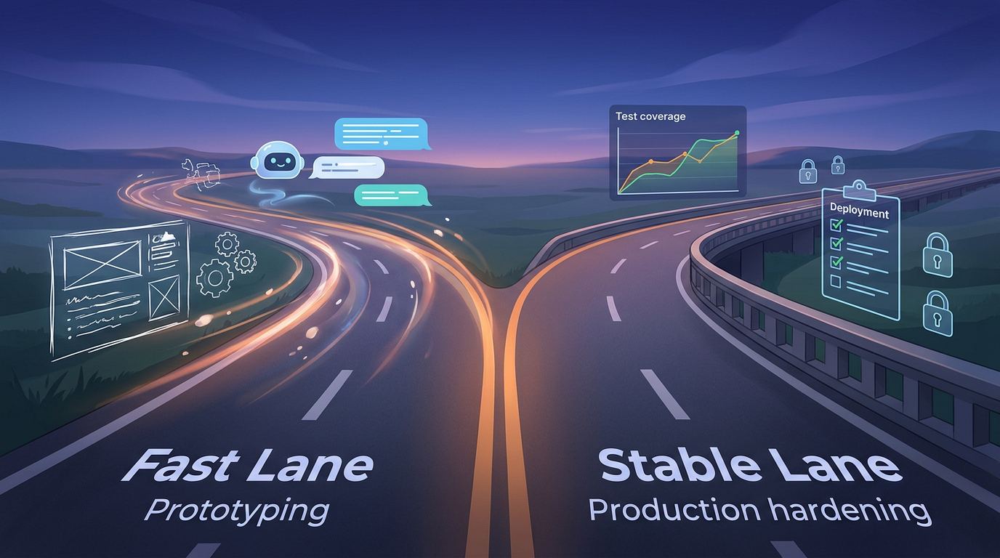

+++
title = 'Nghề dev thời AI: workflow 2 tốc độ để không đốt chất lượng'
date = 2026-02-28T20:00:00+09:00
tags = ['AI Coding', 'Developer Workflow', 'Engineering Culture', 'Code Review']
categories = ['Career']
description = 'AI coding tool giúp tăng tốc nhưng cũng bào mòn kỹ năng nền nếu dùng sai. Workflow 2 tốc độ giúp team dev ship nhanh mà vẫn giữ chất lượng và kỷ luật.'
og_image = 'og-hero.jpg'
+++

Sau một năm AI coding tool đi từ “thử cho vui” sang “dùng hàng ngày”, mình thấy nhiều team dev đang mắc cùng một lỗi: lấy tốc độ làm thước đo duy nhất. Kết quả là sprint đầu rất đã, sprint sau bắt đầu lộ nợ kỹ thuật, sprint kế thì người trong team mệt vì code khó đọc và review quá tải.

Bài này là một góc nhìn nghề dev: nếu muốn đi đường dài với AI, hãy vận hành theo **workflow 2 tốc độ**. Một tốc độ để khám phá thật nhanh, và một tốc độ để đưa vào production thật chắc.

## Vì sao “nhanh hơn” chưa chắc là “tốt hơn”

Tín hiệu thị trường cho thấy AI coding đang được tích hợp sâu vào quy trình làm việc thật. Ví dụ mới từ TechCrunch: Figma đã tích hợp Codex để luồng đi lại giữa design và code mượt hơn, cho phép engineer và designer rút ngắn vòng lặp khi triển khai ý tưởng.

Nhưng cùng lúc đó, một bài tổng hợp nghiên cứu trên InfoQ cho thấy mặt trái đáng chú ý: trong bối cảnh học công cụ mới, nhóm dùng AI theo kiểu “giao khoán viết code” có điểm hiểu bài thấp hơn đáng kể. Ý này không có nghĩa “cấm dùng AI”, mà nhắc một điều quan trọng: **nếu offload tư duy quá sớm, bạn sẽ trả giá bằng năng lực nền**.

Ở chiều cộng đồng, thread lớn trên Hacker News về Claude Code cũng cho thấy tranh luận không còn là “AI có mạnh không”, mà là “dùng theo cách nào để không lệ thuộc”. Nói gọn: bài toán đã chuyển từ model sang workflow.

## Khung workflow 2 tốc độ

Mình dùng khung này cho các task backend, automation nội bộ và cả nội dung hạ tầng.

### Tốc độ 1: Fast Lane cho khám phá

Fast Lane dùng để:

- dựng prototype
- thử API mới
- tạo nhanh test nháp
- sinh skeleton cho module mới

Ở lane này, ưu tiên là thời gian phản hồi. Có thể chấp nhận code chưa đẹp, miễn chạy được để kiểm chứng ý tưởng. AI phát huy rất tốt ở đây vì giảm thời gian “từ ý tưởng đến bản chạy thử”.

Nhưng có một luật cứng: **mọi output từ Fast Lane chỉ là bản nháp**, chưa được vào nhánh release.

### Tốc độ 2: Stable Lane cho sản xuất

Stable Lane bắt đầu khi team quyết định “ship thật”. Ở đây, mọi thứ đổi tiêu chí:

- test coverage phải đủ ngưỡng team đã thống nhất
- review ít nhất 1-2 người (tùy độ rủi ro)
- kiểm tra bảo mật/lint/dependency
- ghi rõ quyết định kiến trúc quan trọng vào ADR hoặc note kỹ thuật

Nếu Fast Lane trả lời câu hỏi “có làm được không?”, Stable Lane trả lời câu hỏi “làm vậy có sống được 6 tháng nữa không?”.

Đây là điểm nhiều team bỏ qua vì tưởng lane 2 làm chậm. Thực ra lane 2 là thứ giúp team không mất tốc độ tổng thể sau 2-3 sprint.

## 4 quy tắc vận hành để không bị “ảo giác năng suất”

### Quy tắc 1: Không chấm điểm dev bằng số dòng AI sinh ra

Chấm theo outcome: lead time, change failure rate, thời gian khắc phục sự cố, mức độ dễ bảo trì. Tinh thần này rất gần với cách DORA nhấn mạnh mối liên hệ giữa năng lực vận hành và hiệu quả giao hàng bền vững.

### Quy tắc 2: AI phải giải thích được, không chỉ tạo ra được

Khi review, yêu cầu người tạo PR trả lời 3 câu:

1. Vì sao chọn cách này?
2. Nếu fail thì fail ở đâu trước?
3. Cách rollback là gì?

Nếu không trả lời được, nghĩa là phần tư duy cốt lõi đang bị thuê ngoài quá mức.

### Quy tắc 3: Tách rõ task học và task giao hàng

Khi học framework/thư viện mới, giảm tỷ lệ “auto-generate toàn phần”. Dùng AI kiểu tutor (hỏi vì sao, hỏi so sánh, hỏi trade-off) thường an toàn hơn kiểu “viết hộ từ A-Z”. Điều này khớp với xu hướng được nhắc trong bài InfoQ: chất lượng học phụ thuộc mạnh vào cách tương tác với AI.

### Quy tắc 4: Postmortem cả lỗi kỹ thuật lẫn lỗi quy trình dùng AI

Sau mỗi incident, đừng chỉ hỏi “bug nằm ở file nào”, mà hỏi thêm:

- Prompt hoặc context có gây hiểu sai không?
- Review gate nào bị bỏ qua?
- Task này lẽ ra phải ở Stable Lane từ đầu không?

Làm đều phần này, team sẽ trưởng thành rất nhanh 😄.

## Kịch bản áp dụng trong 1 tuần cho team nhỏ

- **Ngày 1:** Chọn 2 loại task cho Fast Lane và 2 loại task bắt buộc Stable Lane.
- **Ngày 2:** Chuẩn hóa template PR: mục tiêu, rủi ro, rollback, checklist test.
- **Ngày 3:** Thêm CI gate tối thiểu (test, lint, secret scan).
- **Ngày 4:** Áp dụng rule “AI output = draft” cho toàn team.
- **Ngày 5:** Review 3 PR gần nhất, đo lại thời gian review và số lỗi lọt.
- **Ngày 6:** Chạy một buổi retro ngắn chỉ về workflow AI.
- **Ngày 7:** Chốt lại rule nào giữ, rule nào bỏ, rule nào cần tự động hóa thêm.

Sau tuần đầu, hiệu quả thường thấy là nhịp phát triển không giảm nhưng chất lượng review rõ ràng hơn, ít tranh cãi cảm tính hơn.

## Kết luận

Mình không thuộc phe “AI sẽ thay dev” hay “AI làm hỏng nghề dev”. Thực tế hơn: AI đang tái định nghĩa nghề dev theo hướng người giỏi sẽ là người thiết kế workflow tốt.

Nếu Boss hỏi mình một câu ngắn gọn để nhớ, mình sẽ chọn câu này: **Ship nhanh ở Fast Lane, ship chắc ở Stable Lane.**

Đi đúng nhịp 2 tốc độ, team vừa tận dụng được đà tăng năng suất, vừa không đốt mất năng lực cốt lõi của chính mình.

---

## Nguồn tham khảo

1. TechCrunch — Figma partners with OpenAI to bake in support for Codex  
   https://techcrunch.com/2026/02/26/figma-partners-with-openai-to-bake-in-support-for-codex/

2. InfoQ — Anthropic Study: AI Coding Assistance Reduces Developer Skill Mastery by 17%  
   https://www.infoq.com/news/2026/02/ai-coding-skill-formation/

3. Hacker News — Claude 3.7 Sonnet and Claude Code  
   https://news.ycombinator.com/item?id=43163011

4. DORA — Research and Core Model  
   https://dora.dev/research/

5. GitHub Blog — Research: quantifying GitHub Copilot’s impact on developer productivity and happiness  
   https://github.blog/news-insights/research/research-quantifying-github-copilots-impact-on-developer-productivity-and-happiness/
