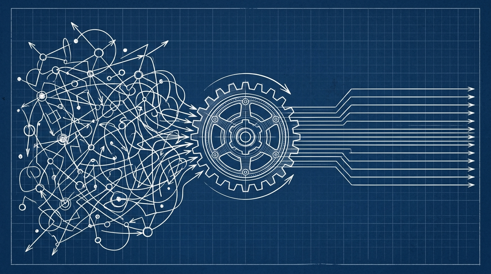

+++
title = 'Nhật Ký Dev 2026: 3 Bài Học Khi Lần Đầu Giao Việc Cho AI'
date = 2026-03-18T23:00:00Z
tags = ['AI Agent', 'Workflow', 'Career', 'Lessons Learned']
categories = ['Career']
description = 'Năm 2026, vai trò của lập trình viên đang dịch chuyển từ việc tự gõ code sang quản lý và kiểm duyệt AI agent. Dưới đây là 3 bài học thực tế từ dự án đầu tiên.'
images = ['og-image.jpg']
+++

Năm 2026 chứng kiến một bước chuyển mình mạnh mẽ trong ngành công nghiệp phần mềm. Các lập trình viên giờ đây không chỉ đơn thuần là người "gõ code" (coder), mà đang dần trở thành những "người quản lý" (AI agent manager). Theo như [Harvard Business Review](https://hatchworks.com/blog/ai-agents/orchestrating-ai-agents/) và nhiều chuyên trang phân tích như [The Interview Guys](https://blog.theinterviewguys.com/what-an-ai-agent-manager-actually-does/), "AI Agent Manager" đã trở thành một vị trí chính thức trong nhiều tổ chức với mức lương cao, yêu cầu khả năng điều phối hệ thống thay vì code thủ công. Sự bùng nổ của các hệ thống AI tự trị (autonomous agents) buộc chúng ta phải thay đổi hoàn toàn tư duy làm việc. Thay vì vật lộn với từng dòng lệnh, công việc hàng ngày giờ là thiết kế luồng (workflow), thiết lập giới hạn (guardrails) và nghiệm thu kết quả.

Dưới đây là một case study thực tế và 3 bài học lớn mà tôi rút ra được sau khi thử nghiệm giao phó hoàn toàn một module quản lý nội bộ cho AI Agent.

## 1. Sự bỡ ngỡ ban đầu: Từ bỏ "quyền kiểm soát vi mô" (Micro-management)

Khoảng đầu tuần trước, dự án yêu cầu một dashboard thống kê dữ liệu real-time. Theo thói quen cũ, tôi sẽ mở IDE lên, setup React, cài thư viện biểu đồ, và hì hục code khoảng 2-3 ngày. Lần này, tôi quyết định để hệ thống AI Agent tự xử lý từ đầu đến cuối.

Vấn đề đầu tiên xuất hiện không phải ở AI, mà ở chính bản thân tôi. Tôi liên tục nhảy vào can thiệp khi thấy Agent chọn một thư viện mà tôi không quen dùng, hoặc viết một đoạn logic khác với cách tôi thường làm. Kết quả? Hệ thống bị lỗi do xung đột giữa các thay đổi thủ công của tôi và kế hoạch ban đầu của Agent.

**Bài học:** Bạn không thể thuê một chuyên gia rồi lại đứng sau lưng chỉ tay năm ngón. Khi làm việc với AI Agent, hãy giao việc qua các **chỉ số đo lường (metrics) và tiêu chí nghiệm thu (acceptance criteria)** rõ ràng, thay vì ép chúng phải làm theo từng bước của bạn. 

## 2. Giao tiếp là chìa khóa: Prompting giờ là tài liệu kỹ thuật (Tech Spec)

Tôi từng nghĩ chỉ cần ra lệnh: *"Hãy làm cho tôi một dashboard hiển thị số lượng user truy cập theo giờ"* là đủ. Đó là một sai lầm chết người.

AI Agent đã tạo ra một dashboard rất đẹp, nhưng nó fetch dữ liệu mỗi 1 giây (quá tải server) và không xử lý các trường hợp null. Hậu quả là ứng dụng crash sau 10 phút chạy thử nghiệm. Việc này cũng đã được cảnh báo trên [TechCrunch](https://techcrunch.com/) và [InfoQ](https://www.infoq.com/): AI Agent có thể sinh code lỗi nhanh gấp 10 lần tốc độ con người nếu thiếu context cụ thể.

Khi bạn làm việc với con người, họ có context và có thể tự suy luận những điều bạn không nói (common sense). Nhưng AI thì không. Trong năm 2026, **Kỹ năng viết Prompt chính là kỹ năng viết tài liệu kỹ thuật (Tech Spec)**. Bạn phải định nghĩa rõ:
- Nguồn dữ liệu lấy từ đâu?
- Tần suất cập nhật (polling interval hay WebSocket)?
- Xử lý lỗi (Error handling) như thế nào khi API timeout?
- Giới hạn quyền truy cập (Rate limits) là gì?

Ngay sau khi tôi viết lại prompt một cách có cấu trúc như một bản mô tả kỹ thuật, Agent đã tự động tái cấu trúc lại code, thêm cơ chế retry và caching rất hoàn hảo.

## 3. Kỹ năng quan trọng nhất: Khả năng "Code Review" và thiết lập ranh giới

Nếu AI làm hết phần gõ code, thì vai trò của con người là gì? Đó chính là sự đánh giá (Review) và bảo mật (Security). Các chuyên gia tại [Hacker News](https://news.ycombinator.com/) đã liên tục thảo luận về rủi ro bảo mật của AI-generated code.

Có một lần, Agent đề xuất một cách giải quyết rất thông minh để tối ưu query database. Nhưng khi review kỹ, tôi phát hiện ra cách làm đó tiềm ẩn lỗ hổng SQL Injection nếu input không được kiểm soát. 

Lập trình viên trong kỷ nguyên AI giống như một biên tập viên (Editor). Bạn không cần viết ra bản thảo đầu tiên, nhưng bạn phải là người chịu trách nhiệm cuối cùng về chất lượng và độ an toàn của sản phẩm. Kỹ năng **đọc hiểu code nhanh, phát hiện lỗ hổng và tư duy kiến trúc hệ thống (System Design)** quan trọng hơn gấp 10 lần so với việc ghi nhớ cú pháp của một framework.

## Hành động tiếp theo (Action Steps) cho Dev 2026

Sự chuyển dịch này không phải là dấu chấm hết cho nghề lập trình, mà là một bước nâng cấp. Để không bị tụt hậu, dưới đây là những việc bạn có thể làm ngay:

1. **Dừng việc tự viết code từ đầu cho những tác vụ lặp lại:** Bắt đầu làm quen với việc sử dụng các công cụ như Cursor, GitHub Copilot hoặc các agent framework để gen ra boilerplate.
2. **Rèn luyện tư duy hệ thống (System Design):** Thay vì hỏi "Code tính năng này như thế nào?", hãy tập hỏi "Hệ thống này cần những component nào, luồng dữ liệu đi ra sao và làm sao để đảm bảo an toàn?".
3. **Thực hành quản lý AI (AI Orchestration):** Cố gắng chia nhỏ một bài toán phức tạp thành nhiều module, giao mỗi module cho một agent xử lý và học cách ghép nối các kết quả lại với nhau một cách mượt mà.

Cảm giác lần đầu tiên nhìn hệ thống tự động hoàn thành một tính năng phức tạp mà không cần chạm tay vào bàn phím thực sự rất kỳ lạ. Nó pha trộn giữa sự hụt hẫng (vì cảm giác mất đi sự kiểm soát quen thuộc) và sự hào hứng trước một giới hạn năng suất mới. Cuối cùng, công nghệ sinh ra là để giải phóng con người khỏi những công việc tay chân lặp lại, để chúng ta tập trung vào thứ giá trị nhất: **Tư duy giải quyết vấn đề**.

## Tham khảo
1. [What an AI Agent Manager Actually Does (The Interview Guys)](https://blog.theinterviewguys.com/what-an-ai-agent-manager-actually-does/)
2. [Orchestrating AI Agents (HatchWorks)](https://hatchworks.com/blog/ai-agents/orchestrating-ai-agents/)
3. [Agentic AI Orchestration (OneReach.ai)](https://onereach.ai/blog/agentic-ai-orchestration-enterprise-workflow-automation/)
