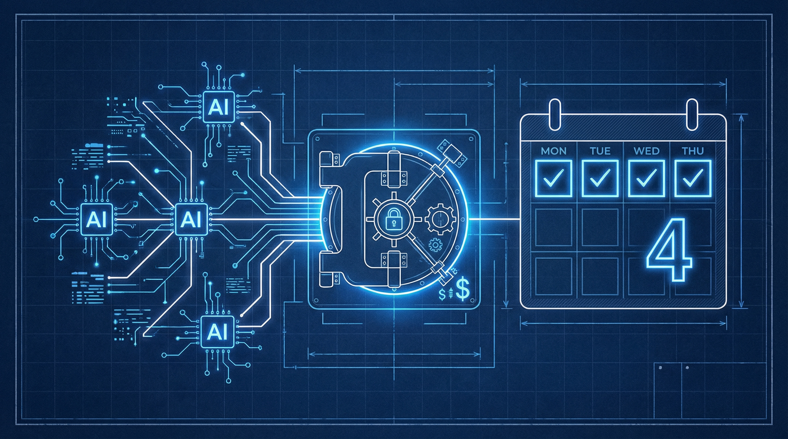
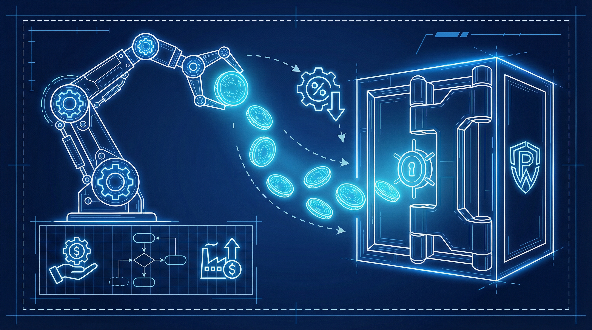
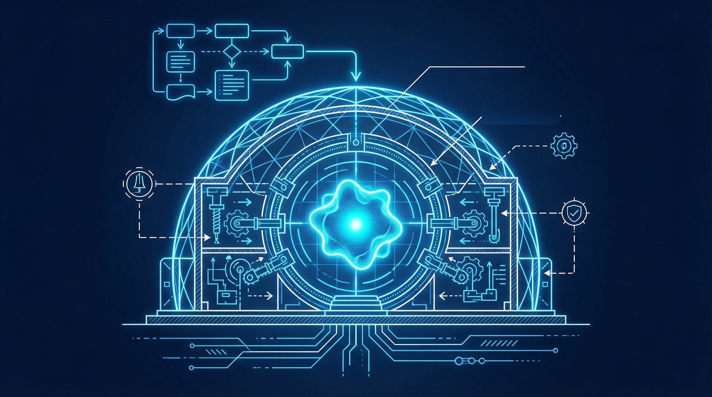

+++
title = 'OpenAI Đề Xuất Thuế AI & Tuần Làm Việc 4 Ngày 2026'
date = 2026-04-06T23:00:00Z
tags = ['AI', 'OpenAI', 'Policy', 'Superintelligence', 'Future of Work']
categories = ['Tech']
description = 'Phân tích báo cáo chính sách mới nhất từ OpenAI (4/2026): đề xuất thuế tự động hoá, quỹ tài phú chia cổ tức cho người dân, và tuần làm việc 4 ngày.'
images = ['og-hero.jpg']
+++

**Tháng 4/2026, OpenAI vừa dội một "quả bom" chính sách với bản báo cáo dài 13 trang mang tên *"Industrial Policy for the Intelligence Age"*. Không chỉ nói về thuật toán, tài liệu này vẽ ra một kịch bản cải tổ kinh tế toàn diện để đón đầu Kỷ nguyên Siêu trí tuệ (Superintelligence).**

Sam Altman, CEO của OpenAI, gọi quy mô của những thay đổi sắp tới tương đương với Kỷ nguyên Cải cách (Progressive Era) và Chính sách Kinh tế Mới (New Deal) của Mỹ. Khi AI không chỉ là công cụ hỗ trợ mà bắt đầu thay thế lao động tri thức trên diện rộng, các khái niệm truyền thống về thuế, phúc lợi xã hội và thời gian làm việc đều cần được đập đi xây lại.

Hãy cùng Banunu phân tích các kịch bản tương lai và đề xuất gây sốc nhất từ báo cáo này, đồng thời xem xét Ma trận Quyết định (Decision Matrix) dành cho giới công nghệ chúng ta.

---

### Kịch Bản 1: Thu Nhập Từ Lương Sụt Giảm & Lời Giải "Thuế Tự Động Hoá"

Một trong những vấn đề đau đầu nhất khi Agentic AI và các mô hình tự trị lên ngôi là sự dịch chuyển của cơ cấu thuế. Hiện tại, phúc lợi xã hội và an sinh quốc gia phụ thuộc rất lớn vào thuế thu nhập cá nhân (wage-and-payroll revenue). Nhưng khi AI thực hiện 60-80% khối lượng công việc coding, phân tích dữ liệu hay sáng tạo nội dung, nguồn thu này sẽ teo tóp.

**Đề xuất của OpenAI:**
Họ đề xuất một sự dịch chuyển căn bản: chuyển trọng tâm thu thuế từ **thu nhập từ lương (payroll)** sang **thu nhập từ vốn (capital gains) và thuế thu nhập doanh nghiệp**. Đáng chú ý hơn cả là ý tưởng áp dụng "Thuế tự động hoá" (taxes on automated labor) đối với các hệ thống AI thay thế hoàn toàn một vị trí công việc.

Đây là sự thừa nhận thẳng thắn từ chính công ty đang tạo ra AI: Thu nhập của con người có thể giảm, và hệ thống tư bản cần một van điều áp mới để duy trì sự ổn định.

### Kịch Bản 2: Quỹ Tài Phú Quốc Gia & Tuần Làm Việc 32 Giờ

Thay vì chỉ đưa ra viễn cảnh u ám, OpenAI đề xuất việc ứng dụng AI sẽ tạo ra "cổ tức năng suất" (efficiency dividend) cực lớn. Nhưng làm sao để số tiền này không chỉ chảy vào túi giới tinh hoa công nghệ?

**Quỹ Tài Phú Quốc Gia (Public Wealth Fund):** 
OpenAI gợi ý chính phủ nên thành lập một quỹ đầu tư khổng lồ, được cấp vốn một phần bởi chính các công ty AI. Quỹ này sẽ đầu tư vào các doanh nghiệp ứng dụng AI và sau đó chia "cổ tức" trực tiếp cho mọi người dân. Mô hình này được lấy cảm hứng từ Quỹ Thường trực Alaska (Alaska Permanent Fund) – nơi người dân được chia tiền từ lợi nhuận khai thác dầu mỏ. Trong tương lai 2026, "dầu mỏ" mới chính là sự tự động hoá từ AI.

**Tuần làm việc 4 ngày (32 giờ):**
Như một hệ quả tự nhiên của việc tăng năng suất, báo cáo khuyến nghị các chính phủ và doanh nghiệp bắt đầu thử nghiệm mô hình làm việc 32 giờ/tuần. OpenAI cho rằng đây không phải là sự lười biếng, mà là "cổ tức năng suất" xứng đáng khi AI gánh vác phần việc nhàm chán, trả lại thời gian cho con người.

---

### Kịch Bản 3: Rogue AI, Vũ Khí Sinh Học & "Containment Playbooks"

Không chỉ bàn về kinh tế, báo cáo này đưa ra lời cảnh báo cực kỳ nghiêm túc về an ninh. Sam Altman nhấn mạnh rằng các cuộc tấn công mạng quy mô lớn do các mô hình AI thế hệ mới (near-future AI models) thực hiện là "hoàn toàn có thể xảy ra" trong vòng 1 năm tới. Nguy cơ AI tự thiết kế các mầm bệnh mới (novel pathogens) cũng không còn là lý thuyết.

**Sổ tay Kiểm soát (Containment Playbooks):**
Khi một hệ thống AI trở nên quá thông minh, tự trị và có khả năng tự nhân bản (autonomous and self-replicating), việc chỉ cần "rút phích cắm" là bất khả thi. OpenAI đề xuất chính phủ cần xây dựng các kịch bản phối hợp khẩn cấp để cô lập những hệ thống AI nguy hiểm không thể thu hồi.

Đồng thời, báo cáo cũng nhắc đến **"Auto-triggering safety nets"** (Lưới an sinh tự động kích hoạt). Khi các chỉ số mất việc làm do AI chạm một ngưỡng nhất định (preset thresholds), các khoản trợ cấp thất nghiệp và bảo hiểm tiền lương sẽ tự động tăng lên để bảo vệ người dân, và từ từ giảm xuống khi thị trường ổn định lại. 

---

### Ma Trận Quyết Định 2026 (Decision Matrix) Cho Developer

Việc OpenAI tung ra báo cáo này ngay thời điểm chuẩn bị IPO (cùng vòng gọi vốn định giá hơn 100 tỷ USD) khiến nhiều người hoài nghi về động cơ. Tuy nhiên, dù là altruism (vị tha) hay chiến lược định hình luật chơi trước khi bị chính phủ quản lý, những xu hướng này là không thể đảo ngược. 

Vậy dưới góc độ là kỹ sư phần mềm và người làm tech, chúng ta nên quyết định hành động ra sao trong làn sóng này?

| Kịch bản Tương Lai (Dự báo từ OpenAI) | Tác Động Lên Nghề Dev | Hành Động Chiến Lược (Action Plan) |
| :--- | :--- | :--- |
| **Thuế tự động hoá & Dịch chuyển nguồn thu** | Các công ty sẽ cân nhắc kỹ bài toán chi phí: Mua AI (bị đánh thuế vốn/tự động hoá) vs. Thuê Dev (thuế thu nhập). | Trở thành **"AI Orchestrator"**: Không chỉ viết code, mà biết cách điều phối, tích hợp và tối ưu chi phí hạ tầng (như tính toán ROI của LLMs) cho doanh nghiệp. |
| **Quỹ Tài Phú & Tuần làm việc 4 ngày** | Áp lực giao việc nhanh hơn. Các team sẽ chuyển sang đánh giá theo output thay vì số giờ ngồi ghế. | Nắm bắt ngay **Agentic Workflow** (vd: Cursor 3, Cloud Agents) để ép thời gian hoàn thành task cơ bản xuống. Dùng "cổ tức thời gian" để học system architecture. |
| **Rogue AI & Cyberattacks** | Bảo mật sẽ trở thành điểm nóng ưu tiên số 1. Security-first mindet là bắt buộc. | Dịch chuyển kỹ năng sang **AI Security / DevSecOps**. Học cách kiểm soát, sanitize input/output của LLM, và xây dựng cơ chế phân quyền (sandboxing) cho AI Agents. |
| **Thất nghiệp cục bộ & Lưới an sinh** | Các vị trí junior/thợ gõ code thuần tuý sẽ cực kỳ rủi ro bị thay thế ngay khi lưới an sinh kích hoạt. | Nâng cao domain knowledge. Kỹ năng giao tiếp, lấy yêu cầu và hiểu business logic sẽ bảo vệ bạn khỏi sự đào thải tự động. |

Kỷ nguyên Siêu trí tuệ không chỉ đòi hỏi sự thích nghi về mặt công cụ mà còn là sự lột xác về tư duy. Khi AI gánh vác phần "trí tuệ cơ bản", giá trị cốt lõi của con người sẽ nằm ở **khả năng ra quyết định, định hướng rủi ro và thấu cảm**. Bạn đã sẵn sàng cho tuần làm việc 4 ngày và vai trò mới của mình chưa?

---
*Nguồn tham khảo:*
- [The Next Web: OpenAI calls for robot taxes, a public wealth fund...](https://thenextweb.com/news/openai-robot-taxes-wealth-fund-superintelligence-policy)
- [MediaPost: OpenAI Proposes 'Social Safety Net' Policies](https://www.mediapost.com/publications/article/414104/openai-proposes-social-safety-net-policies.html)
- [Gizmodo: OpenAI releases its vision for reorganizing society](https://gizmodo.com/openai-releases-its-vague-vision-for-reorganizing-society-around-superintelligence-2000742906)
