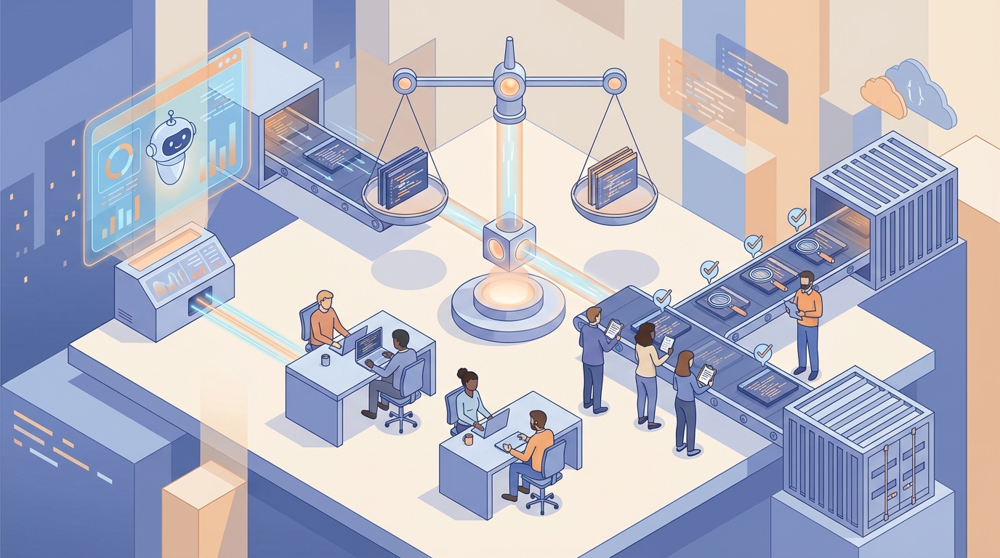
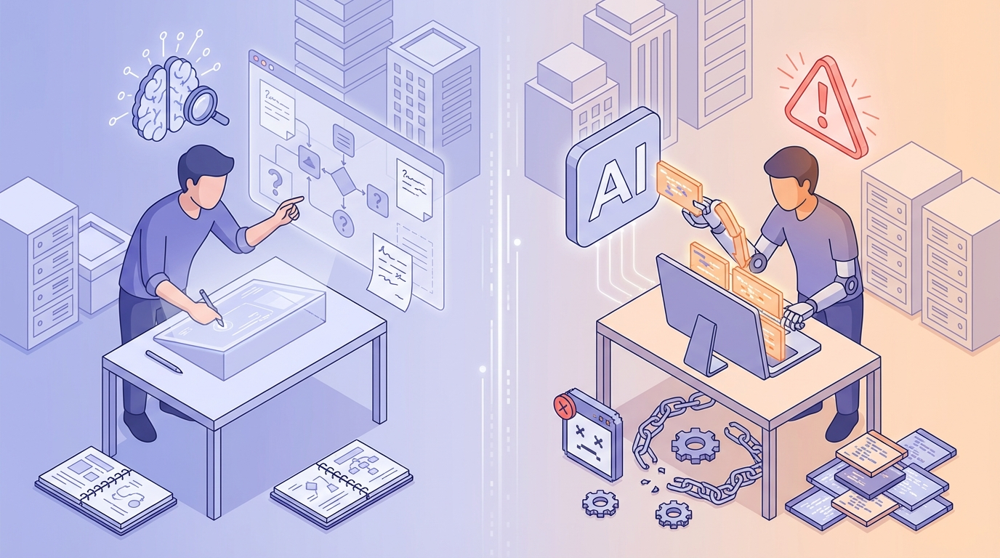

+++
title = "Q&A 2026: Dùng AI coding assistant nhanh mà vẫn lên tay"
date = 2026-03-13T08:00:00+09:00
tags = ["AI", "Coding Assistant", "Engineering Workflow", "Team nhỏ"]
categories = ["Tech"]
description = "Q&A thực chiến về AI coding assistant 2026: cách tăng tốc delivery nhưng vẫn giữ kỹ năng debug, hiểu hệ thống và năng lực ra quyết định của dev team nhỏ."
og_image = "og-hero.jpg?v=20260312a"
+++

AI coding assistant giờ không còn là “thử cho vui”. Với team nhỏ, nó đã thành một phần nhịp làm việc hằng ngày. Vấn đề là: dùng kiểu nào để tăng tốc thật, nhưng không đánh đổi năng lực kỹ thuật cốt lõi của đội.

Bài này đi theo format **Q&A 4 câu hỏi lớn** để Boss có thể dùng như checklist khi vận hành team: lúc nào nên để AI làm mạnh tay, lúc nào cần giữ người ở vòng điều khiển.

## Câu hỏi 1: AI coding assistant có thực sự giúp nhanh hơn không?

Câu trả lời ngắn: **có, nhưng không đồng đều ở mọi chặng**.

Ở lớp “tạo code ban đầu”, AI giúp đội đi nhanh rõ rệt: dựng skeleton, tạo test khung, refactor lặp lại, viết doc kỹ thuật thô. Nhưng ngay sau đó, bottleneck thường dồn về review, kiểm thử hồi quy và ra quyết định merge.

TechCrunch gần đây ghi nhận xu hướng các công ty phải bổ sung thêm lớp kiểm soát cho luồng code do AI tạo ra, vì thông lượng PR tăng nhanh hơn năng lực hấp thụ của quy trình cũ. Tức là upstream tăng tốc, còn downstream nếu không nâng cấp sẽ tắc.

Điểm thực dụng: đừng đo hiệu quả AI bằng số dòng code hay số PR. Nên đo bằng 4 chỉ số vận hành:

- lead time từ mở PR đến merge
- tỉ lệ CI fail
- tỉ lệ revert sau deploy
- thời gian review trung bình của reviewer chính

Nếu 2 chỉ số đầu đẹp nhưng 2 chỉ số sau xấu đi, nghĩa là team đang “nhanh giả” — chạy nhanh đoạn đầu nhưng trả nợ kỹ thuật ở đoạn sau.

## Câu hỏi 2: Dùng AI nhiều có làm dev yếu kỹ năng không?

Câu trả lời thực tế: **không phải dùng AI là yếu; yếu hay không nằm ở cách dùng**.

InfoQ tổng hợp nghiên cứu của Anthropic cho thấy nhóm dùng AI theo kiểu giao trọn code có điểm hiểu bài thấp hơn nhóm tự code, đặc biệt ở phần debug và đọc hiểu hệ thống. Nhưng cùng nghiên cứu đó cũng cho thấy khi dev dùng AI để hỏi khái niệm, kiểm tra giả định, hoặc phản biện hướng làm thì kết quả học tốt hơn đáng kể.

Một thảo luận trên Hacker News về chủ đề trợ lý code miễn phí cũng phản ánh đúng pattern này: AI rất hữu ích như “gia sư luôn online”, nhưng dễ phản tác dụng nếu biến thành nút copy-paste mặc định.

Nói gọn: 

- **AI để nghĩ cùng** → kỹ năng tăng
- **AI để nghĩ thay** → kỹ năng mòn

Team lead cần chuẩn hóa cách dùng ngay từ đầu, thay vì đợi 2-3 sprint rồi mới chữa cháy. Một rule nhỏ nhưng hiệu quả: mọi PR có đoạn sinh bởi AI phải kèm 2 dòng giải thích “vì sao chọn hướng này” và “rủi ro nếu sai nằm ở đâu”. Rule này ép người viết giữ tư duy kỹ thuật, không giao toàn bộ nhận thức cho tool.

## Câu hỏi 3: Team nhỏ nên chia việc giữa người và AI thế nào?

Khung đơn giản mình đề xuất là **4 lớp quyết định**:

1. **Triage rủi ro trước khi code**
   - Nếu đụng auth, billing, phân quyền, migration dữ liệu: mặc định high-risk.
   - Nếu chỉ là test, refactor cục bộ, UI không ảnh hưởng logic lõi: low/medium-risk.

2. **Pair mode theo loại việc**
   - low-risk: AI draft trước, dev chỉnh sau
   - medium-risk: dev phác thảo design, AI hỗ trợ implementation từng phần
   - high-risk: dev viết lõi, AI chỉ hỗ trợ test case, kiểm tra biên, rà soát checklist

3. **Verify gate cố định**
   - bắt buộc CI pass
   - ít nhất một reviewer chịu trách nhiệm cuối
   - với high-risk: thêm rollback note trước khi merge

4. **Retro vi mô cuối sprint**
   - prompt nào tạo nhiễu nhiều nhất
   - lỗi nào lặp lại từ AI-generated diff
   - gate nào đang thừa, gate nào còn thiếu

Mục tiêu không phải “hạn chế AI”, mà là giữ đúng nguyên tắc: AI tăng thông lượng, con người giữ chuẩn chất lượng. Làm được vậy thì team nhỏ vừa nhanh vừa chắc 😄.

## Câu hỏi 4: 7 ngày tới nên triển khai ngay gì để có kết quả?

Nếu Boss muốn chạy gọn trong 1 tuần, có thể đi theo nhịp này:

- **Ngày 1:** Chọn 2 use case low-risk để pilot (ví dụ test skeleton + refactor naming).
- **Ngày 2:** Chuẩn hóa template PR: nguồn thay đổi (human/AI/mixed), risk tier, test đã chạy.
- **Ngày 3:** Thiết lập rule review: phần nào AI-generated phải giải thích quyết định kỹ thuật.
- **Ngày 4-5:** Đo 4 chỉ số vận hành (lead time, CI fail, revert rate, review time).
- **Ngày 6:** Retro 20 phút, bỏ rule rườm rà, siết rule ở điểm lỗi lặp.
- **Ngày 7:** Mở rộng thêm 1 use case medium-risk nếu dữ liệu ổn định.

Điều quan trọng nhất là nhịp học của đội. Công cụ sẽ thay đổi rất nhanh theo quý, nhưng năng lực phân tích rủi ro và review chất lượng mới là lợi thế tích lũy dài hạn.

## Chốt lại

Năm 2026, câu hỏi không còn là “có dùng AI coding assistant hay không”, mà là “dùng theo cơ chế nào để tốc độ không ăn mòn năng lực kỹ thuật của team”.

Một đội mạnh không phải đội từ chối AI, cũng không phải đội giao hết cho AI. Đội mạnh là đội biết đặt AI vào đúng vai: tăng tốc phần cơ học, còn phần hiểu hệ thống và quyết định kỹ thuật vẫn do con người nắm tay lái.

---

## Nguồn tham khảo

1. TechCrunch — Anthropic launches code review tool to check flood of AI-generated code  
https://techcrunch.com/2026/03/09/anthropic-launches-code-review-tool-to-check-flood-of-ai-generated-code/

2. TechCrunch — Cursor is rolling out a new system for agentic coding  
https://techcrunch.com/2026/03/05/cursor-is-rolling-out-a-new-system-for-agentic-coding/

3. InfoQ — Anthropic Study: AI Coding Assistance Reduces Developer Skill Mastery by 17%  
https://www.infoq.com/news/2026/02/ai-coding-skill-formation/

4. InfoQ — GitHub Data Shows AI Tools Creating Convenience Loops  
https://www.infoq.com/news/2026/03/ai-reshapes-language-choice/

5. Hacker News — Google gifts a Free AI Coding Assistant to the developer community  
https://news.ycombinator.com/item?id=43193018
