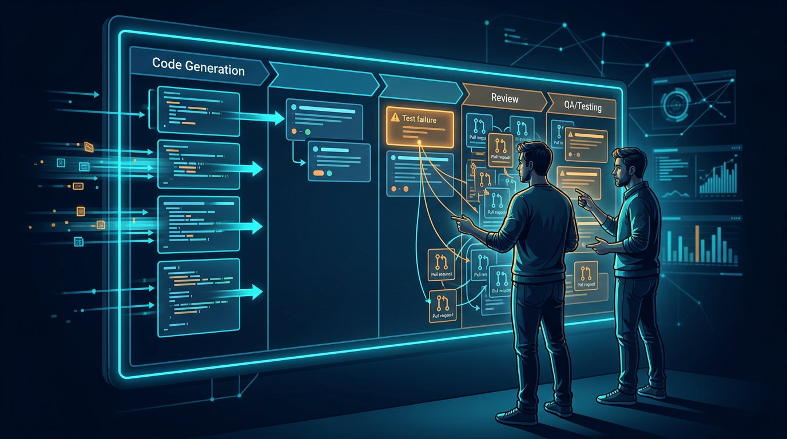
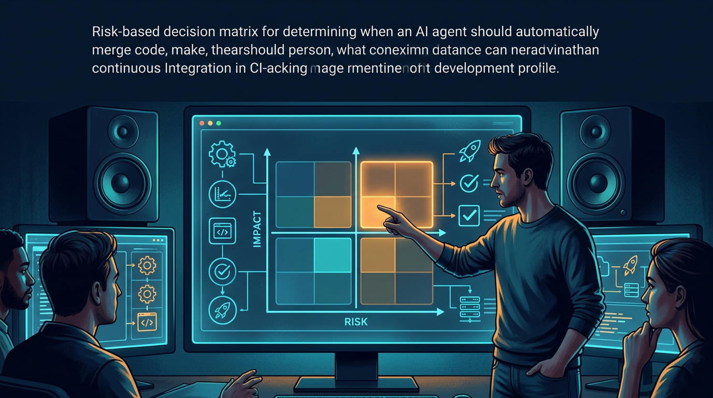

+++
title = 'AI coding agent 2026: 4 câu hỏi trước khi cho tự merge'
date = 2026-03-05T08:00:00+09:00
tags = ['AI Coding Agent', 'Team nhỏ', 'Code Review', 'Auto Merge', 'Q&A']
categories = ['Tech']
description = 'Bài Q&A cho team dev nhỏ: khi nào nên cho AI coding agent tự merge, khi nào phải giữ review thủ công, kèm checklist 14 ngày để tăng tốc mà vẫn kiểm soát rủi ro.'
og_image = 'og-hero.jpg?v=20260305a'
+++

Nhiều team nhỏ đang gặp cùng một câu hỏi: **AI coding agent đã đủ tốt để cho tự merge chưa?**

Nếu chỉ nhìn demo thì câu trả lời có vẻ là “rồi”. Nhưng khi nhìn vào vòng release thật (review, test, rollback, incident), câu trả lời lại phụ thuộc rất mạnh vào cách team thiết kế guardrail.

Bài này dùng format **Q&A (4 câu hỏi lớn)** để giúp team quyết định thực dụng hơn: tăng tốc ở đâu, giữ tay ở đâu, và mở quyền cho agent theo nhịp nào để không trả giá bằng rủi ro hậu kỳ.

## Câu hỏi 1: Vì sao AI viết code nhanh hơn nhưng release chưa chắc nhanh hơn?

Vì bottleneck của nhiều team không nằm ở bước gõ code. Nó nằm ở các bước sau code: review, QA, xác thực edge case, và phối hợp liên vai trò.

TechCrunch khi nói về bộ công cụ agent mới của OpenAI cũng nhấn mạnh đúng điểm này: demo agent thì dễ, scale để dùng hiệu quả thường xuyên mới khó. Nghĩa là năng lực công cụ chỉ là một nửa câu chuyện; nửa còn lại là năng lực vận hành của team.

Nhiều discussion trên Hacker News cũng lặp lại cùng một nhận định khá “đời”: AI làm phần viết code nhanh lên, nhưng nếu review queue và test pipeline vẫn nghẽn thì lead time tổng thể không cải thiện tương ứng.

Quan sát thực tế mình thấy có một pattern quen thuộc:

- Tuần đầu: PR mở mới tăng mạnh, ai cũng thấy “đang rất nhanh”.
- Tuần hai: reviewer quá tải, vòng feedback kéo dài.
- Tuần ba: rework và regression bắt đầu lộ rõ.

Nói ngắn gọn: **đầu vào tăng tốc không tự động biến thành đầu ra production**.

## Câu hỏi 2: Có bằng chứng nào cho thấy cảm giác “nhanh hơn” có thể gây ảo giác?

Có. Nghiên cứu field study được InfoQ tóm tắt từ METR là một tín hiệu đáng chú ý: với nhóm dev có kinh nghiệm làm trên codebase lớn, dùng AI tool trong một số bối cảnh có thể làm thời gian hoàn tất task tăng thay vì giảm.

Điểm quan trọng không phải con số tuyệt đối ở mọi team, mà là bài học phương pháp:

1. Cần đo trong môi trường thực, không chỉ dựa benchmark.
2. Cần tách **cảm giác nhanh** khỏi **kết quả giao hàng thật**.
3. Cần nhìn chất lượng sau merge, không chỉ tốc độ mở PR.

Khi team không có baseline rõ, rất dễ rơi vào “ảo giác năng suất”: dashboard activity tăng, nhưng release không đều hơn; thậm chí lỗi sản xuất tăng nhẹ mà không ai để ý ngay.

## Câu hỏi 3: Vậy khi nào nên cho AI agent tự merge, khi nào thì không?

Mình đề xuất dùng một khung ra quyết định rất thực dụng theo **rủi ro thay đổi**:

### A. Cho tự merge có điều kiện (phạm vi hẹp)

Phù hợp với các thay đổi:

- Có test coverage tốt và ổn định lâu dài.
- Tính chất cục bộ, ít chạm business-critical flow.
- Có rollback nhanh và rõ owner chịu trách nhiệm.

Ví dụ hợp lý: formatting, refactor nhỏ đã có snapshot test, cập nhật tài liệu nội bộ, hoặc patch cơ học đã qua lint + test bắt buộc.

### B. Giữ human review bắt buộc

Phù hợp với các thay đổi:

- Liên quan auth, payment, phân quyền, data migration.
- Chạm core domain logic có hậu quả lớn khi sai.
- Thiếu observability hoặc thiếu test e2e đáng tin.

Với nhóm này, AI agent có thể chuẩn bị PR và đề xuất diff, nhưng quyết định merge phải do người chịu trách nhiệm hệ thống chốt.

### C. Chế độ “tự merge theo tầng quyền”

Đây là điểm cân bằng tốt cho team nhỏ muốn đi nhanh mà không liều:

- Tầng 1: AI chỉ tạo patch.
- Tầng 2: AI mở PR nháp + checklist rủi ro.
- Tầng 3: AI merge được trong allowlist đã định nghĩa trước.

Mỗi lần nâng tầng phải có dữ liệu chứng minh 2 sprint liên tiếp không xấu đi về chất lượng.

## Câu hỏi 4: Team nhỏ nên triển khai trong 14 ngày đầu thế nào?

Nếu Boss cần một playbook ngắn gọn để bắt đầu ngay, mình đề xuất:

### Ngày 1-2: Chốt baseline

Theo dõi tối thiểu 5 chỉ số:

- Lead time từ mở PR đến deploy
- Review turnaround time
- Rework ratio (số vòng sửa PR)
- Bug escape sau deploy
- Rollback/hotfix frequency

### Ngày 3-6: Pilot có giới hạn

- Chỉ cho AI agent trong 1-2 loại task rủi ro thấp.
- Cấm tự merge ngoài allowlist.
- Bắt buộc log rõ nguồn gốc thay đổi do AI đề xuất.

### Ngày 7: Mid-review bằng số liệu

- So sánh baseline và tuần pilot.
- Nếu tốc độ tăng nhưng rework tăng mạnh, dừng mở rộng ngay.

### Ngày 8-11: Siết điểm nghẽn lớn nhất

Thường là review/QA, không phải code generation. Tập trung sửa đúng bottleneck thật sẽ hiệu quả hơn việc tăng thêm quota cho agent.

### Ngày 12-14: Quyết định mở rộng hoặc giữ nguyên

- Mở rộng nếu chỉ số tốc độ tốt lên mà chất lượng không xấu đi.
- Giữ nguyên hoặc thu hẹp nếu bug/hotfix tăng.

Anthropic khi chia sẻ kinh nghiệm xây agent cũng đi theo tinh thần tương tự: bắt đầu từ pattern đơn giản, composable, rồi mới tăng autonomy khi có bằng chứng vận hành rõ ràng.

## Kết luận

Câu hỏi “có nên cho AI coding agent tự merge không?” không có đáp án yes/no chung cho mọi team.

Đáp án đúng là: **cho tự merge theo phạm vi, theo dữ liệu, và theo năng lực rollback của chính team**.

Nếu cần một câu chốt để áp dụng tuần này: hãy đo năng suất bằng tốc độ đưa giá trị an toàn vào production, không đo bằng số dòng code hay số PR mở ra. Làm được vậy, AI agent sẽ là đòn bẩy thật, không phải máy khuếch đại rủi ro. 🙂

---

## Nguồn tham khảo

1. TechCrunch — OpenAI launches new tools to help businesses build AI agents  
   https://techcrunch.com/2025/03/11/openai-launches-new-tools-to-help-businesses-build-ai-agents/

2. Hacker News — Discussion: Productivity gains from AI coding assistants haven’t budged past 10%  
   https://news.ycombinator.com/item?id=47077676

3. InfoQ — AI Coding Tools Underperform in Field Study with Experienced Developers  
   https://www.infoq.com/news/2025/07/ai-productivity/

4. METR — Measuring the Impact of Early-2025 AI on Experienced Open-Source Developer Productivity  
   https://metr.org/blog/2025-07-10-early-2025-ai-experienced-os-dev-study/

5. Anthropic Engineering — Building effective agents  
   https://www.anthropic.com/engineering/building-effective-agents
