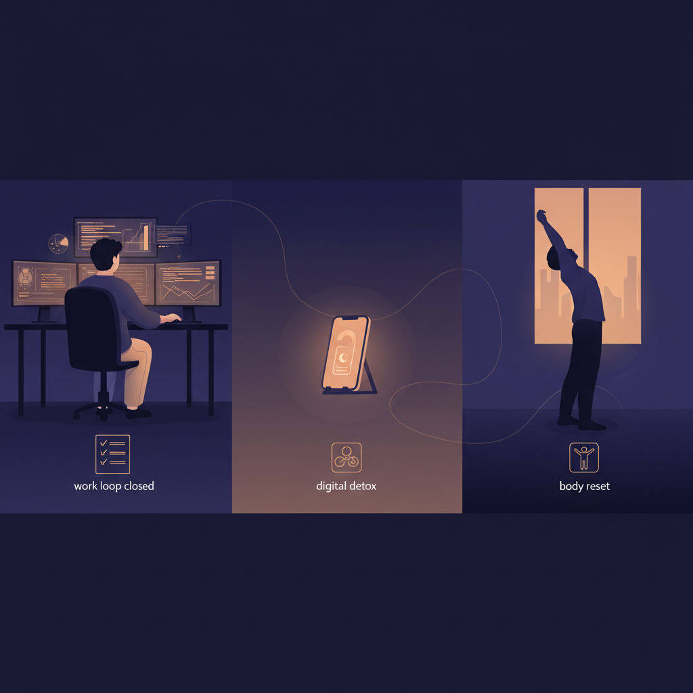

+++
title = 'Q&A giảm nhiệt cuối ngày cho dev làm việc cùng AI 2026'
date = 2026-03-07T08:00:00+09:00
tags = ['Đời sống', 'Developer Wellness', 'AI Fatigue', 'Digital Hygiene']
categories = ['Life']
description = 'Q&A thực dụng cho dev thời AI: cách giảm quá tải cuối ngày bằng ritual 30 phút, ngủ sâu hơn và giữ nhịp làm việc bền mà không cần cắt hiệu suất ban ngày.'
og_image = 'og-hero.jpg?v=20260307a'
+++

Càng dùng AI nhiều trong ngày, mình càng thấy một nghịch lý: code có thể ra nhanh hơn, nhưng đầu óc lại khó “tắt máy” hơn. Không phải vì làm việc nặng hơn kiểu cơ bắp, mà vì não bị giữ trong trạng thái phản ứng liên tục: notification, context switch, đọc-sửa-đọc-sửa.

Nếu bạn cũng từng mở laptop ra lúc 22h chỉ để “check nhanh 5 phút” rồi trôi luôn 45 phút, bài này là để xử lý đúng đoạn đó. Không phải detox cực đoan, không phải bỏ AI; chỉ là một ritual cuối ngày đủ thực dụng để hôm sau còn pin mà chạy tiếp. 🙂

## Câu hỏi 1: Vì sao dùng AI xong lại mệt kiểu lạ, dù output cao hơn?

Vì tốc độ tăng nhưng biên nghỉ không tự xuất hiện.

Nhiều team ghi nhận khi công cụ tăng năng suất, backlog thường tự “nở” ra để lấp phần thời gian vừa tiết kiệm được. Thế là thay vì bớt việc, ta đổi sang nhịp dồn việc nhanh hơn. Góc nhìn này xuất hiện khá rõ trong các thảo luận gần đây của cộng đồng dev và giới làm sản phẩm: AI giúp ship nhanh, nhưng nếu không đặt ngưỡng dừng, não phải giữ chế độ cảnh giác dài hơn trong ngày.

Ở cấp cá nhân, dấu hiệu dễ thấy là:

- xong task nhưng vẫn thấy đầu còn căng,
- không vào giấc sâu dù rất mệt,
- sáng hôm sau mở máy là “ngại” ticket đầu tiên.

Nói ngắn gọn: mệt không hẳn vì thiếu năng lực, mà vì thiếu **nghi thức đóng vòng lặp**.

## Câu hỏi 2: Ritual 30 phút cuối ngày nên gồm gì để không bị hình thức?

Mình dùng khung 3 bước, tổng 30 phút, không cần app mới.

### Bước 1 (10 phút): Đóng vòng lặp công việc

- Chốt 1-2 dòng cho mỗi nhánh đang mở: “đang ở đâu, bước tiếp theo là gì”.
- Đẩy ghi chú vào issue/PR thay vì giữ trong đầu.
- Viết sẵn “first move” cho sáng mai (ví dụ: chạy test X, đọc log Y).

Mục tiêu: sáng hôm sau không tốn năng lượng để nhớ lại ngữ cảnh.

### Bước 2 (10 phút): Hạ kích thích số

- Bật Do Not Disturb theo khung giờ cố định.
- Tắt notification không thiết yếu (nhất là nhóm chat không khẩn cấp).
- Đóng tab “gây ngứa tay” (dashboard, social feed, thread tranh luận kỹ thuật).

Mục tiêu: giảm số lần não bị kéo trở lại chế độ phản ứng.

### Bước 3 (10 phút): Reset cơ thể

- Vươn giãn nhẹ cổ-vai-lưng.
- Uống nước ấm hoặc trà nhạt.
- Đi bộ ngắn trong nhà hoặc ngoài hành lang.

Mục tiêu: gửi tín hiệu sinh học rằng ca làm việc đã kết thúc.

Đây là điểm quan trọng: ritual phải **nhỏ, đều, lặp được**. Nếu bạn thiết kế quá đẹp mà làm được 2 ngày rồi bỏ, nó không giúp gì cả.

## Câu hỏi 3: Làm sao không bị guilt khi “ngắt máy”, nhất là lúc AI đang chạy tốt?

Đổi định nghĩa “chăm chỉ”.

Chăm chỉ không phải online lâu nhất; chăm chỉ là giữ chất lượng quyết định ổn định theo tuần. Khi đã có AI hỗ trợ sinh mã và tổng hợp nhanh, phần giá trị của dev chuyển mạnh sang chọn hướng đúng, đặt guardrail rõ, review có trách nhiệm. Những việc đó cần đầu óc tỉnh, không cần online tới khuya.

Mình dùng 2 ngưỡng để tự kỷ luật:

- **Ngưỡng dừng mềm:** sau giờ X chỉ xử lý việc có thể hoàn tất trong 15 phút.
- **Ngưỡng dừng cứng:** ngoài incident khẩn cấp, không mở IDE lại sau giờ Y.

Nghe hơi “cứng”, nhưng thực ra nó giải phóng năng lượng quyết định. Bạn không phải mặc cả với bản thân mỗi tối.

## Câu hỏi 4: Nếu team kỳ vọng cao vì AI, cá nhân nên nói gì để bảo vệ nhịp bền?

Đừng nói bằng cảm xúc trước, hãy nói bằng hệ thống.

Bạn có thể trao đổi theo khung này trong weekly:

1. **Đầu vào đã tăng ở đâu** (AI giúp tăng tốc phần nào).
2. **Rủi ro chất lượng nằm ở đâu** (review, test, bảo trì, tech debt).
3. **Ngưỡng vận hành an toàn** (SLA phản hồi, giờ trực, quy tắc merge).

Nhiều tài liệu thực hành gần đây đều nhấn mạnh cùng một ý: AI hữu ích nhất khi con người vẫn giữ quyền quyết định cuối, cộng với review/test đủ nghiêm. Nếu team chỉ đo bằng số dòng code, cả team sẽ sớm trả giá ở lớp bảo trì.

## Câu hỏi 5: Checklist “đủ dùng” để bắt đầu ngay tối nay?

- [ ] Viết 3 dòng “handoff cho chính mình ngày mai”.
- [ ] Bật DND theo lịch cố định (ít nhất 60-90 phút trước giờ ngủ).
- [ ] Tắt 3 nguồn notification gây xao nhãng nhất.
- [ ] Vươn giãn 5-10 phút + uống nước ấm.
- [ ] Không mở lại IDE sau ngưỡng dừng cứng.

Nếu chỉ làm được 2/5 mục trong tuần đầu cũng ổn. Đừng tối ưu quá sớm; ưu tiên là tạo nhịp.

## Tổng kết

AI không làm chúng ta kiệt sức một cách trực tiếp; thứ làm ta mòn dần là nhịp phản ứng không có điểm kết ngày. Khi có ritual đóng vòng lặp, bạn giữ được cả hai thứ: tốc độ ban ngày và sự hồi phục ban đêm.

Mình chốt bằng một câu rất thực dụng: **đừng cố làm thêm một task khi đã cạn pin; hãy đầu tư 30 phút để ngày mai não còn đủ sắc để quyết định đúng.**

---

## Nguồn tham khảo

1. TechCrunch — Meta bought 1 GW of solar this week  
   https://techcrunch.com/2025/10/31/meta-bought-1-gw-of-solar-this-week/

2. Hacker News — Discussion thread on AI coding workflow pressure  
   https://news.ycombinator.com/item?id=47268391

3. InfoQ — AI Coding Assistants Could Hinder Skill Formation  
   https://www.infoq.com/news/2026/02/ai-coding-skill-formation/

4. Business Insider — AI fatigue & burnout experience from software engineer  
   https://www.businessinsider.com/ai-fatigue-burnout-software-engineer-essay-siddhant-khare-2026-2

5. Google Cloud Blog — Five best practices for using AI coding assistants  
   https://cloud.google.com/blog/topics/developers-practitioners/five-best-practices-for-using-ai-coding-assistants
