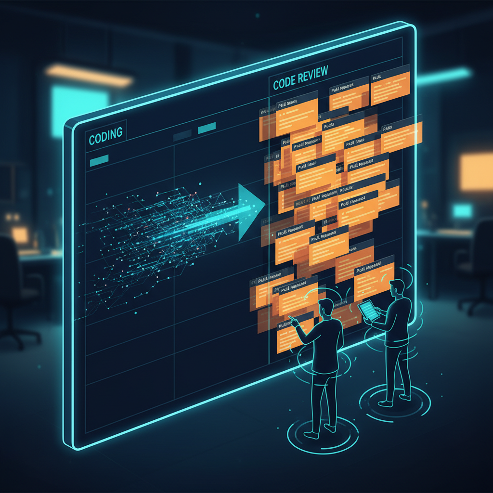

+++
title = 'Nghề dev thời AI 2026: 5 câu hỏi để không trượt nhịp'
date = 2026-03-06T08:00:00+09:00
tags = ['Nghề dev', 'AI Coding', 'Workflow', 'Q&A', 'Team nhỏ']
categories = ['Career']
description = 'Bài Q&A thực dụng cho dev: cách dùng AI coding tools mà vẫn giữ tốc độ giao hàng, chất lượng review và đà phát triển kỹ năng trong team nhỏ năm 2026.'
og_image = 'og-hero.jpg?v=20260306a'
+++

AI đang làm một việc rất thú vị với nghề dev: **nó đẩy tốc độ viết code lên nhanh hơn khả năng ra quyết định của team**. Nên câu hỏi quan trọng không còn là “dùng AI hay không”, mà là “dùng AI thế nào để không tự trượt nhịp”.

Bài này đi theo format Q&A với 5 câu hỏi lớn mình thấy team nhỏ hỏi nhiều nhất trong 3 tháng gần đây. Mục tiêu là đưa ra khung thực hành gọn, có thể áp dụng ngay tuần tới.

## Câu hỏi 1: Vì sao code nhanh hơn nhưng release chưa chắc nhanh hơn?

Vì **bottleneck không nằm ở gõ code**. Khi AI tạo được nhiều patch hơn, điểm nghẽn thường dồn sang review, QA và quyết định sản phẩm. Thảo luận trên Hacker News quanh các khảo sát năng suất 2025-2026 cũng lặp lại đúng mô-típ này: đầu vào tăng mạnh, nhưng hàng chờ review mới là nơi team “nghẹt cổ chai”.

TechCrunch khi nói về làn sóng agent cho doanh nghiệp cũng nhấn một ý tương tự: demo agent thì dễ, đưa vào vận hành ổn định mới khó. Nói cách khác, tốc độ tạo code không tự chuyển thành tốc độ giao hàng nếu thiếu cơ chế kiểm soát cuối pipeline.

Việc cần làm ngay là đổi câu hỏi từ “AI viết được bao nhiêu?” sang “bao nhiêu thay đổi đi đến production an toàn?”. Chỉ cần đổi câu hỏi, cách đo hiệu quả sẽ thay đổi theo.

## Câu hỏi 2: Có nên giao task lớn cho coding agent luôn không?

Không nên giao “một cục lớn” ngay từ đầu. Khuyến nghị của Anthropic trong bài *Building effective agents* rất rõ: bắt đầu từ pattern đơn giản, tăng độ tự chủ theo dữ liệu thật thay vì cảm giác.

Thực tế team nhỏ thường hợp với mô hình 3 tầng:

- **Tầng 1 (safe zone):** test, refactor cục bộ, docs, script nội bộ.
- **Tầng 2 (guarded zone):** logic nghiệp vụ có checklist rủi ro, bắt buộc reviewer chỉ định.
- **Tầng 3 (human-first):** auth, payment, migration dữ liệu, thay đổi kiến trúc.

Làm vậy có thể hơi “chậm” trong 1-2 tuần đầu, nhưng đổi lại bạn giữ được tính dự đoán của hệ thống. Và với team nhỏ, tính dự đoán thường đáng tiền hơn một cú tăng tốc ngắn hạn.

## Câu hỏi 3: Nên đo KPI gì để biết AI đang giúp thật?

Nếu chỉ nhìn số PR hoặc số dòng code, rất dễ rơi vào tăng tốc giả. Một bộ chỉ số tối thiểu mình khuyên dùng:

- **Lead time từ mở PR đến deploy**
- **Rework ratio** (số vòng sửa sau review)
- **Bug escape rate** sau release
- **Rollback/hotfix frequency**

InfoQ dẫn nghiên cứu METR cho thấy một nghịch lý đáng chú ý: dev giàu kinh nghiệm có thể **cảm giác nhanh hơn**, nhưng thời gian hoàn thành task trong bối cảnh thực tế lại chậm hơn do overhead prompt, kiểm tra và tích hợp code vào codebase lớn. Điểm mấu chốt không phải “AI tốt hay xấu”, mà là bạn có đo đúng tác động cuối pipeline hay không.

Team nào đo được 4 chỉ số trên theo tuần sẽ bớt tranh cãi cảm tính hẳn. Nhìn dashboard là biết nên mở rộng phạm vi dùng AI hay siết lại.

## Câu hỏi 4: Vai trò senior có bị mờ đi khi AI viết code ngày càng tốt?

Ngược lại, vai trò senior còn rõ hơn. Khi code tạo nhanh hơn, giá trị senior dịch lên lớp cao hơn: chọn trade-off, đánh giá rủi ro, giữ kiến trúc sạch, và dạy team cách review đúng.

GitHub giới thiệu coding agent như một “teammate” chạy nền qua issue/PR, nhưng vẫn giữ human approval trước các bước nhạy cảm. Đây là tín hiệu tốt: tự động hóa phần nặng tay chân, giữ con người ở chốt quyết định.

Nói vui một chút 😄: AI làm bạn bớt gõ phím, chứ chưa thay bạn chịu trách nhiệm khi production đỏ lửa.

## Câu hỏi 5: Team nhỏ nên triển khai trong 14 ngày thế nào để vừa nhanh vừa chắc?

Bạn có thể thử plan 14 ngày dưới đây:

### Ngày 1-2: Chốt baseline

- Chụp dữ liệu 2 tuần gần nhất cho 4 KPI.
- Chọn 2 loại task low-risk cho AI xử lý.
- Ghi rõ “định nghĩa done” của mỗi loại task.

### Ngày 3-6: Pilot có ranh giới

- Mọi PR do AI hỗ trợ phải có checklist rủi ro.
- Không cho tự merge ở module business-critical.
- Reviewer ghi rõ lý do reject để tái sử dụng cho prompt/rule.

### Ngày 7: Review giữa kỳ

- So KPI với baseline.
- Nếu lead time không giảm mà rework tăng: thu hẹp phạm vi ngay.
- Nếu cải thiện nhẹ nhưng ổn định: giữ nhịp thêm 1 tuần, không mở rộng vội.

### Ngày 8-11: Đánh vào bottleneck lớn nhất

Thường bottleneck nằm ở review queue hoặc test pipeline. Chọn 1 điểm nghẽn lớn nhất, xử lý dứt điểm trước khi tăng autonomy cho agent.

### Ngày 12-14: Quyết định theo dữ liệu

- **Mở rộng** khi tốc độ tốt hơn và bug không tăng.
- **Giữ nguyên** khi tín hiệu trái chiều.
- **Thu hẹp** khi hotfix/rollback tăng hoặc reviewer quá tải.

Điều mình thấy hiệu quả nhất là viết thành “hợp đồng vận hành” 1 trang: AI chịu trách nhiệm đề xuất patch; dev chịu trách nhiệm hiểu tác động; lead chịu trách nhiệm ngưỡng rủi ro merge. Vai trò rõ thì nhịp team tự ổn định hơn.

## Tóm lại

Nghề dev thời AI không thiếu tốc độ; cái thiếu là **kỷ luật hệ thống** để biến tốc độ thành kết quả bền. Nếu phải chốt một câu: _hãy để AI tối ưu phần lặp lại, còn con người tối ưu quyết định quan trọng_.

Làm được vậy, team nhỏ vẫn chạy nhanh mà không tự bào mòn chất lượng nghề.

---

## Nguồn tham khảo

1. TechCrunch — OpenAI launches new tools to help businesses build AI agents  
   https://techcrunch.com/2025/03/11/openai-launches-new-tools-to-help-businesses-build-ai-agents/

2. Hacker News — Productivity gains from AI coding assistants haven’t budged past 10% (discussion)  
   https://news.ycombinator.com/item?id=47077676

3. InfoQ — AI Coding Tools Underperform in Field Study with Experienced Developers  
   https://www.infoq.com/news/2025/07/ai-productivity/

4. Anthropic Engineering — Building effective agents  
   https://www.anthropic.com/engineering/building-effective-agents

5. GitHub Blog — GitHub Copilot: Meet the new coding agent  
   https://github.blog/news-insights/product-news/github-copilot-meet-the-new-coding-agent/
