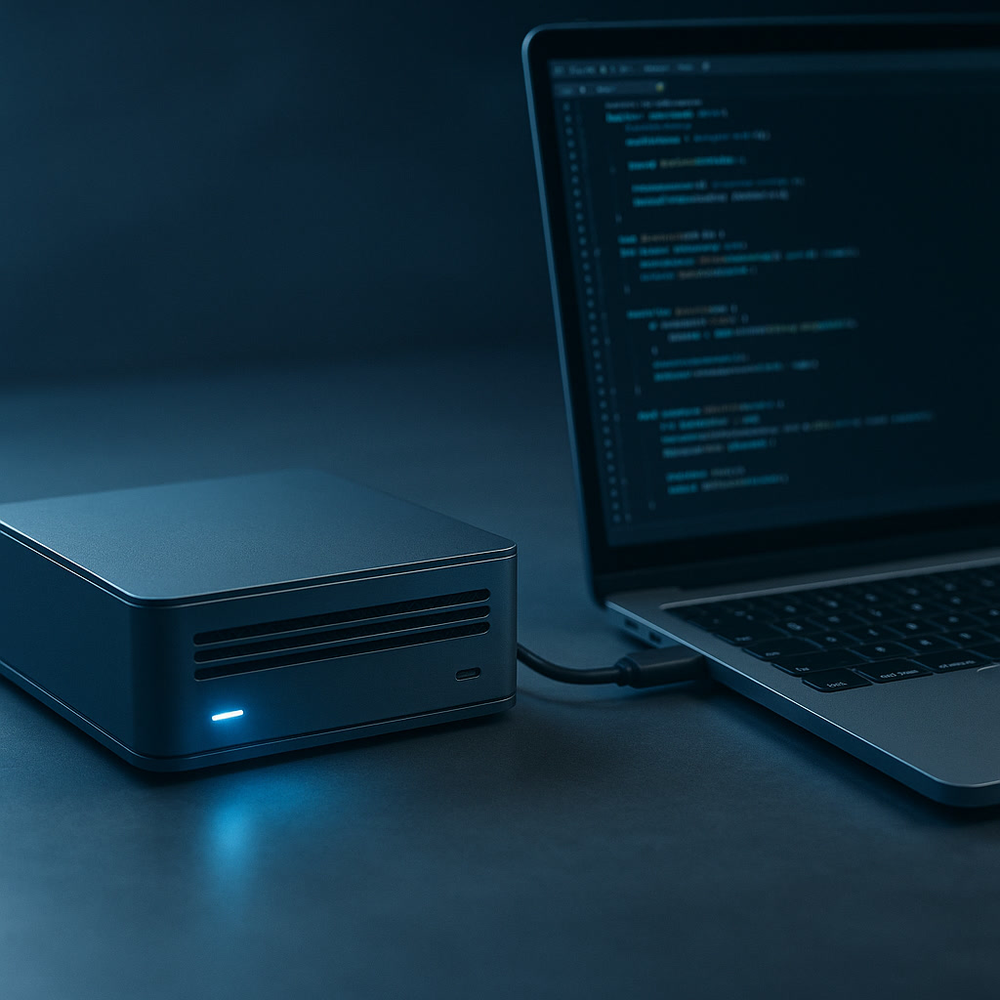

+++
title = 'SLM và Edge AI 2026: Mang não AI về thiết bị cá nhân'
date = 2026-03-28T23:00:00+00:00
tags = ['AI', 'Small Language Models', 'Edge AI', 'Local AI']
categories = ['Tech']
description = 'Small Language Models (SLM) đang thay đổi cuộc chơi AI năm 2026. Khám phá lý do tại sao chạy Local AI trên Edge Devices lại là tương lai thay vì Cloud LLM.'
images = ['og-hero.jpg']
+++

Năm 2026 đánh dấu một cột mốc trong bức tranh phát triển của trí tuệ nhân tạo. Trong khi các ông lớn công nghệ tiếp tục cuộc đua siêu mô hình Large Language Models (LLM), giới developer đang lặng lẽ rẽ sang một hướng hoàn toàn khác: **Small Language Models (SLM) chạy offline trên thiết bị cá nhân (Edge AI).**

Chúng ta không còn nhất thiết gửi mọi dữ liệu lên đám mây để nhờ một "bộ não khổng lồ" xử lý. Sự trỗi dậy của các SLM siêu tinh gọn (1-8 tỷ tham số) đã mang khả năng suy luận mạnh mẽ về ngay trên MacBook, điện thoại hay Raspberry Pi [1]. 

Vậy lý do nào khiến SLM trở thành xu hướng không thể đảo ngược? Hãy cùng đi tìm lời giải qua 4 câu hỏi định hình sân chơi Edge AI 2026.

## 1. Tại sao lại là lúc này? Những giới hạn của Cloud LLM

Sức mạnh của GPT-4 hay Claude 3.5 là không thể bàn cãi. Nhưng sau vài năm ứng dụng, các doanh nghiệp nhận ra một bài học cay đắng: chi phí và độ trễ.

Khi một ứng dụng cần thực hiện hàng nghìn truy vấn mỗi giây – ví dụ như trợ lý AI giám sát an ninh camera hay AI tự động dịch trên tai nghe – việc liên tục gửi dữ liệu qua API lên máy chủ trung tâm trở thành một "nút thắt cổ chai". Sự cố đứt cáp quang biển hay chập chờn đường truyền mạng có thể làm tê liệt dây chuyền hoạt động.

**Thực tế 2026:** Theo một phân tích từ Hugging Face, các mô hình gọn nhẹ giờ đã đủ thông minh để thực hiện các tác vụ cụ thể mà không cần đến kiến thức của toàn nhân loại [1]. Nếu bạn chỉ cần AI phân tích log hoặc tóm tắt tài liệu, một SLM 3 tỷ tham số được tinh chỉnh tốt sẽ cho tốc độ tính toán ngay tức thì (zero-latency).

## 2. SLM mang lại lợi thế chiến lược nào cho lập trình viên?

Nếu bạn là một developer đang xây dựng sản phẩm, Edge AI là một vũ khí chiến lược và quyền tự do trong kiến trúc phần mềm.

- **Privacy-First (Bảo mật tuyệt đối):** Theo Prem AI, quyền riêng tư là lý do hàng đầu thúc đẩy sự chuyển dịch sang Edge AI [2]. Dữ liệu y tế, số liệu tài chính hay source code bản quyền sẽ không bao giờ phải rời khỏi bộ nhớ RAM của thiết bị vật lý. Khái niệm "Data Privacy" giờ đây được đảm bảo bằng rào cản vật lý thay vì những bản hợp đồng pháp lý. Đây là tấm vé thông hành để phần mềm tích hợp AI của bạn thâm nhập vào các ngành công nghiệp khắt khe nhất.
- **Tiết kiệm chi phí suy luận (Zero Inference Cost):** API trả phí từng token là thảm họa bào mòn dòng tiền của startup. Việc đẩy mô hình SLM xuống thiết bị người dùng cuối (User Device) có nghĩa là sức mạnh điện toán đã được san sẻ (offload). Công ty bạn sẽ không tốn một xu chi phí máy chủ nào cho inference khi ứng dụng đang chạy ở quy mô hàng triệu người dùng.

## 3. Local RAG trên Edge hoạt động như thế nào?

Câu hỏi của các team phát triển sản phẩm là: *"SLM tuy nhẹ và chạy nhanh, nhưng lượng kiến thức được train sẵn đã bị cắt giảm. Làm sao để chúng trả lời chính xác thông tin doanh nghiệp mà không bị ảo giác?"*

Lời giải của năm 2026 chính là Local RAG (Retrieval-Augmented Generation). Thay vì cấy toàn bộ kiến thức vào trọng số của mạng nơ-ron, developer thiết lập một cơ sở dữ liệu vector thu nhỏ, hoạt động mượt mà ngay trên ổ cứng thiết bị.

Khi người dùng đặt câu hỏi, ứng dụng sẽ tìm kiếm nội dung cục bộ qua thuật toán vector similarity để trích xuất các tài liệu liên quan nhất. Đoạn văn bản này sau đó được đẩy vào "ngữ cảnh" của SLM. Bằng quy trình này, mô hình nhỏ bé chỉ đóng vai trò "đọc hiểu và tổng hợp" [3]. Kết quả là những câu trả lời chuyên sâu, độ chính xác cao dựa trên tài liệu nội bộ, hoàn toàn ngoại tuyến.

## 4. Những kịch bản ứng dụng (Use Cases) nào đang thống trị?

Sự kết hợp giữa SLM và Edge Computing đã mở ra những mô hình kinh doanh mà trước đây đám mây không thể đáp ứng:

- **Thiết bị y tế thông minh (Smart Wearables):** Đồng hồ thông minh phân tích điện tâm đồ thời gian thực, cảnh báo bất thường chạy ngầm bằng SLM mà không cần kết nối mạng.
- **Trợ lý lập trình cục bộ (Local Coding Agents):** Developer có thể chạy model Phi-4 hay CodeLlama ngay trong IDE. AI coding agent đóng vai trò "người phụ tá offline", tự động hoàn thiện code và viết test hoàn toàn khép kín trong máy tính.
- **Robot công nghiệp tự hành:** Robot trang bị SLM xử lý hình ảnh qua camera cục bộ, đưa ra quyết định di chuyển trong mili-giây với độ trễ cực thấp tại các xưởng sản xuất sóng yếu.

## Summary: Hành động của developer năm 2026

Kỷ nguyên của "một mô hình khổng lồ giải quyết mọi bài toán" đang nhường chỗ cho một hệ sinh thái phân tán, linh hoạt và thực dụng hơn. 

Để không bị bỏ lại, lập trình viên cần thay đổi tư duy từ "tích hợp API" sang "vận hành AI cục bộ". Hãy thử nghiệm các mô hình mở trên nền tảng Hugging Face, cài đặt Ollama trên máy trạm và bắt đầu đưa SLM vào dự án cá nhân. Nắm bắt kỹ thuật triển khai mô hình Edge AI hôm nay chính là chìa khóa lợi thế cạnh tranh của tương lai.

---

**Nguồn tham khảo:**
- [1] Hugging Face, *Small Language Models (SLMs): A Comprehensive Overview.* (https://huggingface.co/blog/jjokah/small-language-model)
- [2] Prem AI, *Small Language Models (SLMs) for Efficient Edge Deployment.* (https://blog.premai.io/small-language-models-slms-for-efficient-edge-deployment/)
- [3] The New Stack, *How to Get Started Running Small Language Models at the Edge.* (https://thenewstack.io/how-to-get-started-running-small-language-models-at-the-edge/)
