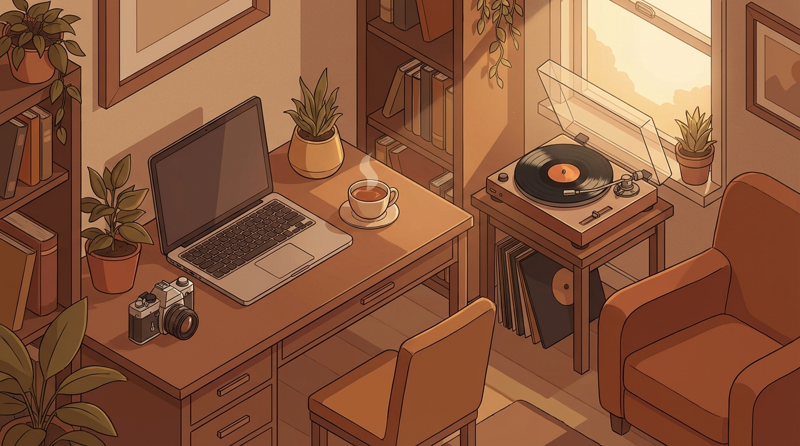
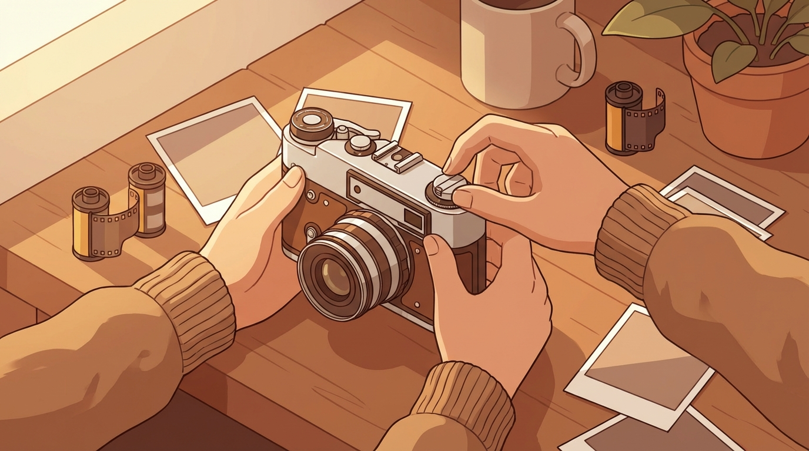

+++
title = 'Sở Thích Analog 2026: Đi Tìm Sự Cân Bằng Giữa Bão AI'
date = 2026-03-31T23:00:00Z
tags = ['Digital Detox', 'Mental Health', 'AI 2026', 'Analog']
categories = ['Daily Life']
description = 'Năm 2026 chứng kiến sự bùng nổ của nhiếp ảnh film và đĩa than. Khám phá cách các sở thích analog này giúp giới công nghệ tìm lại sự cân bằng giữa thời đại AI.'
images = ['og-hero.jpg']
+++

Có một nghịch lý thú vị trong năm 2026: Khi các mô hình AI ngày càng làm được nhiều việc thay con người, một bộ phận không nhỏ giới tech lại chọn cách... quay về thời "đồ đá". Những chiếc điện thoại cục gạch (dumbphone), máy ảnh film chụp tốn chục ngàn một tấm, hay đĩa than lách cách đang lội ngược dòng ngoạn mục.

Không phải vì chúng ta ghét bỏ công nghệ. Trái lại, chính vì chúng ta đang sống quá sâu trong thế giới số, sự mệt mỏi kỹ thuật số (digital fatigue) đã đẩy nhiều người tới nhu cầu tự nhiên: cần thứ gì đó có thể chạm vào được, và không có một con AI nào thao túng nó.

## Căn Bệnh "Quá Tải Nhận Thức" Của Developer 2026

Nếu bạn là một lập trình viên trong giai đoạn này, bạn sẽ hiểu cảm giác "không bao giờ là đủ". Các coding agent như Cursor, Copilot hay Claude Code liên tục nâng cấp, gánh vác việc viết boilerplate và review code. 

Dù giúp năng suất tăng vọt, nó lại tước đi niềm vui mộc mạc: chậm rãi gõ từng dòng code và thấy nó chạy. Khi mọi thứ quá nhanh, não bộ liên tục bị nhồi nhét thông tin và thông báo. Sự quá tải này dẫn đến burnout - không phải vì chúng ta làm việc nhiều giờ hơn, mà vì mất đi khoảng trống để thở giữa các tác vụ.

Báo cáo của Quartz đầu năm nay về xu hướng "Digital Detox" ([Quartz](https://qz.com/analog-experiences-screens-smartphone-fatigue)) cho thấy doanh số điện thoại chỉ dùng để nghe gọi đang tăng 25%. Forbes ([Forbes](https://www.forbes.com/sites/elizabethgracecoyne/2026/01/11/2026-is-the-year-of-analog-living-how-will-this-impact-fashion/)) cũng nhận định 2026 là năm của "lối sống Analog", khi người dùng quay lưng lại sự hoàn hảo của AI để tìm về tính thủ công. Họ không trốn tránh công việc, họ chỉ muốn lấy lại sự chú ý của chính mình khi tắt màn hình.

## Câu Chuyện Của Một Dev Đi Chụp Film

Một người bạn của tôi là Solutions Architect. Suốt ngày anh ấy phải đối mặt với kiến trúc microservices phức tạp và cấu hình hàng trăm container. Mỗi quyết định đều ảnh hưởng tới toàn bộ hệ thống. Áp lực vô hình nhưng nặng nề.

Thế nhưng, cứ cuối tuần, thay vì chơi game hay xem Netflix, anh lại xách một chiếc Canon AE-1 cũ kỹ, lắp cuộn Kodak Gold 200 và đi lang thang.

"Chụp ảnh film đắt đỏ, bất tiện và dễ hỏng," anh tâm sự. "Nhưng đó chính là điểm ăn tiền. Mình chỉ có đúng 36 kiểu ảnh cho một buổi chiều. Bắt buộc phải ngắm nghía ánh sáng, đo sáng bằng tay, xoay vòng lấy nét, nín thở rồi mới bấm cò. Không có thuật toán AI nào cứu sáng, không có HDR, và hoàn toàn không có nút 'Undo'. Mình phải chấp nhận kết quả, dù nó out nét đi nữa."

Sự bất toàn và chậm rãi của analog là liều thuốc giải độc cho thế giới số hoàn hảo nhưng vô cảm. Chờ đợi vài ngày, thậm chí vài tuần mới thấy ảnh là khái niệm cực kỳ xa xỉ trong năm 2026, nơi mọi thắc mắc đều được ChatGPT trả lời trong vài mili-giây.

## Bài Học Từ Sự Trở Lại Của "Analog"

Sự bùng nổ của các thú vui analog không phải là bước thụt lùi, mà là cơ chế tự vệ và cân bằng của con người. Từ những trải nghiệm thực tế và số liệu từ CNN ([CNN Business](https://www.cnn.com/2026/01/18/business/crafting-soars-ai-analog-wellness)) (doanh số đồ thủ công đan len tăng vọt hơn 1.200% tại Michael's), chúng ta rút ra những nguyên lý cốt lõi:

### 1. Giới Hạn Tạo Ra Chiều Sâu
Trong thế giới số, tài nguyên gần như vô hạn. Trong thế giới analog, tài nguyên rất hạn hẹp (một cuộn film 36 kiểu, một đĩa than 20 phút). Sự hữu hạn này ép chúng ta trân trọng từng khoảnh khắc và đưa ra quyết định có ý nghĩa hơn.

### 2. Sự Tập Trung "Đơn Tác Vụ"
Khi nghe đĩa than, bạn không thể dễ dàng "skip" bài hát như trên smartphone. Bạn buộc phải ngồi xuống, thả lỏng và nghe toàn bộ album. Điều này rèn luyện lại khả năng tập trung sâu (deep focus) - kỹ năng đang xói mòn khi ta quá quen lướt TikTok.

### 3. Cảm Giác Chạm Thật
Con người là sinh vật vật lý, cần phản hồi từ xúc giác. Lắp cuộn film vào máy, đặt kim than lên đĩa, hay viết bút mực lên giấy mang lại mức độ thỏa mãn thần kinh mà màn hình cảm ứng không thể thay thế.

### 4. Ranh Giới Sống Và Làm Việc
Một chiếc "dumbphone" khi đi dạo cuối tuần đảm bảo bạn không nhận email công việc hay thông báo Slack. Nó vạch ra ranh giới: Đây là thời gian cá nhân của tôi, không phải của thuật toán.

## Hành Động Ngay Cuối Tuần Này

Nếu bạn đang kiệt sức với nhịp độ vũ bão của AI, hãy thử áp dụng vài "liều thuốc analog":

- **Ngày Chủ Nhật "Low-Tech":** Chuyển smartphone sang chế độ máy bay, cất vào ngăn kéo. Chỉ dùng điện thoại cục gạch nếu thật sự cần.
- **Sổ Tay Thật:** Thay vì ghi chú Todo list trên Notion, hãy thử viết tay bằng bút mực. Gạch bỏ vật lý một công việc trên giấy mang lại sự thỏa mãn dopamine rất khác biệt.
- **Trải Nghiệm Chạm:** Mua một chiếc máy ảnh dùng một lần, bộ xếp hình lego, hay bắt đầu làm mộc. Hãy để đôi tay làm việc thay vì chỉ mỏi mệt gõ phím.

Trong kỷ nguyên AI 2026, thứ đắt giá nhất không còn là tốc độ xử lý, mà chính là sự tĩnh lặng trong tâm trí. Hãy để những sở thích analog kéo bạn về với thực tại, nơi bạn là một con người bằng xương bằng thịt, biết cảm nhận, thay vì chỉ là một mắt xích trong mạng lưới dữ liệu.
