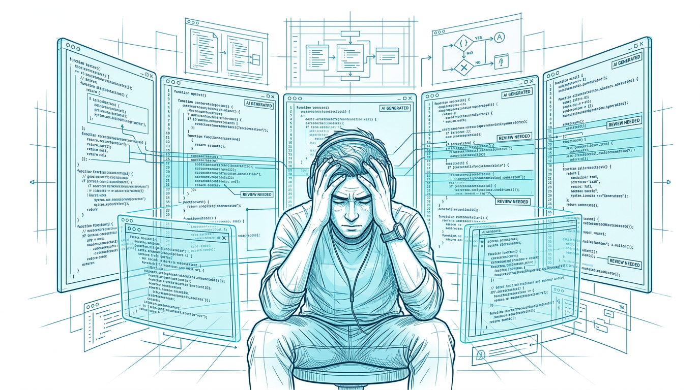
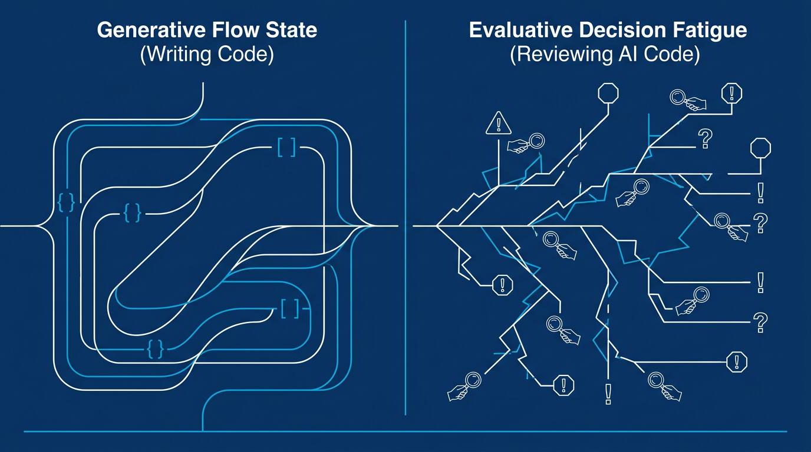
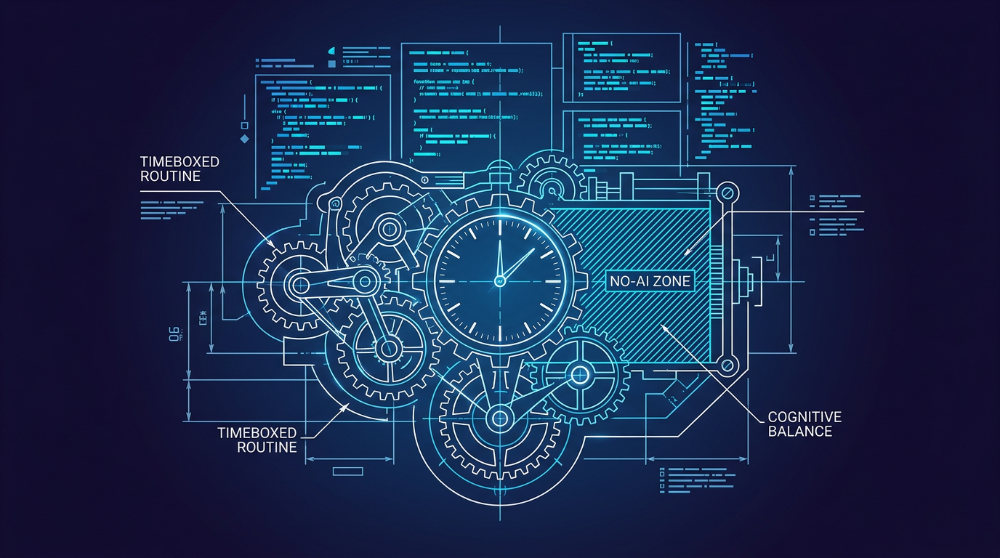

+++
title = 'Thợ gõ code thành thợ duyệt: Hội chứng mệt mỏi AI 2026'
date = 2026-03-15T23:00:00+09:00
tags = ['Đời sống', 'Developer', 'AI Fatigue', 'Code Review', 'Năng suất bền vững']
categories = ['Life']
description = "Năm 2026, dev không thiếu code mà thiếu sự tỉnh táo để duyệt code AI. Case study về hội chứng AI brain fry và 3 bước giải quyết triệt để sự mệt mỏi nhận thức."
og_image = 'og-hero.jpg?v=20260315'
+++

Bạn có nhớ cảm giác “vào luồng” (flow state) khi tự tay gõ từng dòng code? Năm 2026, cảm giác đó đang dần trở nên xa xỉ. Giờ đây, một ngày làm việc thường bắt đầu bằng việc đối mặt với 10 Pull Request được các agent (như Devin, hay GitHub Copilot Workspace) tự động tạo ra từ đêm qua.

Thay vì tự xây nhà, chúng ta đang biến thành những thanh tra xây dựng — đi gõ từng viên gạch để xem tường có rỗng bên trong không. Sự chuyển dịch từ **"Thợ gõ code"** sang **"Người duyệt code"** đang gây ra một hội chứng mới mà nhiều dev gọi là "AI brain fry" (hội chứng cháy não vì duyệt code AI, như [Atomic Robot từng cảnh báo](https://atomicrobot.com/blog/ai-review-fatigue/)).

## 1. Case study: Sự khác biệt giữa Flow và Decision Fatigue

Cuối tuần trước, mình ngồi nói chuyện với một team lead tại một startup SaaS. Anh ấy kể: "Team anh mua tài khoản Pro cho tất cả các AI tool xịn nhất. Về mặt feature, tốc độ ra mắt tăng 30%. Nhưng cứ đến 3 giờ chiều là anh em trong team mặt mày phờ phạc, không ai muốn nói chuyện với ai."

Tại sao làm ít việc tay chân hơn lại mệt hơn? Câu trả lời nằm ở **loại tải trọng nhận thức (cognitive load)**.

Khi bạn tự viết code, não bộ rơi vào trạng thái tạo lập (Generative work). Bạn kiểm soát từng biến, từng hàm từ lúc nó sinh ra. Điều này tạo ra *Flow state* — trạng thái tập trung sâu và ít tốn năng lượng ý chí.

Nhưng khi duyệt code do AI viết, não phải chuyển sang chế độ đánh giá (Evaluative work). Bạn không biết suy nghĩ thực sự đằng sau đoạn code đó là gì (Trust Deficit). Mỗi dòng code có vẻ rất hoàn hảo, rất tự tin, nhưng lại tiềm ẩn rủi ro tinh tế ở logic góc. Việc liên tục phải đưa ra phán xét: "Cái này đúng không? Cái kia có edge case nào không?" liên tục bào mòn ý chí của bạn. Đó là [Decision Fatigue](https://www.codeant.ai/blogs/reduce-code-review-fatigue) (mệt mỏi vì ra quyết định).

## 2. Nghịch lý của sự cảnh giác (Vigilance Decrement)

Một vấn đề nguy hiểm hơn là sự tự tin giả tạo của AI. Code AI viết năm nay đã không còn lỗi cú pháp ngớ ngẩn. Nó pass toàn bộ unit test cơ bản.

Nhưng chính vì nó trông "có vẻ đúng", năng lượng bạn cần bỏ ra để bóc tách nó lại càng lớn. Theo một [báo cáo gần đây từ InfoWorld](https://www.infoworld.com/article/4125231/ai-use-may-speed-code-generation-but-developers-skills-suffer.html) về sự tương tác giữa người và hệ thống tự động hóa (Human-Automation Interaction), khi tỷ lệ lỗi của máy móc quá thấp, con người sẽ rơi vào trạng thái "Automation Complacency" (thỏa mãn với tự động hóa). Khi bạn cố gắng chống lại sự thỏa mãn này để soi thật kỹ, não bạn phải làm việc gấp đôi bình thường để ép bản thân không được tin tưởng cái màn hình.

Việc soi lỗi trong một thứ "có vẻ hoàn hảo" bào mòn năng lượng nhanh hơn nhiều so với việc fix một thứ "đang vỡ nát".

## 3. Playbook 3 bước: Trả lại sự cân bằng cho não bộ

Nhận thức được vấn đề là một chuyện, giải quyết nó cần những thay đổi mang tính cấu trúc trong workflow hàng ngày. Dưới đây là 3 bước thực dụng team mình đã áp dụng để giảm "AI brain fry".

### Bước 1: Giới hạn thời gian duyệt (Timeboxed Review)
Tuyệt đối không rải rác việc duyệt code AI suốt cả ngày. Việc liên tục context-switch giữa viết code (flow) và duyệt code (evaluating) sẽ giết chết năng suất. Hãy gom toàn bộ PR do AI tạo ra vào 2 khung giờ cố định trong ngày (ví dụ: 10:00 sáng và 15:30 chiều). Trong tối đa 45 phút, chỉ tập trung duyệt. Hết giờ là dừng.

### Bước 2: Ép AI giải thích trước khi bạn đọc code
Đừng cố dịch ngược code của AI thành logic. Hãy bắt AI chứng minh logic trước. Mình luôn set một prompt bắt buộc trong workflow: *"Trước khi output code, hãy tóm tắt cách tiếp cận trong 3 bullet point và liệt kê 2 edge case đã được tính đến."*
Khi bạn đọc bullet point trước, não bạn đã có ngữ cảnh (mental model), việc đọc code sau đó sẽ nhẹ nhàng hơn rất nhiều.

### Bước 3: Thiết lập "No-AI Zone" (Vùng cấm AI)
Đừng khoán trắng 100% việc gõ phím cho AI. Kỹ năng lập trình cần sự mài giũa liên tục để tạo ra các "đường mòn thần kinh". Nếu bạn ngừng tự giải quyết các bài toán khó, kỹ năng đọc hiểu và debug của bạn sẽ thoái hóa.
Hãy tự quy ước: Các module core (liên quan đến thanh toán, phân quyền, security) hoặc các bài toán cấu trúc dữ liệu tối ưu sẽ thuộc "vùng cấm". Ở đó, bạn tự nghĩ, tự gõ, tự test. AI chỉ đóng vai trò auto-complete cú pháp (Tab) chứ không được quyền sinh ra toàn bộ function.

## Lời kết

AI coding assistant là đòn bẩy vĩ đại, nhưng nó đi kèm với một cái giá ngầm: sự cạn kiệt nhận thức. Chúng ta đang chuyển từ kỷ nguyên "quản lý thời gian gõ code" sang kỷ nguyên "quản lý năng lượng duyệt code". 

Chìa khóa không phải là chạy đua xem agent của ai tạo ra nhiều PR hơn trong một đêm, mà là ai thiết kế được một workflow bảo vệ được sự tỉnh táo của con người đến 5 giờ chiều.
