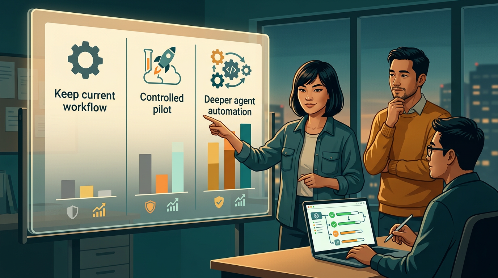

+++
title = 'AI coding 2026: timeline năng suất thật cho team nhỏ'
date = 2026-03-04T20:00:00+09:00
tags = ['AI Coding', 'Developer Productivity', 'Team nhỏ', 'Timeline', 'Decision Matrix']
categories = ['Tech']
description = 'Phân tích theo mốc 30 ngày vì sao team dev nhỏ dùng AI coding vẫn có thể chậm delivery, kèm decision matrix thực dụng để tăng tốc mà không tăng rủi ro.'
og_image = 'og-hero.jpg?v=20260304a'
+++

Nếu nhìn riêng tốc độ viết code, AI coding tool năm 2026 đúng là rất ấn tượng. Nhưng nếu nhìn cả vòng delivery (code → review → test → deploy), nhiều team nhỏ lại gặp nghịch lý: code ra nhanh hơn, còn release thì không nhanh tương ứng.

Bài này dùng format **timeline/scenario-based analysis → decision matrix** để trả lời câu hỏi thực dụng: *khi nào AI coding thực sự tăng năng suất cho team nhỏ, và khi nào chỉ tạo thêm backlog hậu kỳ?*

## Bối cảnh: tín hiệu thị trường đang nói gì?

Có một điểm đáng chú ý: cùng lúc chúng ta thấy hai luồng thông tin tưởng như trái ngược.

- TechCrunch ghi nhận làn sóng công cụ agent cho doanh nghiệp đang tăng mạnh; OpenAI cũng tung Responses API để dev xây agent có thể search web, đọc file nội bộ và tự động hoá thao tác kiểu computer-use.
- Nhưng nghiên cứu thực địa do METR công bố (được InfoQ tóm tắt) cho thấy với nhóm dev giàu kinh nghiệm trên codebase lớn, bật AI tool có thể làm **thời gian hoàn tất task tăng 19%** thay vì giảm.

Hai tín hiệu này không phủ định nhau. Chúng cho thấy một sự thật khá “đời”: **năng lực model tăng nhanh, nhưng năng lực vận hành của team không tự tăng theo**.

Anthropic cũng nhấn mạnh nguyên tắc tương tự khi bàn về agent: nên bắt đầu từ cấu hình đơn giản, chỉ tăng độ tự chủ khi có bằng chứng rõ là hiệu quả hơn trong ngữ cảnh thực tế.

## Timeline 30 ngày: vì sao team thấy nhanh mà KPI release vẫn ì?

Dưới đây là một kịch bản rất thường gặp ở team 4-10 người, đặc biệt khi bắt đầu dùng AI coding assistant/agent theo kiểu “đẩy nhanh đầu vào”.

### Tuần 1: bùng nổ output

- Tốc độ tạo patch tăng rõ.
- Task nhỏ được khép nhanh, cảm giác “đang thắng”.
- Số PR mở mới tăng mạnh.

Ở giai đoạn này, team dễ kết luận sớm là quy trình mới đã thành công. Nhưng thực ra, đây chỉ là tín hiệu ở đầu ống.

### Tuần 2: nghẽn ở review và tích hợp

- PR queue bắt đầu dài ra.
- Reviewer mất thêm thời gian xác thực giả định và kiểm tra side effect.
- Chất lượng mô tả thay đổi không đồng đều giữa các PR.

Hacker News có nhiều thảo luận khá sát thực tế này: bottleneck của đa số tổ chức không nằm ở “gõ code”, mà nằm ở review, QA, quyết định phạm vi và điều phối liên nhóm.

### Tuần 3: chi phí hậu kỳ lộ rõ

- Số vòng sửa PR tăng.
- Regression test và hotfix bắt đầu xuất hiện nhiều hơn.
- Thời gian chờ phản hồi giữa các vai trò (dev, reviewer, QA) dài hơn.

Lúc này team thường cảm thấy bận hơn nhưng khó chỉ ra vì sao. Đây chính là “perception gap” mà nghiên cứu METR mô tả: trải nghiệm chủ quan là nhanh, còn thời gian hoàn tất thực tế lại chậm.

### Tuần 4: phân hoá kết quả

Team nào có guardrail rõ thì bắt đầu ổn định trở lại. Team nào rollout quá rộng từ đầu thường bị kéo vào vòng lặp “đẻ nhanh - vá nhanh - mệt nhanh”.

Điểm chốt ở đây: AI không tự tạo kỷ luật vận hành. Nếu thiếu rule kiểm soát, AI chỉ khuếch đại cả điểm mạnh lẫn điểm yếu của team.

## Decision matrix cho team nhỏ: chọn nhịp nào để tăng tốc bền?

Thay vì tranh luận kiểu “AI tốt hay xấu”, mình đề xuất chọn theo ma trận **Impact x Risk** với 3 chiến lược.

### Phương án A: Giữ workflow hiện tại (Risk thấp, Impact thấp)

Phù hợp khi:
- Team đang sát deadline phát hành lớn.
- Chưa có reviewer bandwidth.
- Chưa có baseline metric đáng tin.

Việc cần làm:
- Khoanh đúng 1 use case an toàn (ví dụ scaffold test, refactor cục bộ).
- Không mở rộng quyền agent khi chưa có số đo tối thiểu.

### Phương án B: Pilot có kiểm soát (Risk trung bình, Impact cao)

Phù hợp khi:
- Team có thể dành 1-2 tuần đo nghiêm túc.
- Có người chịu trách nhiệm chất lượng cuối.
- Có staging pipeline đủ sạch.

Việc cần làm:
1. Chốt 5 chỉ số bắt buộc: lead time thật, review turnaround, bug escape, rollback/hotfix, rework ratio.
2. Giới hạn phạm vi: agent chỉ đề xuất patch hoặc mở PR nháp.
3. Đặt điều kiện mở rộng: chỉ nâng quyền khi 2 sprint liên tiếp đạt ngưỡng chất lượng.

Đây thường là điểm cân bằng tốt nhất cho team nhỏ muốn đi nhanh mà không “đốt” hệ thống.

### Phương án C: Tự động hoá sâu (Risk cao, Impact rất cao nếu làm đúng)

Phù hợp khi:
- Team đã có observability tốt.
- Luật merge rõ, rollback nhanh.
- Có kill-switch thực chiến, không chỉ viết trên docs.

Việc cần làm:
- Chia khu vực cho phép tự động merge theo mức rủi ro.
- Bắt buộc audit log cho mọi hành động agent.
- Review định kỳ các lỗi “suýt hỏng” để cập nhật rule.

Nếu thiếu nền tảng này mà vẫn đẩy tự động hoá sâu, team dễ rơi vào trạng thái “nợ vận hành” tăng nhanh hơn nợ code.

## Checklist triển khai 14 ngày để tránh ảo giác năng suất

Đây là bản rút gọn mình khuyên dùng ngay:

- **Ngày 1-2:** chốt use case duy nhất + baseline metric.
- **Ngày 3-6:** cho AI hỗ trợ có giới hạn; chưa cho phép tự merge.
- **Ngày 7:** review giữa kỳ bằng số liệu, không tranh luận bằng cảm giác.
- **Ngày 8-11:** siết quy tắc ở điểm nghẽn lớn nhất (thường là review/QA).
- **Ngày 12-14:** quyết định mở rộng, giữ nguyên hoặc rollback phạm vi.

Nguyên tắc vận hành: chỉ mở rộng khi tốc độ tăng **đồng thời** chất lượng không xấu đi.

## Kết luận

Năm 2026, lợi thế thật của team nhỏ không nằm ở việc “dùng AI nhiều hơn”, mà nằm ở việc **dùng AI có kỷ luật hơn**. Công cụ đang tốt lên rất nhanh, nhưng năng suất bền vẫn là bài toán hệ thống: đo đúng, rollout đúng, và dừng đúng lúc khi rủi ro tăng.

Nếu cần một câu chốt để áp dụng ngay tuần này: **đừng đo tốc độ gõ code; hãy đo tốc độ đưa giá trị an toàn vào production**. Làm được vậy, AI mới là đòn bẩy — không phải máy tạo thêm việc. 🙂

---

## Nguồn tham khảo

1. TechCrunch — OpenAI launches new tools to help businesses build AI agents  
   https://techcrunch.com/2025/03/11/openai-launches-new-tools-to-help-businesses-build-ai-agents/

2. Hacker News — Discussion: Productivity gains from AI coding assistants haven’t budged past 10%  
   https://news.ycombinator.com/item?id=47077676

3. InfoQ — AI Coding Tools Underperform in Field Study with Experienced Developers  
   https://www.infoq.com/news/2025/07/ai-productivity/

4. METR — Measuring the Impact of Early-2025 AI on Experienced Open-Source Developer Productivity  
   https://metr.org/blog/2025-07-10-early-2025-ai-experienced-os-dev-study/

5. Anthropic Engineering — Building effective agents  
   https://www.anthropic.com/engineering/building-effective-agents
