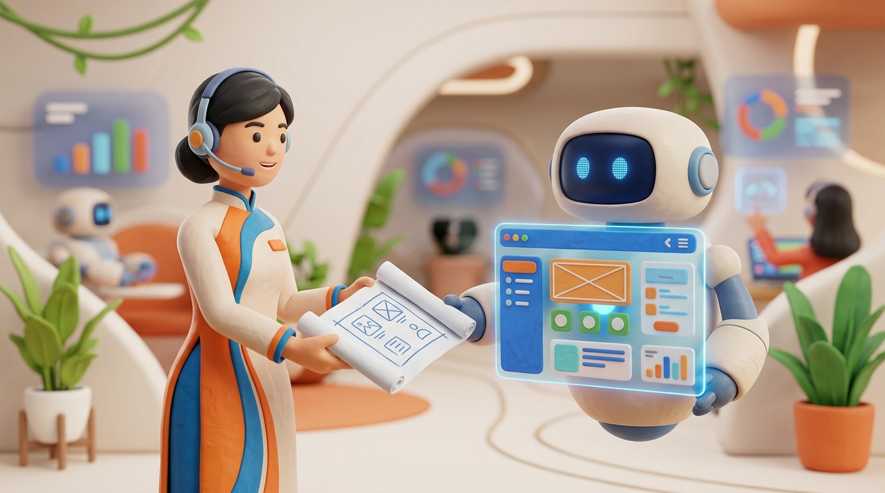

+++
title = 'Tương Lai Frontend 2026: Generative UI Và Kỷ Nguyên Mới'
date = 2026-03-25T23:00:00Z
tags = ['Frontend', 'AI', 'GenUI', 'Web Dev']
categories = ['Tech']
description = 'Generative UI (GenUI) năm 2026 giúp AI tự generate UI theo real-time. Xem cách xu hướng này định hình lại vai trò của Frontend Developer.'
images = ['og-hero.jpg']
+++

Giao diện tĩnh đã chính thức trở thành "đồ cổ". Năm 2026, chúng ta đang chứng kiến một cuộc cách mạng mang tên Generative UI (GenUI) – nơi giao diện người dùng không còn được code cứng bằng HTML/CSS, mà được AI sinh ra theo thời gian thực dựa trên ngữ cảnh và ý định của người dùng. Vậy Frontend Developer đang làm gì khi AI đã lấy đi phần lớn công việc cắt giao diện?

## 1. Vấn đề: Sự chật vật với những giao diện đóng hộp

Trong nhiều năm, quy trình phát triển web là một chuỗi tuyến tính: Designer vẽ mockup trên Figma, sau đó Frontend Developer chuyển đổi chúng thành mã nguồn React, Vue hay Svelte. Giao diện thường bị khóa cứng vào những component đã được viết sẵn. Nếu người dùng cần một cách hiển thị dữ liệu mới, họ phải chờ đội ngũ sản phẩm lên kế hoạch, thiết kế, code, test và deploy.

Tuy nhiên, với sự phổ biến của các mô hình ngôn ngữ lớn (LLMs), kỳ vọng của người dùng đã thay đổi chóng mặt. Theo [phân tích của LogRocket về xu hướng Web Dev 2026](https://blog.logrocket.com/8-trends-web-dev-2026/), người dùng hiện đại muốn giao diện tự biến đổi, tự hiển thị bảng biểu hay nút bấm phù hợp để trả lời đúng câu hỏi của họ vào thời điểm đó. Điều này tạo ra áp lực khổng lồ phải liên tục tạo ra các "disposable interfaces" (giao diện dùng một lần) – những thành phần UI chỉ tồn tại trong vài phút để phục vụ một task cụ thể. 

Quy trình thủ công truyền thống không thể theo kịp tốc độ cá nhân hoá ở mức độ cực đoan này. Việc duy trì hàng ngàn component cho hàng ngàn kịch bản khác nhau dẫn đến phình to source code và làm cạn kiệt nguồn lực của đội ngũ Frontend.

## 2. Phân tích: Sự trỗi dậy của GenUI và Delegative UI

Để giải quyết bài toán trên, Generative UI đã ra đời. Thay vì cố gắng "nhét" trải nghiệm AI vào các khung chat đơn điệu (Conversational UI) như năm 2023-2024, xu hướng của năm 2026 đang dịch chuyển sang **Delegative UI**. 

Bạn không cần chat liên tục với hệ thống. Bạn chỉ cần giao cho AI một mục tiêu (goal), và hệ thống tự động phân tích ý định, thu thập dữ liệu, sau đó sinh ra các component trực quan nhất ngay trên màn hình. Ví dụ, nếu bạn muốn so sánh doanh thu quý 3 của hai sản phẩm, AI không trả về một đoạn text, mà render ra một Dashboard hoàn chỉnh với biểu đồ tương tác, các nút filter và bảng dữ liệu – tất cả được code và render trong tích tắc.

Các công cụ mạnh mẽ như Vercel v0, Figma Make, và các AI-agentic framework giờ đây tạo ra production-ready code với mức độ chính xác tuyệt đối. Chúng không chỉ viết ra HTML, mà còn tuân thủ tính năng hỗ trợ người khuyết tật (accessibility) và kế thừa đúng Design System. Sự thay đổi này cũng được thảo luận rầm rộ trên [Hacker News](https://news.ycombinator.com/) và các diễn đàn công nghệ lớn, khẳng định rằng GenUI đang viết lại luật chơi của Frontend.

Theo [nghiên cứu của UX Tigers về dự đoán 2026](https://www.uxtigers.com/post/2026-predictions), vai trò của designer hiện tại đang chuyển từ "creator" (người tạo ra giao diện) sang "curator" (người định hướng và kiểm duyệt giao diện). Tương tự, Frontend Developer đang tiến hóa thành **UX Engineer** hoặc **AI Architect**. Họ không còn viết từng dòng CSS Flexbox. Công việc của họ là thiết kế kiến trúc hệ thống, kiểm soát luồng dữ liệu (data flow), và thiết lập các giới hạn (guardrails) an toàn để AI không sinh ra giao diện gây lỗi hệ thống.

Sự chuyển dịch này đang tạo ra một khoảng cách lớn về hiệu suất giữa những team ứng dụng AI và những team giữ cách làm cũ.

## 3. Checklist: Kỹ năng Frontend Dev cần nâng cấp

Để không bị bỏ lại trong làn sóng GenUI năm 2026, đây là bộ kỹ năng bắt buộc Frontend Developer cần trang bị:

- **Kiểm soát State linh hoạt:** Khi các component sinh ra và hủy đi liên tục bởi AI, việc duy trì trạng thái ứng dụng trở nên phức tạp. Bạn cần vững các pattern quản lý state nâng cao.
- **Kiến trúc Server-Driven UI:** Hiểu cách server trả về các mô tả giao diện (JSON schema) và cách client phân tích chúng để render ra UI động là kỹ năng then chốt. Theo [InfoQ](https://www.infoq.com/), đây là một trong những kiến trúc quan trọng nhất trong việc vận hành UI agent.
- **Đóng gói Design System cho AI:** Bạn phải biết cách cấu trúc Design Token, xây dựng thư viện component chuẩn mực, và viết prompt để AI sinh code không phá vỡ UI guidelines.
- **Tối ưu hiệu năng rendering:** Kiểm soát re-render, áp dụng memoization và lazy loading động trở nên quan trọng hơn bao giờ hết khi client-side render liên tục các UI tự tạo.
- **Hệ thống Error Boundary vững chắc:** Xây dựng cơ chế để bắt các component bị lỗi do AI sinh ra (như cấu trúc DOM sai) để ứng dụng không bị sập (crash) toàn bộ.

## 4. Tổng kết

Làn sóng AI năm 2026 không giết chết nghề Frontend; nó chỉ tiêu diệt phần thợ gõ nhàm chán nhất. Generative UI trao cho Developer khả năng tạo ra những trải nghiệm cá nhân hoá vô hạn cho từng người dùng riêng biệt mà không tốn hàng nghìn giờ viết code lặp đi lặp lại.

Đừng cố gắng chạy đua viết code nhanh hơn AI, vì bạn sẽ không bao giờ thắng. Hãy học cách lắp ráp, định hướng và tinh chỉnh các component do AI tạo ra thành một hệ thống linh hoạt, mạnh mẽ và an toàn. Trở thành một người kiến trúc sư thiết kế trải nghiệm, đó mới chính là tương lai bền vững của Frontend Developer.
