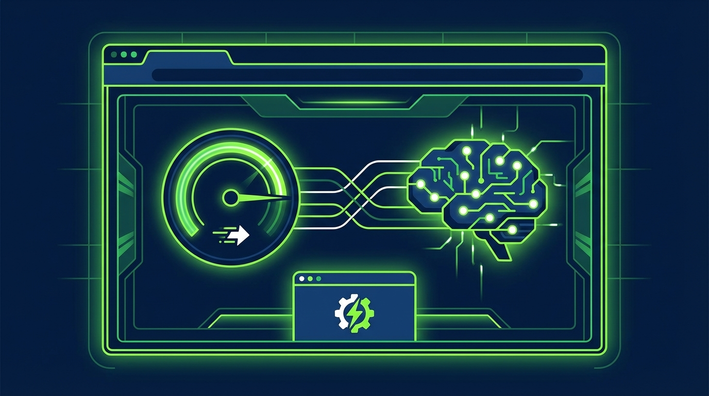

+++
title = 'WebGPU và SLM 2026: Khi Mọi Trình Duyệt Biến Thành Cỗ Máy AI'
date = 2026-04-08T23:00:00Z
tags = ['AI', 'WebGPU', 'SLM', 'Edge Computing', 'Transformers.js']
categories = ['Tech']
description = 'Khám phá sức mạnh WebGPU và Small Language Models (SLM) năm 2026. Tìm hiểu cách biến trình duyệt thành cỗ máy AI siêu tốc, bảo mật mà không cần cài đặt.'
images = ['og-hero.jpg']
+++

Trong năm 2026, câu chuyện về AI không còn chỉ xoay quanh những cụm máy chủ khổng lồ tốn hàng triệu USD của Big Tech. Một cuộc cách mạng âm thầm nhưng mạnh mẽ đang diễn ra ngay trên thiết bị của bạn: **chạy trực tiếp AI trên trình duyệt web**.

Sự kết hợp giữa **WebGPU**, thư viện **Transformers.js** và các **Small Language Models (SLM)** đang biến mọi thiết bị—từ laptop đến điện thoại—thành một cỗ máy AI cục bộ (local AI) siêu tốc độ và bảo mật tuyệt đối. 

Vậy rốt cuộc công nghệ này đang thay đổi luật chơi như thế nào? Hãy cùng bóc tách những lầm tưởng phổ biến và đi tìm lời giải cho bài toán AI on edge.

## 1. Lầm Tưởng và Sự Thật (Myth vs Fact)

### Myth 1: Chạy AI cục bộ cần card đồ hoạ (VGA) nghìn đô
Nhiều người vẫn tin rằng để chạy được một mô hình ngôn ngữ (LLM) ra hồn, bạn phải trang bị ít nhất một chiếc card NVIDIA RTX dòng cao cấp. 

**Fact:** Với tiêu chuẩn **WebGPU** (đã được hỗ trợ mặc định trên hầu hết trình duyệt hiện đại năm 2026), ứng dụng web giờ đây có thể giao tiếp trực tiếp với lõi xử lý đồ hoạ của thiết bị ở cấp độ phần cứng. Điều này có nghĩa là ngay cả GPU tích hợp (iGPU) trên laptop văn phòng hay chip di động cũng đủ sức "gánh" các tính toán ma trận nặng nề của AI. Bạn không cần card rời đắt đỏ, chỉ cần một trình duyệt web cập nhật.

### Myth 2: AI trên web rất chậm và yếu
Phiên bản WebGL cũ kỹ trước đây từng khiến việc render 3D hay chạy machine learning trên web trở nên "ì ạch". Do đó, định kiến AI web là "đồ chơi" vẫn còn tồn tại.

**Fact:** Thực tế, với WebGPU, các mô hình nhỏ (Small Language Models - SLM) như Llama-3-8B hoặc Qwen1.5 sau khi được lượng tử hoá (quantized) kết hợp với Transformers.js v3 có thể chạy mượt mà ngay trên trình duyệt với tốc độ lên đến 20-30 tokens/s, tận dụng GPU tích hợp (iGPU) mà không cần cài đặt phức tạp. Sự ra đời của các định dạng tối ưu như GGUF hay ONNX Runtime Web khiến khoảng cách hiệu năng giữa native app và web app gần như bị xoá bỏ.

## 2. Framework Giải Pháp: 3 Trụ Cột Của "AI Browser"

Để làm được điều kỳ diệu này, hệ sinh thái năm 2026 dựa trên 3 trụ cột cốt lõi:

1. **Compute Layer (Lớp tính toán) - WebGPU:**
   Đóng vai trò là cầu nối siêu tốc từ mã JavaScript/Wasm xuống GPU thiết bị. [Tài liệu chính thức của Chrome](https://developer.chrome.com/docs/web-platform/webgpu/) khẳng định WebGPU mang lại hiệu năng tính toán song song vượt trội hơn hẳn so với WebGL.
2. **Inference Layer (Lớp suy luận) - Transformers.js & ONNX Runtime:**
   Thư viện [Transformers.js của Hugging Face](https://huggingface.co/docs/transformers.js/index) cho phép load các mô hình AI trực tiếp trong trình duyệt. Ở tầng dưới, [ONNX Runtime Web](https://github.com/microsoft/onnxruntime) tối ưu hoá quá trình thực thi graph nơ-ron, tận dụng tối đa băng thông bộ nhớ.
3. **Model Layer (Lớp mô hình) - Quantized SLMs:**
   Các mô hình với tham số nhỏ (dưới 8B) được nén chặt bằng kỹ thuật lượng tử hoá (ví dụ 4-bit quantization). Kết quả là một model chỉ nặng cỡ 1-2GB, dễ dàng tải về và cache lại ngay trong bộ nhớ IndexedDB của trình duyệt.

## 3. Practical Playbook: Tích Hợp AI Vào Web App Của Bạn

Nếu bạn là lập trình viên hoặc nhà phát triển sản phẩm, đây là playbook để bắt kịp xu hướng:

- **Bắt đầu với mô hình nhỏ nhất:** Thay vì nhét một LLM đồ sộ vào sản phẩm, hãy bắt đầu với các mô hình chuyên biệt như SmolAgents hay các phiên bản siêu nhỏ của Qwen. Việc tải model lần đầu (cold start) sẽ mất thời gian, nên dung lượng nhỏ là ưu tiên hàng đầu.
- **Tận dụng bộ nhớ đệm (Caching):** Thiết lập Service Worker và IndexedDB để cache mô hình sau lần tải đầu tiên. Ở những lần truy cập sau, web app của bạn sẽ có khả năng hoạt động offline hoàn toàn.
- **Tối ưu trải nghiệm UI/UX (Streaming):** Quá trình sinh chữ (generation) cần được hiển thị theo thời gian thực (streaming) để người dùng không cảm thấy ứng dụng đang bị "treo".
- **Kiểm soát tính riêng tư:** Lợi thế lớn nhất của việc chạy AI trực tiếp trên trình duyệt là **Zero-data retention**. Dữ liệu của người dùng không bao giờ rời khỏi thiết bị. Hãy nhấn mạnh điều này trong chính sách bảo mật để tạo niềm tin.

## Tổng Kết

Kỷ nguyên của các trợ lý AI khổng lồ sống trên đám mây sẽ không biến mất, nhưng sự bùng nổ của WebGPU và SLM năm 2026 đã mở ra một nhánh rẽ mới: AI cá nhân hoá, phân tán, siêu tốc và tôn trọng quyền riêng tư tuyệt đối. Trình duyệt không còn chỉ là công cụ để lướt web—nó đã chính thức trở thành hệ điều hành cho thế hệ AI tiếp theo.

*Visual style used: Minimal flat vector*
