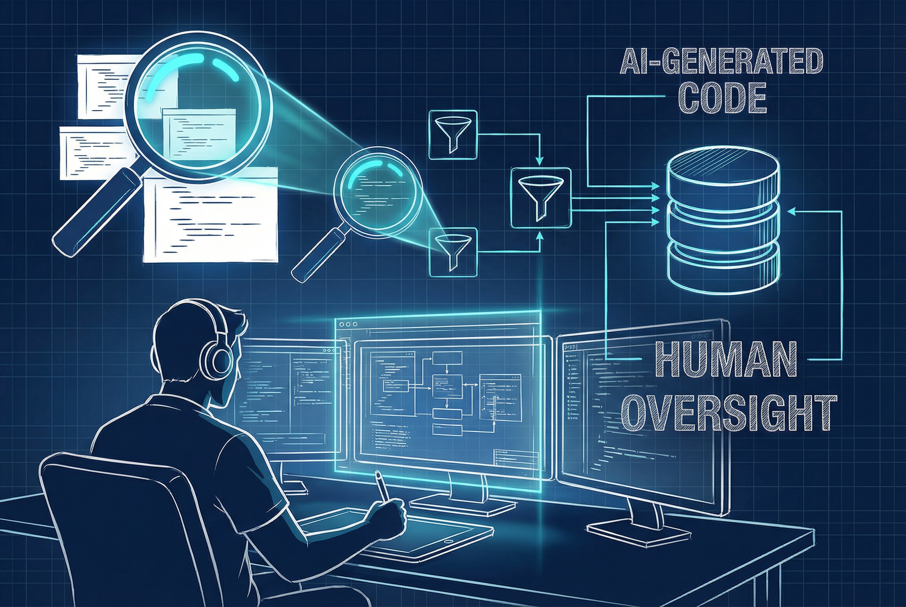
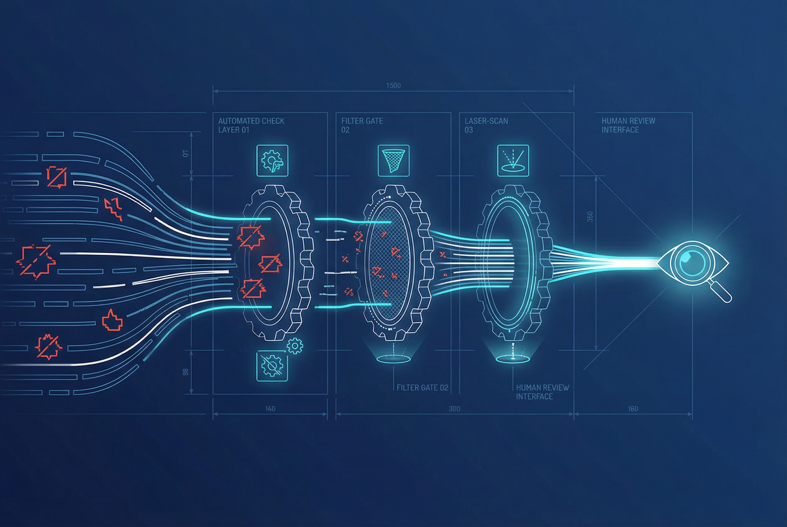

+++
title = 'Workflow Review Code AI 2026: 4 Bước Để Không Bị Ngợp'
date = 2026-04-04T23:00:00Z
tags = ['AI', 'Code Review', 'Workflow', 'Developer Productivity']
categories = ['Career']
description = 'Tốc độ tạo code của AI năm 2026 đang khiến dev quá tải khi review. Khám phá 4 bước workflow để không bị ngợp và duy trì quyền kiểm soát chất lượng dự án.'
images = ['og-hero.jpg']
+++

Trong năm 2026, chúng ta đã chứng kiến sự chuyển dịch rõ rệt từ việc AI chỉ gợi ý vài dòng lệnh sang khả năng tự động viết cả một module lớn hoặc tự sửa lỗi thông qua các AI Agent độc lập. Điều này tạo ra một hệ quả phụ mà ít người lường trước: tốc độ sản xuất code tăng theo cấp số nhân, kéo theo khối lượng công việc review code khổng lồ. 

Việc duyệt mã nguồn (code review) vốn đã đòi hỏi nhiều nỗ lực nhận thức, nay lại càng trở thành nút thắt cổ chai. Nếu không cẩn thận, chúng ta rất dễ rơi vào trạng thái "duyệt mù" (blind approve) — ấn LGTM (Looks Good To Me) chỉ vì code trông có vẻ sạch sẽ và chạy được test. Tuy nhiên, rủi ro tiềm ẩn bên dưới những dòng code do AI tạo ra có thể phá vỡ kiến trúc hệ thống hoặc tạo ra lỗ hổng bảo mật nghiêm trọng.

## Vấn đề: Vì sao review code AI lại mệt hơn code người?

Khi review code của một đồng nghiệp, bạn thường có thể "đọc vị" được tư duy của họ, hiểu được bối cảnh tại sao họ chọn cách giải quyết đó. Nhưng với AI, code được sinh ra dựa trên xác suất và các mô hình học máy. AI có thể tạo ra những đoạn code rất tinh vi, chuẩn cú pháp nhưng lại sai lệch hoàn toàn về mặt logic nghiệp vụ (business logic) hoặc vi phạm các quy chuẩn ngầm của dự án [1](https://brightsec.com/blog/5-best-practices-for-reviewing-and-approving-ai-generated-code/).

Hơn nữa, các AI Agent hiện nay có khả năng refactor hàng loạt file cùng lúc. Đứng trước một Pull Request (PR) với hàng nghìn dòng code thay đổi, việc soi từng dòng là bất khả thi. Nếu tiếp tục áp dụng quy trình review truyền thống, Developer sẽ nhanh chóng bị quá tải và kiệt sức (AI fatigue). Nhiều báo cáo thực tế đã chỉ ra rằng, sau giai đoạn ưu tiên tốc độ, năm 2026 là thời điểm bắt buộc phải hướng tới chất lượng và sự ổn định [2](https://www.coderabbit.ai/blog/2025-was-the-year-of-ai-speed-2026-will-be-the-year-of-ai-quality).

## Giải pháp: Workflow 4 lớp bảo vệ (Layered Review)

Để giành lại quyền kiểm soát, chúng ta cần thay đổi tư duy: không review cú pháp, mà tập trung review hành vi và bối cảnh. Dưới đây là workflow 4 lớp đang được nhiều team kỹ thuật áp dụng hiệu quả [3](https://www.codeant.ai/blogs/how-development-teams-can-adopt-ai-assisted-code-review-workflows).

### 1. Tự động hóa bộ lọc tầng thấp (Automated CI Checks)
Đừng dùng sức người để bắt lỗi cú pháp hay style code. Hãy thiết lập các hooks, linter, và công cụ phân tích tĩnh (static analysis) chạy tự động ngay khi PR được mở. Đây là lớp bảo vệ đầu tiên chặn lại những sai sót cơ bản nhất. 

### 2. Dùng AI để review code của... AI (Local & Bot Review)
Nghe có vẻ ngược đời, nhưng hãy dùng một AI Model khác (với context prompt thiên về bảo mật và performance) để đánh giá sơ bộ đoạn code vừa được sinh ra. Các bot review tích hợp sẵn vào GitHub/GitLab có thể đưa ra cảnh báo sớm về các lỗ hổng tiềm ẩn hoặc những đoạn code quá phức tạp [4](https://dev.to/heraldofsolace/the-best-ai-code-review-tools-of-2026-2mb3).

### 3. Phương pháp "Context-First"
Thay vì đọc code từ trên xuống dưới, hãy yêu cầu AI cung cấp bằng chứng cho những thay đổi của nó. Bắt buộc PR phải đi kèm với test case chứng minh hành vi, các log chạy thử, hoặc giải thích rõ ràng lý do thay đổi. Reviewer chỉ cần tập trung vào việc đối chiếu xem giải pháp của AI có khớp với yêu cầu hệ thống hay không.

### 4. Human Review: Tập trung vào kiến trúc và ý đồ
Đây là bước cuối cùng và quan trọng nhất. Con người không nên soi dấu chấm phẩy, mà phải đánh giá:
- Đoạn code này có phù hợp với kiến trúc tổng thể không?
- Nó có xử lý đúng các edge cases (trường hợp biên) chưa?
- Mô hình phân quyền và bảo mật có bị phá vỡ không?

## Kết luận

Sự tiến hóa của AI Coding Assistant không đồng nghĩa với việc Developer sẽ mất việc, mà vai trò của chúng ta đang chuyển dịch từ "Thợ gõ code" sang "Người biên tập và kiểm duyệt" (Editor & Reviewer). Bằng cách áp dụng một workflow đánh giá phân lớp, đẩy các công việc kiểm tra cơ bản cho tự động hóa và giữ lại phần đánh giá bối cảnh cho con người, bạn sẽ không bao giờ bị ngợp trước tốc độ của AI.

Hãy luôn giữ tư duy hoài nghi hợp lý: "Trust, but verify" — Tin tưởng, nhưng phải xác minh.

## Ma trận Quyết định Duyệt Code (Decision Matrix)

Trước khi nhấn nút Approve, hãy lướt qua ma trận dưới đây để biết bạn cần tập trung vào đâu:

| Loại Code thay đổi | Mức độ rủi ro | Hành động bắt buộc trong Review |
|--------------------|---------------|----------------------------------|
| **Cập nhật UI/UX, CSS, Text** | Thấp | Kiểm tra trực quan trên trình duyệt (Visual check). Đảm bảo không vỡ layout ở các màn hình khác nhau. |
| **Logic nghiệp vụ nội bộ (Internal Logic), Utility functions** | Trung bình | Yêu cầu Unit Test coverage tối thiểu 80%. Đọc kỹ các edge cases và kiểm tra các kịch bản ngoại lệ. |
| **Tương tác Database, API Gateway, Queries** | Cao | Kiểm tra kỹ khả năng N+1 query, thiếu index. Yêu cầu log phân tích hiệu suất (Explain plan) nếu query phức tạp. |
| **Bảo mật, Phân quyền (Auth/Roles), Xử lý dữ liệu nhạy cảm** | Rất cao | Yêu cầu Peer-review chéo (thêm 1 Human reviewer). Kiểm tra các lỗ hổng Injection, rò rỉ dữ liệu (Data leakage) và các kịch bản tấn công cơ bản. Không chấp nhận giải thích chung chung từ AI. |

